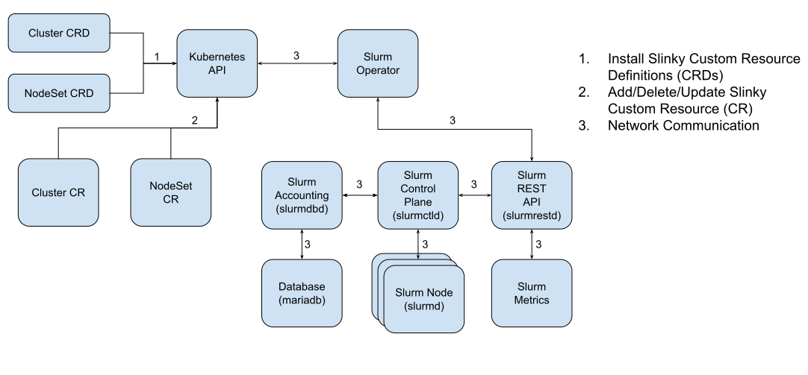

# slurm-operator

This project provides a framework that runs [Slurm] in [Kubernetes].

## Overview

This project deploys [Slurm] on [Kubernetes]. These pods coexist with other
running workloads on Kubernetes. This project provides controls over the Slurm
cluster configuration and deployment, along with configurable autoscaling policy
for Slurm compute nodes.

This project allows for much of the functionality within Slurm for workload
management. This includes:

- Priority scheduling: Determine job execution order based on priorities and
  weights such as age
- Fair share: Resources are distributed equitably among users based on
  historical usage.
- Quality of Service (QoS): set of policies, such as limits of resources,
  priorities, and preemption and backfilling.
- Job accounting: Information for every job and job step executed
- Job dependencies: Allow users to specify relationships between jobs, from
  start, succeed, fail, or a particular state.
- Workflows with partitioning: Divide cluster resource into sections for job
  management

To best enable Slurm in Kubernetes, the project uses
[Custom Resources (CRs)][custom-resources] and an [Operator] to extend
Kubernetes with custom behaviors for Slurm clusters. In addition, [Helm] is used
for managing the deployment of the various components of this project to
Kubernetes.

### Supported Slurm Versions

Data Parser: v41

- 24.05
- 24.11

## Quickstart

See the [Quickstart Guide][quickstart] to install.

## Overall Architecture

This is a basic architecture. A more in depth description can be found
[in the docs directory][architecture].

## Known Issues

- CGroups is currently disabled, due to difficulties getting core information
  into the pods.
- Updates may be slow, due to needing to wait for sequencing before the
  slurm-controller can be deployed.

## License

Copyright (C) SchedMD LLC.

Licensed under the
[Apache License, Version 2.0](http://www.apache.org/licenses/LICENSE-2.0) you
may not use project except in compliance with the license.

Unless required by applicable law or agreed to in writing, software distributed
under the License is distributed on an "AS IS" BASIS, WITHOUT WARRANTIES OR
CONDITIONS OF ANY KIND, either express or implied. See the License for the
specific language governing permissions and limitations under the License.

<!-- links -->

[architecture]: ./docs/architecture.md
[custom-resources]: https://kubernetes.io/docs/concepts/extend-kubernetes/api-extension/custom-resources/
[helm]: https://helm.sh/
[kubernetes]: https://kubernetes.io/
[operator]: https://kubernetes.io/docs/concepts/extend-kubernetes/operator/
[quickstart]: ./docs/quickstart.md
[slurm]: https://slurm.schedmd.com/overview.html
