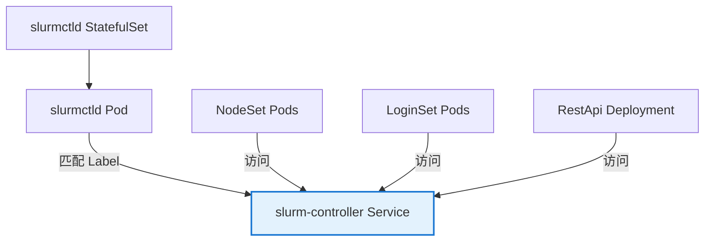
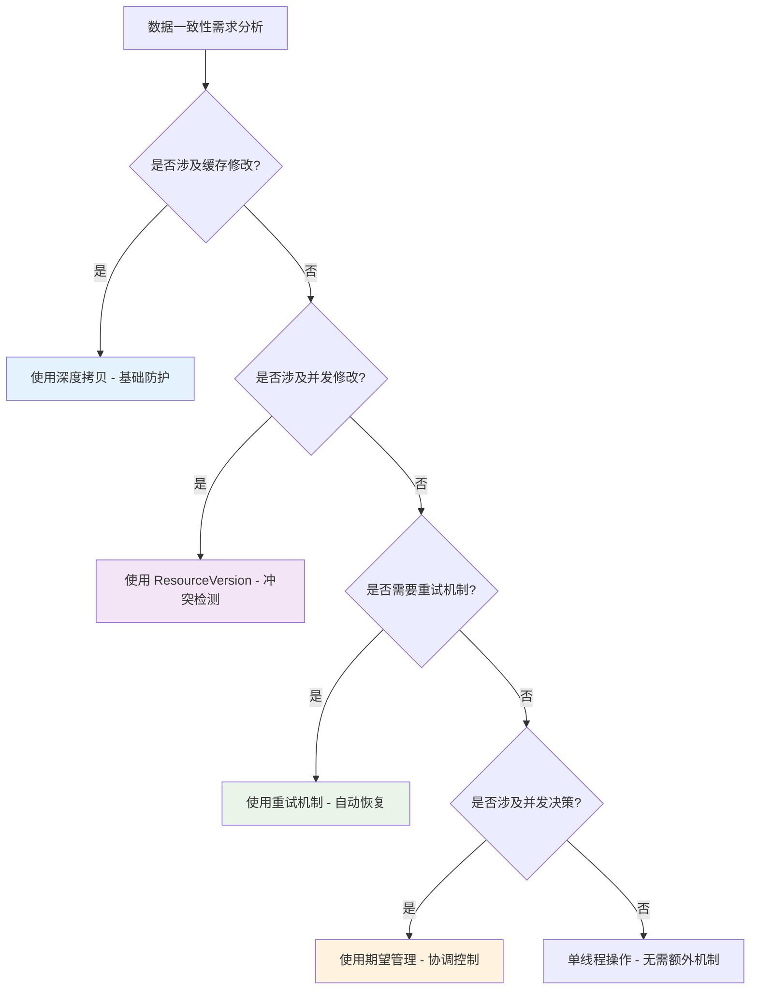
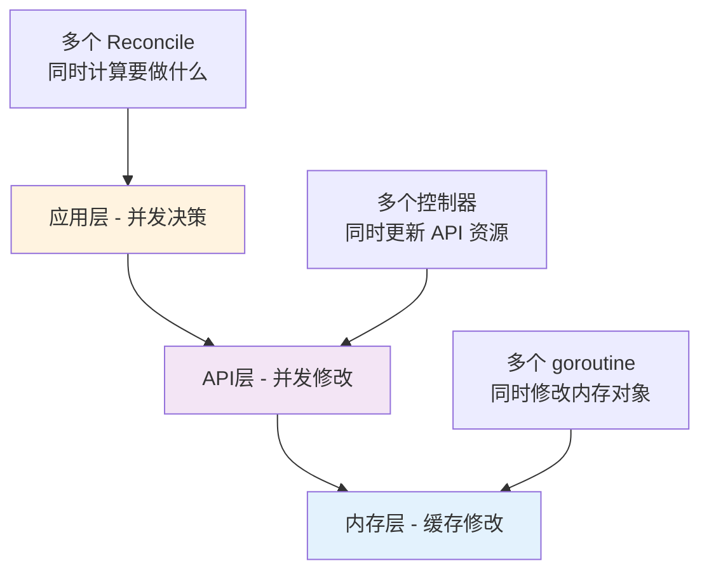

# Slinky 项目技术问答集

## 目录

1. [BuildControllerService 与 Service 的关系](#buildcontrollerservice-与-service-的关系)
2. [深度拷贝与缓存污染](#深度拷贝与缓存污染)
3. [数据一致性的四个层次](#数据一致性的四个层次)
4. [三种并发问题的本质区别](#三种并发问题的本质区别)

---

## BuildControllerService 与 Service 的关系

### 问题
BuildControllerService 这个是创建下面这个 service 用的吗？
```
slurm-controller-controller ClusterIP 10.96.55.217 <none> 6817/TCP 16h
```

### 答案

**是的**，`BuildControllerService` 就是用来创建这个服务的。让我详细解释整个流程：

#### 1. 调用链路
```go
// Controller 控制器的 Sync 函数
syncSteps := []SyncStep{
    {
        Name: "Service",
        Sync: func(ctx context.Context, controller *slinkyv1alpha1.Controller) error {
            object, err := r.builder.BuildControllerService(controller)
            // ...
            if err := objectutils.SyncObject(r.Client, ctx, object, false); err != nil {
                return fmt.Errorf("failed to sync object (%s): %w", klog.KObj(object), err)
            }
            return nil
        },
    },
}
```

#### 2. BuildControllerService 的具体实现
```go
// BuildControllerService 创建 slurmctld 的 Service
func (b *Builder) BuildControllerService(controller *slinkyv1alpha1.Controller) (*corev1.Service, error) {
    service := &corev1.Service{
        ObjectMeta: metav1.ObjectMeta{
            Name:      controller.Key().Name,  // 通常就是 slurm-controller-{controller-name}
            Namespace: controller.GetNamespace(),
            Labels:    labels.NewBuilder().WithControllerSelectorLabels(controller).Build(),
        },
        Spec: corev1.ServiceSpec{
            Ports: []corev1.ServicePort{
                {
                    Port:     6817,     // Slurmctld 的默认端口
                    Protocol: corev1.ProtocolTCP,
                },
            },
            Selector: labels.NewBuilder().WithControllerSelectorLabels(controller).Build(),
            Type:     corev1.ServiceTypeClusterIP,  // 集群内部访问
        },
    }

    // 设置 OwnerReference
    if err := controllerutils.SetControllerReference(controller, service, b.Scheme); err != nil {
        return nil, err
    }

    return service, nil
}
```

#### 3. Service 的命名规则
Service 的命名遵循：`slurm-controller-{Controller CRD 的 Name}`

如果您的 Controller CRD 名称为 `slurm-controller`，那么创建的 Service 名称就是 `slurm-controller-slurm-controller`，可能被截断为 `slurm-controller-controlle`。

#### 4. Service 的作用
- **访问入口**：为 slurmctld 组件提供稳定的网络访问点
- **服务发现**：其他组件（如 NodeSet、LoginSet）通过这个 Service 访问 slurmctld
- **负载均衡**：如果有多个 slurmctld 实例（高可用模式），Service 会分发请求
- **内部通信**：所有 Slurm 相关组件都通过这个内部 Service 通信

#### 5. Service 与 Pod 的关系


#### 6. 验证方法
```bash
# 查看 Service 详情
kubectl get service slurm-controller-controller -n slurm -o yaml

# 查看 Service 的 Endpoint
kubectl get endpoints slurm-controller-controller -n slurm

# 验证 Service 是否正确指向 Pod
kubectl describe service slurm-controller-controller -n slurm
```

---

## 深度拷贝与缓存污染

### 问题
"避免缓存污染" 是什么意思？拷贝怎么保证数据的一致性，比如 A 读到一份拷贝，但是后来 B 修改了拷贝，A 使用的是旧版本？

### 答案

#### 1. 什么是缓存污染？

**缓存污染**指的是多个并发操作共享同一个缓存对象时，一个操作对对象的修改��外地影响了其他正在使用该对象的操作。

```go
// 🚨 危险的操作 - 可能导致缓存污染
func dangerousExample() {
    // 从 API 获取的对象实际上是缓存对象的引用
    nodeset := &slinkyv1alpha1.NodeSet{}
    r.Get(ctx, req.NamespacedName, nodeset)

    // 如果直接修改这个对象...
    nodeset.Spec.Replicas = ptr.To[int32](5)  // 修改副本数

    // 这会影响其他 goroutine 看到的缓存内容！
    // 因为多个 Reconcile 可能共享同一个缓存对象
}
```

#### 2. 深度拷贝的作用

深度拷贝创建对象的独立副本，避免修改共享缓存：

```go
// ✅ 正确的操作 - 避免缓存污染
func correctExample() {
    // 从 API 获取对象
    nodeset := &slinkyv1alpha1.NodeSet{}
    r.Get(ctx, req.NamespacedName, nodeset)

    // 创建深度拷贝，避免修改缓存
    nodesetCopy := nodeset.DeepCopy()

    // 修改拷贝，不会影响原始缓存
    nodesetCopy.Spec.Replicas = ptr.To[int32](5)

    // 后续操作都使用拷贝
}
```

#### 3. 深度拷贝的限制

深度拷贝本身**不能**保证数据的一致性，它只能解决缓存污染问题。真正的数据一致性需要多层次的机制：

```go
// 🤯 深度拷贝无法解决的并发修改问题
func (r *NodeSetReconciler) Reconcile(ctx context.Context, req ctrl.Request) (ctrl.Result, error) {
    // 时间 T1: A Reconcile 开始
    nodeset := &slinkyv1alpha1.NodeSet{}
    r.Get(ctx, req.NamespacedName, nodeset)
    nodeset = nodeset.DeepCopy()  // A 获得版本：replicas=3, status="Ready"

    // 时间 T2: B Reconcile 修改了 API Server
    // B: r.Update(ctx, nodeset)  // 成功，ResourceVersion 现在是 101

    // 时间 T3: A 基于过期数据做决策
    currentReplicas := ptr.Deref(nodeset.Spec.Replicas, 0)  // A 认为：3（实际是 5）
    if currentReplicas < 4 {  // A 认为需要扩容，但实际上已经扩容了
        // A 做出错误决策：再次扩容到 4
        nodeset.Spec.Replicas = ptr.To[int32](4)
        return r.Update(ctx, nodeset)  // 错误地缩容了！
    }

    return ctrl.Result{}, nil
}
```

#### 4. 基于过期数据的错误决策

更危险的问题是：基于过期数据的错误决策（没有修改数据，只是根据数据做决策）：

```go
// 🚨 危险场景：基于过期数据的决策
func (r *NodeSetReconciler) dangerousDecision(ctx context.Context, req ctrl.Request) error {
    // 时间 T1: A 获取数据
    nodeset := &slinkyv1alpha1.NodeSet{}
    r.Get(ctx, req.NamespacedName, nodeset)
    nodeset = nodeset.DeepCopy()  // A 获得版本：replicas=3, status="Ready"

    // 时间 T2: B 将 replicas 改为 5，status 改为 "Scaling"

    // 时间 T3: A 基于过期信息做决策
    currentReplicas := ptr.Deref(nodeset.Spec.Replicas, 0)  // A 认为：3（实际是 5）
    if currentReplicas < 4 {  // A 认为需要扩容，但实际上已经扩容了
        // A 可能做出错误决策：删除 Pod、修改配置等
        return r.deleteSomePods()
    }

    return nil
}
```

#### 5. 解决方案：多层一致性保证

```go
// ✅ 完整的数据一致性解决方案
func (r *NodeSetReconciler) safeOperation(ctx context.Context, req ctrl.Request) error {
    return retry.RetryOnConflict(retry.DefaultRetry, func() error {
        // 1. 获取最新版本
        nodeset := &slinkyv1alpha1.NodeSet{}
        if err := r.Get(ctx, req.NamespacedName, nodeset); err != nil {
            return err
        }

        // 2. 创建工作拷贝（避免缓存污染）
        workingCopy := nodeset.DeepCopy()

        // 3. 检查期望机制（防止并发决策）
        if !r.expectations.SatisfiedExpectations(logger, req.String()) {
            return nil  // 其他人在处理，跳过
        }

        // 4. 基于最新数据做决策
        if needsUpdate(workingCopy) {
            // 5. 设置期望
            if err := r.expectations.ExpectCreations(logger, req.String(), count); err != nil {
                return err
            }

            // 6. 执行操作（ResourceVersion 会自动检查冲突）
            return r.Update(ctx, workingCopy)
        }

        return nil
    })
}
```

---

## 数据一致性的四个层次

### 问题
数据一致性保证的四个层次怎么决定什么场景使用什么方式的，原则和原理是什么？

### 答案

### 1. 四个层次的决策框架



### 2. 层次一：深度拷贝 - 基础防护层

#### 使用原则
**何时必须使用**：
- 任何从缓存读取对象后需要修改的场景
- 对象需要在多个函数间传递且可能被修改
- 避免意外的缓存污染

#### 实际场景
```go
// ✅ 场景1：读取后���要修改
func (r *NodeSetReconciler) Sync(ctx context.Context, req ctrl.Request) error {
    // 从 API 读取
    nodeset := &slinkyv1alpha1.NodeSet{}
    r.Get(ctx, req.NamespacedName, nodeset)

    // 🔑 关键决策点：后续会修改这个对象
    nodeset = nodeset.DeepCopy()  // 必须深度拷贝

    // 后续操作可能修改 nodeset
    if err := r.adoptOrphanRevisions(ctx, nodeset); err != nil {
        return err
    }

    // ...
}
```

#### 决策原则
```go
// 🎯 深度拷贝决策树
func shouldDeepCopy(obj client.Object, willModify bool) bool {
    switch {
    case willModify:
        return true  // 要修改 → 必须拷贝
    case obj == nil:
        return false // 空对象 → 无需拷贝
    case isReadOnly():
        return false // 只读操作 → 无需拷贝
    default:
        return true  // 默认安全 → 建议拷贝
    }
}
```

### 3. 层次二：ResourceVersion - 并发修改检测层

#### 使用原则
**何时必须使用**：
- 同一资源可能被多个控制器/协程并发修改
- 需要检测并防止意外的覆盖修改
- 修改操作不是原子的

#### 实际场景
```go
// ✅ 场景1：多个控制器可能修改同一资源
func (r *NodeSetReconciler) updateNodeSetLabels(ctx context.Context, nodeset *slinkyv1alpha1.NodeSet) error {
    // 🚨 高风险：多个控制器可能同时修改 labels
    updated := nodeset.DeepCopy()
    if updated.Labels == nil {
        updated.Labels = make(map[string]string)
    }
    updated.Labels["last-updated"] = time.Now().Format(time.RFC3339)

    // ResourceVersion 会在 Update 时自动检查冲突
    return r.Update(ctx, updated)
    // 如果冲突，会返回 Conflict 错误
}
```

#### 决策原则
```go
// 🎯 ResourceVersion 决策树
func needsResourceVersionCheck(operation string, obj client.Object) bool {
    switch {
    case operation == "Create":
        return false // 创建对象无冲突
    case operation == "Delete":
        return false // 删除通常基于 UID
    case operation == "Update" || operation == "Patch":
        return true  // 修改需要冲突检测
    case obj.GetResourceVersion() == "":
        return false // 新对象无版本
    default:
        return true  // 默认检查
    }
}
```

### 4. 层次三：重试机制 - 自动恢复层

#### 使用原则
**何时必须使用**：
- 操作可能因为并发冲突而失败
- 需要自动恢复能力
- 业务逻辑允许重试

#### 实际场景
```go
// ✅ 场景1：状态更新需要重试
func (r *NodeSetReconciler) updateStatusWithRetry(ctx context.Context, nodeset *slinkyv1alpha1.NodeSet) error {
    // 🚨 高风险：状态更新经常冲突
    namespacedName := client.ObjectKeyFromObject(nodeset)
    newStatus := calculateNewStatus(nodeset)

    // 🔄 使用重试机制处理冲突
    return retry.RetryOnConflict(retry.DefaultRetry, func() error {
        // 每次重试都重新获取最新版本
        latest := &slinkyv1alpha1.NodeSet{}
        if err := r.Get(ctx, namespacedName, latest); err != nil {
            return err
        }

        // 在最新版本基础上更新状态
        latest.Status = *newStatus
        return r.Status().Update(ctx, latest)
    })
}
```

#### 重试策略的选择
```go
// 🎯 重试策略决策树
func chooseRetryStrategy(operation string, importance string) retry.Backoff {
    switch {
    case operation == "StatusUpdate":
        return retry.DefaultRetry  // 状态更新：标准重试
    case importance == "Critical":
        return retry.DefaultRetry  // 关键操作：标准重试
    case operation == "SpecUpdate":
        return retry.DefaultRetry  // 规格更新：标准重试
    default:
        return retry.OnError(retry.DefaultRetry, func(err error) bool {
            return apierrors.IsConflict(err)  // 只重试冲突错误
        })
    }
}
```

### 5. 层次四：期望管理 - 协调控制层

#### 使用原则
**何时必须使用**：
- 涉及多个子对象的批量操作
- 需要防止并发决策导致的状态不一致
- 操作跨越多个 Reconcile 周期

#### 实际场景
```go
// ✅ 场景1：批量 Pod 操作需要期望管理
func (r *NodeSetReconciler) scaleOutPods(ctx context.Context, nodeset *slinkyv1alpha1.NodeSet) error {
    key := objectutils.KeyFunc(nodeset)

    // 🔒 检查期望：防止并发扩容
    if !r.expectations.SatisfiedExpectations(logger, key) {
        return nil  // 其他 Reconcile 正在处理
    }

    // 计算需要创建的 Pod 数量
    currentPods, _ := r.getNodeSetPods(ctx, nodeset)
    targetReplicas := ptr.Deref(nodeset.Spec.Replicas, 1)
    needToCreate := targetReplicas - len(currentPods)

    if needToCreate <= 0 {
        return nil  // 不需要扩容
    }

    // 🎯 设置期望：告诉其他 Reconcile 我要创建 Pod
    if err := r.expectations.ExpectCreations(logger, key, needToCreate); err != nil {
        return err
    }

    // 执行创建操作
    return r.createPodsWithExpectation(ctx, nodeset, needToCreate)
}
```

#### 期望管理决策原则
```go
// 🎯 期望管理决策树
func needsExpectationManagement(operationType string, objectCount int) bool {
    switch {
    case objectCount > 1:
        return true  // 多对象操作 → 需要期望管理
    case operationType == "BatchCreate":
        return true  // 批量创建 → 需要期望管理
    case operationType == "BatchDelete":
        return true  // 批量删除 → 需要期望管理
    case operationType == "RollingUpdate":
        return true  // 滚动更新 → 需要期望管理
    case operationType == "SingleUpdate":
        return false // 单个更新 → ResourceVersion 足够
    default:
        return false // 默认不需要
    }
}
```

### 6. 综合决策框架

```go
// 🎯 完整的决策框架
type ConsistencyDecision struct {
    NeedDeepCopy     bool
    NeedRVCheck      bool
    NeedRetry        bool
    NeedExpectations bool
}

func analyzeConsistencyNeeds(ctx context.Context, operation Operation, obj client.Object) ConsistencyDecision {
    decision := ConsistencyDecision{}

    // 基础层：是否会修改对象？
    if operation.WillModifyObject() {
        decision.NeedDeepCopy = true
    }

    // 并发层：是否涉及并发修改？
    if operation.IsUpdateOperation() && !obj.IsNew() {
        decision.NeedRVCheck = true
    }

    // 恢复层：是否可能失败并需要重试？
    if operation.MayConflict() && operation.IsRetryable() {
        decision.NeedRetry = true
    }

    // 协调层：是否涉及批量操作或并发决策？
    if operation.IsBatchOperation() || operation.MayCauseRaceCondition() {
        decision.NeedExpectations = true
    }

    return decision
}
```

### 7. 总结：决策的核心原则

1. **最小必要原则**：只使用必要的层次，避免过度保护
2. **风险评估原则**：根据操作的风险和重要性选择保护级别
3. **性能权衡原则**：在一致性和性能之间找到平衡
4. **场景适配原则**：不同的业务场景需要不同的策略

这种分层设计让开发者可以根据具体的业务需求和性能要求，选择合适的一致性保护级别，既保证了系统的正确性，又避免了不必要的性能开销。

---

## 三种并发问题的本质区别

### 问题
以上提到的"是否设计缓存修改"、"是否涉及并发修改"、"是否涉及并发决策"这些不都是并发的修改吗，本质区别在哪里？

### 答案

你提出了一个非常深刻的问题！这三个概念确实都涉及并发，但它们的**本质区别在于并发操作的对象和时机**不同。

### 1. "是否涉及缓存修改" - 数据层面的问题

```go
// 🎯 缓存修改：同一对象的内存并发访问
func cacheModificationScenario() {
    // 场景：多个 goroutine 同时修改同一个内存对象

    // Goroutine A
    go func() {
        nodeset := getFromCache()  // 获取缓存对象的引用
        nodeset.Spec.Replicas = ptr.To[int32](5)  // 修改内存中的对象
        // 🚨 这会直接影响其他 goroutine 看到的缓存内容
    }()

    // Goroutine B
    go func() {
        nodeset := getFromCache()  // 可能获取到同一个内存引用
        fmt.Println(*nodeset.Spec.Replicas)  // 可能读到 A 的修改，也可能读不到
        // 🚨 读取到的值是不确定的
    }()

    // 本质：内存级别的竞态条件
}
```

**关键特征**：
- **对象**：同一个内存对象
- **时机**：同时访问同一块内存
- **问题**：数据竞态、内存污染
- **解决**：深度拷贝（创建独立的内存副本）

### 2. "是否涉及并发修改" - API 层面的问题

```go
// 🎯 并发修改：多个客户端同时修改 API Server 上的同一资源
func concurrentModificationScenario() {
    // 场景：多个控制器/客户端同时更新同一个 Kubernetes 资源

    // Controller A (时间 T1)
    go func() {
        nodeset := &slinkyv1alpha1.NodeSet{}
        client.Get(ctx, key, nodeset)  // ResourceVersion = 100

        nodeset.Spec.Replicas = ptr.To[int32](5)
        err := client.Update(ctx, nodeset)  // 尝试更新到 RV=100
        // 🚨 如果 Controller B 已经更新，这里会失败
    }()

    // Controller B (时间 T2)
    go func() {
        nodeset := &slinkyv1alpha1.NodeSet{}
        client.Get(ctx, key, nodeset)  // ResourceVersion = 100

        nodeset.Labels["update"] = "B"
        err := client.Update(ctx, nodeset)  // B 先成功，RV 变为 101
        // 🚨 A 的更新会失败，因为 A 用的是 RV=100
    }()

    // 本质：分布式系统的并发控制问题
}
```

**关键特征**：
- **对象**：API Server 上的同一个资源
- **时机**：不同的操作时间点
- **问题**：覆盖修改、丢失更新
- **解决**：ResourceVersion（乐观并发控制）

### 3. "是否涉及并发决策" - 逻辑层面的问题

```go
// 🎯 并发决策：多个控制器同时基于过期数据做决策
func concurrentDecisionScenario() {
    // 场景：多个 Reconcile 同时计算需要做什么操作

    // Reconcile A (时间 T1)
    go func() {
        // A 读取当前状态：2 个 Pod，目标 5 个
        currentPods, _ := listPods()  // A 看到 2 个 Pod
        targetReplicas := 5

        needToCreate := targetReplicas - len(currentPods)  // A 计算需要创建 3 个
        // 🚨 A 的决策基于当前看到的状态

        // 设置期望，防止其他决策
        expectations.ExpectCreations("nodeset1", 3)

        // 执行创建 3 个 Pod
        createPods(3)
    }()

    // Reconcile B (时间 T2，在 A 创建 Pod 之前)
    go func() {
        // B 也读取当前状态：还是 2 个 Pod（A 还没创建）
        currentPods, _ := listPods()  // B 也看到 2 个 Pod
        targetReplicas := 5

        needToCreate := targetReplicas - len(currentPods)  // B 也计算需要创建 3 个
        // 🚨 B 做出了相同的决策！

        // 检查期望：发现 A 已经设置了期望
        if !expectations.SatisfiedExpectations("nodeset1") {
            // B 放弃操作
            return
        }
    }()

    // 本质：基于过期数据的重复决策问题
}
```

**关键特征**：
- **对象**：业务逻辑的决策过程
- **时机**：同一时间窗口内的决策计算
- **问题**：重复操作、状态不一致
- **解决**：期望机制（协调并发决策）

### 4. 三个层次的关系和区别

#### 问题发生的层次不同



#### 时间维度的区别

```go
// 🎯 时间维度上的区别
func timeDimensionDifference() {
    // T1: 内存级并发（同一瞬间）
    go func() {
        obj := sharedMemoryObject
        obj.field = "A"  // ←─┐
        //                │   │ 同一内存位置
    }()
    go func() {
        obj := sharedMemoryObject  // ←─┘
        obj.field = "B"  // 可能覆盖 A 的修改
    }()

    // T2-T3: API级并发（不同时间点）
    // A: Read(RV=100) → Modify → Write(RV=100 expected)
    // B: Read(RV=100) → Modify → Write(RV=100 expected)
    // 结果：后写入的失败（Conflict 错误）

    // T1-T4: 决策级并发（同一决策窗口）
    // A: Read State → Calculate → Set Expectation → Execute
    // B: Read State → Calculate → Check Expectation → Skip
}
```

#### 解决方案的递进关系

```go
// 🎯 解决方案的递进性
func progressiveSolutions() {
    // 第一层：内存安全
    func level1_MemorySafety() {
        original := getFromCache()
        working := original.DeepCopy()  // 创建独立副本
        // 现在可以安全修改 working，不影响其他 goroutine
    }

    // 第二层：API 安全
    func level2_APISafety() {
        obj := &MyResource{}
        client.Get(ctx, key, obj)  // 获取最新版本，包含 ResourceVersion

        // 修改后更新，自动检查版本冲突
        err := client.Update(ctx, obj)  // 如果版本过期，返回 Conflict
    }

    // 第三层：逻辑安全
    func level3_LogicSafety() {
        // 设置期望，防止其他控制器做相同决策
        if !expectations.SatisfiedExpectations(key) {
            return  // 其他人在处理，我跳过
        }

        expectations.ExpectCreations(key, count)
        // 现在可以安全地执行批量操作
    }
}
```

### 5. 实际例子：NodeSet 扩缩容中的三层保护

```go
// 🎯 实际场景：NodeSet 扩缩容的完整保护
func (r *NodeSetReconciler) completeProtectionExample(ctx context.Context, req ctrl.Request) error {
    // 第一层：缓存修改保护
    nodeset := &slinkyv1alpha1.NodeSet{}
    r.Get(ctx, req.NamespacedName, nodeset)
    nodeset = nodeset.DeepCopy()  // 🔒 防止缓存污染

    // 第二层：并发修改保护（通过 Update 自动处理）
    // 当后续调用 r.Update(ctx, nodeset) 时，ResourceVersion 会自动检查冲突

    // 第三层：并发决策保护
    key := objectutils.KeyFunc(nodeset)
    if !r.expectations.SatisfiedExpectations(logger, key) {
        // 🔒 有其他 Reconcile 在处理，跳过决策
        return r.syncStatusOnly(ctx, nodeset)
    }

    // 现在可以安全地做决策和执行
    currentPods, _ := r.getNodeSetPods(ctx, nodeset)
    targetReplicas := ptr.Deref(nodeset.Spec.Replicas, 0)
    needToCreate := targetReplicas - len(currentPods)

    if needToCreate > 0 {
        // 设置期望，阻止其他并发决策
        r.expectations.ExpectCreations(logger, key, needToCreate)

        // 执行创建（可能因并发修改失败，会自动重试）
        return r.createPodsWithRetry(ctx, nodeset, needToCreate)
    }

    return nil
}
```

### 6. 总结：本质区别

| 层次 | 并发对象 | 问题本质 | 解决方案 | 关注点 |
|------|----------|----------|----------|--------|
| **缓存修改** | 同一内存对象 | 数据竞态、内存污染 | 深度拷贝 | **内存安全** |
| **并发修改** | API 资源 | 覆盖更新、丢失修改 | ResourceVersion | **API 一致性** |
| **并发决策** | 业务逻辑 | 重复操作、状态偏差 | 期望机制 | **逻辑正确性** |

**核心区别**：
- **缓存修改**：同一时刻、同一内存、数据安全问题
- **并发修改**：不同时刻、同一资源、版本冲突问题
- **并发决策**：同一窗口、相同逻辑、重复执行问题

这三个层次构成了一个**递进的保护体系**，每一层解决不同性质的并发问题，确保 Kubernetes 控制器在高并发环境下的正确性和一致性。

---

## 总结

这个问答集涵盖了 Slinky 项目中几个关键的技术概念：

1. **BuildControllerService** 是构建 slurmctld 服务的关键组件，提供了稳定的网络访问点
2. **深度拷贝**解决了内存层面的缓存污染问题，但需要与其他机制配合确保数据一致性
3. **四层数据一致性保护**构成了一个递进的保护体系，从内存安全到逻辑正确性
4. **三种并发问题**发生在不同的抽象层次，需要针对性的解决方案

这些概念和机制共同确保了 Slinky 作为 Kubernetes Operator 在高并发环境下的正确性、一致性和可靠性。