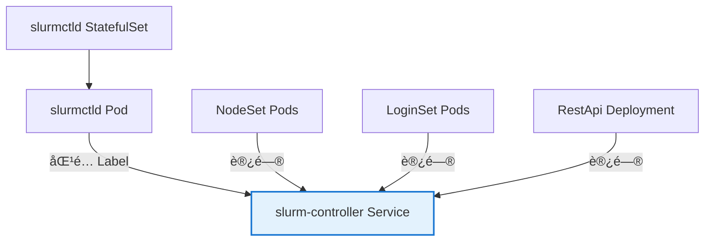
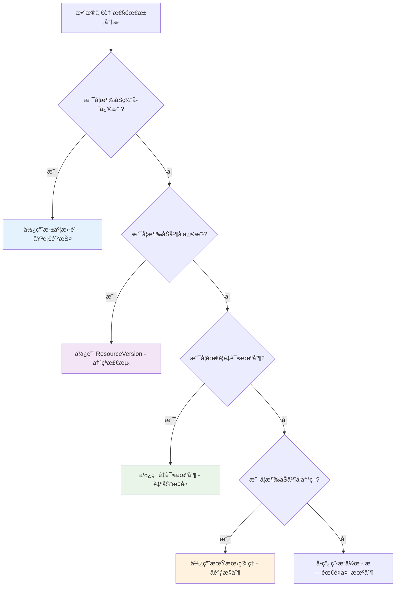
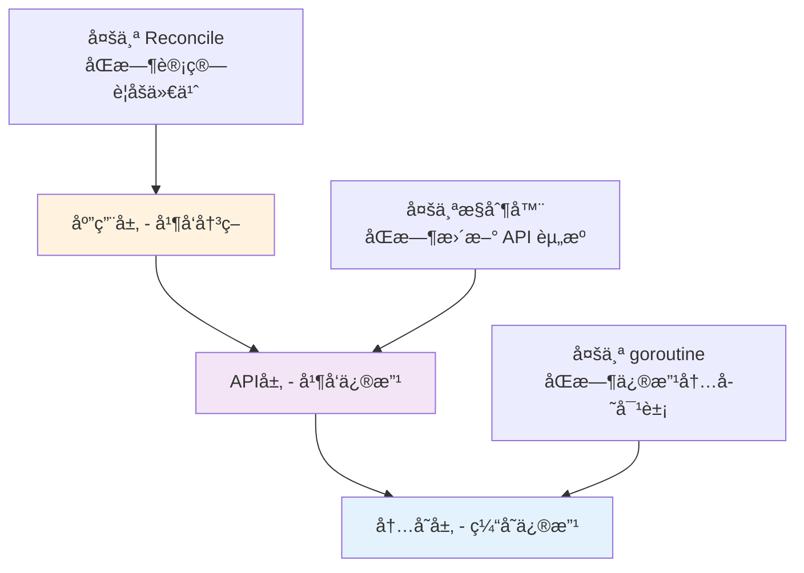

# Slinky 项目技术问答集

## 目录

1. [BuildControllerService ä¸ Service 的关系](#buildcontrollerservice-ä¸-service-的关系)
2. [深度拷è´ä¸ç¼“存污染](#深度拷è´ä¸ç¼“存污染)
3. [æ•°æ®ä¸€è‡´æ€§çš„四个层次](#æ•°æ®ä¸€è‡´æ€§çš„四个层次)
4. [三ç§å¹¶å‘问题的本质区别](#三ç§å¹¶å‘问题的本质区别)

---

## BuildControllerService ä¸ Service 的关系

### 问题
BuildControllerService 这个是创建下é¢è¿™ä¸ª service 用的å—？
```
slurm-controller-controller ClusterIP 10.96.55.217 <none> 6817/TCP 16h
```

### 答案

**是的**，`BuildControllerService` 就是用æ¥åˆ›å»ºè¿™ä¸ªæœåŠ¡çš„。让我详细解释整个æµç¨‹ï¼š

#### 1. 调用链路
```go
// Controller æ§åˆ¶å™¨çš„ Sync 函数
syncSteps := []SyncStep{
    {
        Name: "Service",
        Sync: func(ctx context.Context, controller *slinkyv1alpha1.Controller) error {
            object, err := r.builder.BuildControllerService(controller)
            // ...
            if err := objectutils.SyncObject(r.Client, ctx, object, false); err != nil {
                return fmt.Errorf("failed to sync object (%s): %w", klog.KObj(object), err)
            }
            return nil
        },
    },
}
```

#### 2. BuildControllerService 的具体å®ç°
```go
// BuildControllerService 创建 slurmctld 的 Service
func (b *Builder) BuildControllerService(controller *slinkyv1alpha1.Controller) (*corev1.Service, error) {
    service := &corev1.Service{
        ObjectMeta: metav1.ObjectMeta{
            Name:      controller.Key().Name,  // 通常就是 slurm-controller-{controller-name}
            Namespace: controller.GetNamespace(),
            Labels:    labels.NewBuilder().WithControllerSelectorLabels(controller).Build(),
        },
        Spec: corev1.ServiceSpec{
            Ports: []corev1.ServicePort{
                {
                    Port:     6817,     // Slurmctld 的默认端å£
                    Protocol: corev1.ProtocolTCP,
                },
            },
            Selector: labels.NewBuilder().WithControllerSelectorLabels(controller).Build(),
            Type:     corev1.ServiceTypeClusterIP,  // 集群内部访问
        },
    }

    // 设置 OwnerReference
    if err := controllerutils.SetControllerReference(controller, service, b.Scheme); err != nil {
        return nil, err
    }

    return service, nil
}
```

#### 3. Service 的命å规则
Service 的命åéµå¾ªï¼š`slurm-controller-{Controller CRD çš„ Name}`

如æœæ‚¨çš„ Controller CRD å称为 `slurm-controller`，那么创建的 Service å称就是 `slurm-controller-slurm-controller`，å¯èƒ½è¢«æˆªæ–­ä¸º `slurm-controller-controlle`。

#### 4. Service 的作用
- **访问入å£**：为 slurmctld 组件æ供稳定的网络访问点
- **æœåŠ¡å‘ç°**：其他组件（如 NodeSetã€LoginSet）通过这个 Service 访问 slurmctld
- **è´Ÿè½½å‡è¡¡**：如æœæœ‰å¤šä¸ª slurmctld å®ä¾‹ï¼ˆé«˜å¯ç”¨æ¨¡å¼ï¼‰ï¼ŒService 会分å‘请求
- **内部通信**：所有 Slurm 相关组件都通过这个内部 Service 通信

#### 5. Service ä¸ Pod 的关系


#### 6. 验è¯æ–¹æ³•
```bash
# 查看 Service 详情
kubectl get service slurm-controller-controller -n slurm -o yaml

# 查看 Service 的 Endpoint
kubectl get endpoints slurm-controller-controller -n slurm

# éªŒè¯ Service 是å¦æ­£ç¡®æŒ‡å‘ Pod
kubectl describe service slurm-controller-controller -n slurm
```

---

## 深度拷è´ä¸ç¼“存污染

### 问题
"é¿å…缓存污染" 是什么æ„æ€ï¼Ÿæ‹·è´æ€ä¹ˆä¿è¯æ•°æ®çš„一致性，比如 A 读到一份拷è´ï¼Œä½†æ˜¯åæ¥ B 修改了拷è´ï¼ŒA 使用的是旧版本？

### 答案

#### 1. 什么是缓存污染？

**缓存污染**指的是多个并å‘æ“作共享åŒä¸€ä¸ªç¼“存对象时，一个æ“作对对象的修改��外地影å“了其他正在使用该对象的æ“作。

```go
// 🚨 å±é™©çš„æ“作 - å¯èƒ½å¯¼è‡´ç¼“存污染
func dangerousExample() {
    // ä» API è·å–的对象å®é™…上是缓存对象的引用
    nodeset := &slinkyv1alpha1.NodeSet{}
    r.Get(ctx, req.NamespacedName, nodeset)

    // 如æœç›´æ¥ä¿®æ”¹è¿™ä¸ªå¯¹è±¡...
    nodeset.Spec.Replicas = ptr.To[int32](5)  // 修改副本数

    // 这会影å“其他 goroutine 看到的缓存内容ï¼
    // 因为多个 Reconcile å¯èƒ½å…±äº«åŒä¸€ä¸ªç¼“存对象
}
```

#### 2. 深度拷è´çš„作用

深度拷è´åˆ›å»ºå¯¹è±¡çš„独立副本，é¿å…修改共享缓存：

```go
// ✅ 正确的æ“作 - é¿å…缓存污染
func correctExample() {
    // ä» API è·å–对象
    nodeset := &slinkyv1alpha1.NodeSet{}
    r.Get(ctx, req.NamespacedName, nodeset)

    // 创建深度拷è´ï¼Œé¿å…修改缓存
    nodesetCopy := nodeset.DeepCopy()

    // 修改拷è´ï¼Œä¸ä¼šå½±å“åŸå§‹ç¼“å­˜
    nodesetCopy.Spec.Replicas = ptr.To[int32](5)

    // åç»­æ“作都使用拷è´
}
```

#### 3. 深度拷è´çš„é™åˆ¶

深度拷è´æœ¬èº«**ä¸èƒ½**ä¿è¯æ•°æ®çš„一致性，它åªèƒ½è§£å†³ç¼“存污染问题。真正的数æ®ä¸€è‡´æ€§éœ€è¦å¤šå±‚次的机制：

```go
// 🤯 深度拷è´æ— æ³•è§£å†³çš„并å‘修改问题
func (r *NodeSetReconciler) Reconcile(ctx context.Context, req ctrl.Request) (ctrl.Result, error) {
    // 时间 T1: A Reconcile 开始
    nodeset := &slinkyv1alpha1.NodeSet{}
    r.Get(ctx, req.NamespacedName, nodeset)
    nodeset = nodeset.DeepCopy()  // A è·å¾—版本：replicas=3, status="Ready"

    // 时间 T2: B Reconcile 修改了 API Server
    // B: r.Update(ctx, nodeset)  // æˆåŠŸï¼ŒResourceVersion ç°åœ¨æ˜¯ 101

    // 时间 T3: A 基äºè¿‡æœŸæ•°æ®åšå†³ç­–
    currentReplicas := ptr.Deref(nodeset.Spec.Replicas, 0)  // A 认为：3（å®é™…是 5）
    if currentReplicas < 4 {  // A 认为需è¦æ‰©å®¹ï¼Œä½†å®é™…上已ç»æ‰©å®¹äº†
        // A åšå‡ºé”™è¯¯å†³ç­–：å†æ¬¡æ‰©å®¹åˆ° 4
        nodeset.Spec.Replicas = ptr.To[int32](4)
        return r.Update(ctx, nodeset)  // 错误地缩容了ï¼
    }

    return ctrl.Result{}, nil
}
```

#### 4. 基äºè¿‡æœŸæ•°æ®çš„错误决策

æ›´å±é™©çš„问题是：基äºè¿‡æœŸæ•°æ®çš„错误决策（没有修改数æ®ï¼Œåªæ˜¯æ ¹æ®æ•°æ®åšå†³ç­–）：

```go
// 🚨 å±é™©åœºæ™¯ï¼šåŸºäºè¿‡æœŸæ•°æ®çš„决策
func (r *NodeSetReconciler) dangerousDecision(ctx context.Context, req ctrl.Request) error {
    // 时间 T1: A è·å–æ•°æ®
    nodeset := &slinkyv1alpha1.NodeSet{}
    r.Get(ctx, req.NamespacedName, nodeset)
    nodeset = nodeset.DeepCopy()  // A è·å¾—版本：replicas=3, status="Ready"

    // 时间 T2: B 将 replicas 改为 5，status 改为 "Scaling"

    // 时间 T3: A 基äºè¿‡æœŸä¿¡æ¯åšå†³ç­–
    currentReplicas := ptr.Deref(nodeset.Spec.Replicas, 0)  // A 认为：3（å®é™…是 5）
    if currentReplicas < 4 {  // A 认为需è¦æ‰©å®¹ï¼Œä½†å®é™…上已ç»æ‰©å®¹äº†
        // A å¯èƒ½åšå‡ºé”™è¯¯å†³ç­–：删除 Podã€ä¿®æ”¹é…置等
        return r.deleteSomePods()
    }

    return nil
}
```

#### 5. 解决方案：多层一致性ä¿è¯

```go
// ✅ 完整的数æ®ä¸€è‡´æ€§è§£å†³æ–¹æ¡ˆ
func (r *NodeSetReconciler) safeOperation(ctx context.Context, req ctrl.Request) error {
    return retry.RetryOnConflict(retry.DefaultRetry, func() error {
        // 1. è·å–最新版本
        nodeset := &slinkyv1alpha1.NodeSet{}
        if err := r.Get(ctx, req.NamespacedName, nodeset); err != nil {
            return err
        }

        // 2. 创建工作拷è´ï¼ˆé¿å…缓存污染）
        workingCopy := nodeset.DeepCopy()

        // 3. 检查期望机制（防止并å‘决策）
        if !r.expectations.SatisfiedExpectations(logger, req.String()) {
            return nil  // 其他人在处ç†ï¼Œè·³è¿‡
        }

        // 4. 基äºæœ€æ–°æ•°æ®åšå†³ç­–
        if needsUpdate(workingCopy) {
            // 5. 设置期望
            if err := r.expectations.ExpectCreations(logger, req.String(), count); err != nil {
                return err
            }

            // 6. 执行æ“作（ResourceVersion 会自动检查冲çªï¼‰
            return r.Update(ctx, workingCopy)
        }

        return nil
    })
}
```

---

## æ•°æ®ä¸€è‡´æ€§çš„四个层次

### 问题
æ•°æ®ä¸€è‡´æ€§ä¿è¯çš„四个层次æ€ä¹ˆå†³å®šä»€ä¹ˆåœºæ™¯ä½¿ç”¨ä»€ä¹ˆæ–¹å¼çš„，åŸåˆ™å’ŒåŸç†æ˜¯ä»€ä¹ˆï¼Ÿ

### 答案

### 1. 四个层次的决策框æ¶



### 2. å±‚æ¬¡ä¸€ï¼šæ·±åº¦æ‹·è´ - 基础防护层

#### 使用åŸåˆ™
**何时必须使用**：
- 任何ä»ç¼“存读å–对象å需è¦ä¿®æ”¹çš„场景
- 对象需è¦åœ¨å¤šä¸ªå‡½æ•°é—´ä¼ é€’且å¯èƒ½è¢«ä¿®æ”¹
- é¿å…æ„外的缓存污染

#### å®é™…场景
```go
// ✅ 场景1：读å–å���è¦ä¿®æ”¹
func (r *NodeSetReconciler) Sync(ctx context.Context, req ctrl.Request) error {
    // ä» API 读å–
    nodeset := &slinkyv1alpha1.NodeSet{}
    r.Get(ctx, req.NamespacedName, nodeset)

    // 🔑 关键决策点：å续会修改这个对象
    nodeset = nodeset.DeepCopy()  // 必须深度拷è´

    // åç»­æ“作å¯èƒ½ä¿®æ”¹ nodeset
    if err := r.adoptOrphanRevisions(ctx, nodeset); err != nil {
        return err
    }

    // ...
}
```

#### 决策åŸåˆ™
```go
// 🯠深度拷è´å†³ç­–æ ‘
func shouldDeepCopy(obj client.Object, willModify bool) bool {
    switch {
    case willModify:
        return true  // è¦ä¿®æ”¹ → 必须拷è´
    case obj == nil:
        return false // 空对象 → 无需拷è´
    case isReadOnly():
        return false // åªè¯»æ“作 → 无需拷è´
    default:
        return true  // 默认安全 → 建议拷è´
    }
}
```

### 3. 层次二：ResourceVersion - 并å‘修改检测层

#### 使用åŸåˆ™
**何时必须使用**：
- åŒä¸€èµ„æºå¯èƒ½è¢«å¤šä¸ªæ§åˆ¶å™¨/å程并å‘修改
- 需è¦æ£€æµ‹å¹¶é˜²æ­¢æ„外的覆盖修改
- 修改æ“作ä¸æ˜¯åŸå­çš„

#### å®é™…场景
```go
// ✅ 场景1：多个æ§åˆ¶å™¨å¯èƒ½ä¿®æ”¹åŒä¸€èµ„æº
func (r *NodeSetReconciler) updateNodeSetLabels(ctx context.Context, nodeset *slinkyv1alpha1.NodeSet) error {
    // 🚨 高é£é™©ï¼šå¤šä¸ªæ§åˆ¶å™¨å¯èƒ½åŒæ—¶ä¿®æ”¹ labels
    updated := nodeset.DeepCopy()
    if updated.Labels == nil {
        updated.Labels = make(map[string]string)
    }
    updated.Labels["last-updated"] = time.Now().Format(time.RFC3339)

    // ResourceVersion 会在 Update 时自动检查冲çª
    return r.Update(ctx, updated)
    // 如æœå†²çªï¼Œä¼šè¿”å› Conflict 错误
}
```

#### 决策åŸåˆ™
```go
// 🯠ResourceVersion 决策树
func needsResourceVersionCheck(operation string, obj client.Object) bool {
    switch {
    case operation == "Create":
        return false // 创建对象无冲çª
    case operation == "Delete":
        return false // åˆ é™¤é€šå¸¸åŸºäº UID
    case operation == "Update" || operation == "Patch":
        return true  // 修改需è¦å†²çªæ£€æµ‹
    case obj.GetResourceVersion() == "":
        return false // 新对象无版本
    default:
        return true  // 默认检查
    }
}
```

### 4. 层次三：é‡è¯•æœºåˆ¶ - 自动æ¢å¤å±‚

#### 使用åŸåˆ™
**何时必须使用**：
- æ“作å¯èƒ½å› ä¸ºå¹¶å‘冲çªè€Œå¤±è´¥
- 需è¦è‡ªåŠ¨æ¢å¤èƒ½åŠ›
- 业务逻辑å…许é‡è¯•

#### å®é™…场景
```go
// ✅ 场景1：状æ€æ›´æ–°éœ€è¦é‡è¯•
func (r *NodeSetReconciler) updateStatusWithRetry(ctx context.Context, nodeset *slinkyv1alpha1.NodeSet) error {
    // 🚨 高é£é™©ï¼šçŠ¶æ€æ›´æ–°ç»å¸¸å†²çª
    namespacedName := client.ObjectKeyFromObject(nodeset)
    newStatus := calculateNewStatus(nodeset)

    // 🔄 使用é‡è¯•æœºåˆ¶å¤„ç†å†²çª
    return retry.RetryOnConflict(retry.DefaultRetry, func() error {
        // æ¯æ¬¡é‡è¯•éƒ½é‡æ–°è·å–最新版本
        latest := &slinkyv1alpha1.NodeSet{}
        if err := r.Get(ctx, namespacedName, latest); err != nil {
            return err
        }

        // 在最新版本基础上更新状æ€
        latest.Status = *newStatus
        return r.Status().Update(ctx, latest)
    })
}
```

#### é‡è¯•ç­–略的选择
```go
// 🯠é‡è¯•ç­–略决策树
func chooseRetryStrategy(operation string, importance string) retry.Backoff {
    switch {
    case operation == "StatusUpdate":
        return retry.DefaultRetry  // 状æ€æ›´æ–°ï¼šæ ‡å‡†é‡è¯•
    case importance == "Critical":
        return retry.DefaultRetry  // 关键æ“作：标准é‡è¯•
    case operation == "SpecUpdate":
        return retry.DefaultRetry  // 规格更新：标准é‡è¯•
    default:
        return retry.OnError(retry.DefaultRetry, func(err error) bool {
            return apierrors.IsConflict(err)  // åªé‡è¯•å†²çªé”™è¯¯
        })
    }
}
```

### 5. å±‚æ¬¡å››ï¼šæœŸæœ›ç®¡ç† - åè°ƒæ§åˆ¶å±‚

#### 使用åŸåˆ™
**何时必须使用**：
- 涉åŠå¤šä¸ªå­å¯¹è±¡çš„批é‡æ“作
- 需è¦é˜²æ­¢å¹¶å‘决策导致的状æ€ä¸ä¸€è‡´
- æ“作跨越多个 Reconcile 周期

#### å®é™…场景
```go
// ✅ 场景1ï¼šæ‰¹é‡ Pod æ“作需è¦æœŸæœ›ç®¡ç†
func (r *NodeSetReconciler) scaleOutPods(ctx context.Context, nodeset *slinkyv1alpha1.NodeSet) error {
    key := objectutils.KeyFunc(nodeset)

    // 🔒 检查期望：防止并å‘扩容
    if !r.expectations.SatisfiedExpectations(logger, key) {
        return nil  // 其他 Reconcile 正在处ç†
    }

    // 计算需è¦åˆ›å»ºçš„ Pod æ•°é‡
    currentPods, _ := r.getNodeSetPods(ctx, nodeset)
    targetReplicas := ptr.Deref(nodeset.Spec.Replicas, 1)
    needToCreate := targetReplicas - len(currentPods)

    if needToCreate <= 0 {
        return nil  // ä¸éœ€è¦æ‰©å®¹
    }

    // 🯠设置期望：告诉其他 Reconcile 我è¦åˆ›å»º Pod
    if err := r.expectations.ExpectCreations(logger, key, needToCreate); err != nil {
        return err
    }

    // 执行创建æ“作
    return r.createPodsWithExpectation(ctx, nodeset, needToCreate)
}
```

#### 期望管ç†å†³ç­–åŸåˆ™
```go
// 🯠期望管ç†å†³ç­–æ ‘
func needsExpectationManagement(operationType string, objectCount int) bool {
    switch {
    case objectCount > 1:
        return true  // 多对象æ“作 → 需è¦æœŸæœ›ç®¡ç†
    case operationType == "BatchCreate":
        return true  // 批é‡åˆ›å»º → 需è¦æœŸæœ›ç®¡ç†
    case operationType == "BatchDelete":
        return true  // 批é‡åˆ é™¤ → 需è¦æœŸæœ›ç®¡ç†
    case operationType == "RollingUpdate":
        return true  // 滚动更新 → 需è¦æœŸæœ›ç®¡ç†
    case operationType == "SingleUpdate":
        return false // å•ä¸ªæ›´æ–° → ResourceVersion 足够
    default:
        return false // 默认ä¸éœ€è¦
    }
}
```

### 6. 综åˆå†³ç­–框æ¶

```go
// 🯠完整的决策框æ¶
type ConsistencyDecision struct {
    NeedDeepCopy     bool
    NeedRVCheck      bool
    NeedRetry        bool
    NeedExpectations bool
}

func analyzeConsistencyNeeds(ctx context.Context, operation Operation, obj client.Object) ConsistencyDecision {
    decision := ConsistencyDecision{}

    // 基础层：是å¦ä¼šä¿®æ”¹å¯¹è±¡ï¼Ÿ
    if operation.WillModifyObject() {
        decision.NeedDeepCopy = true
    }

    // 并å‘层：是å¦æ¶‰åŠå¹¶å‘修改？
    if operation.IsUpdateOperation() && !obj.IsNew() {
        decision.NeedRVCheck = true
    }

    // æ¢å¤å±‚：是å¦å¯èƒ½å¤±è´¥å¹¶éœ€è¦é‡è¯•ï¼Ÿ
    if operation.MayConflict() && operation.IsRetryable() {
        decision.NeedRetry = true
    }

    // å调层：是å¦æ¶‰åŠæ‰¹é‡æ“作或并å‘决策？
    if operation.IsBatchOperation() || operation.MayCauseRaceCondition() {
        decision.NeedExpectations = true
    }

    return decision
}
```

### 7. 总结：决策的核心åŸåˆ™

1. **最å°å¿…è¦åŸåˆ™**：åªä½¿ç”¨å¿…è¦çš„层次，é¿å…过度ä¿æŠ¤
2. **é£é™©è¯„ä¼°åŸåˆ™**：根æ®æ“作的é£é™©å’Œé‡è¦æ€§é€‰æ‹©ä¿æŠ¤çº§åˆ«
3. **性能æƒè¡¡åŸåˆ™**：在一致性和性能之间找到平衡
4. **场景适é…åŸåˆ™**：ä¸åŒçš„业务场景需è¦ä¸åŒçš„ç­–ç•¥

è¿™ç§åˆ†å±‚设计让开å‘者å¯ä»¥æ ¹æ®å…·ä½“的业务需求和性能è¦æ±‚，选择åˆé€‚的一致性ä¿æŠ¤çº§åˆ«ï¼Œæ—¢ä¿è¯äº†ç³»ç»Ÿçš„正确性，åˆé¿å…了ä¸å¿…è¦çš„性能开销。

---

## 三ç§å¹¶å‘问题的本质区别

### 问题
以上æ到的"是å¦è®¾è®¡ç¼“存修改"ã€"是å¦æ¶‰åŠå¹¶å‘修改"ã€"是å¦æ¶‰åŠå¹¶å‘决策"这些ä¸éƒ½æ˜¯å¹¶å‘的修改å—，本质区别在哪里？

### 答案

ä½ æ出了一个é常深刻的问题ï¼è¿™ä¸‰ä¸ªæ¦‚念确å®éƒ½æ¶‰åŠå¹¶å‘，但它们的**本质区别在äºå¹¶å‘æ“作的对象和时机**ä¸åŒã€‚

### 1. "是å¦æ¶‰åŠç¼“存修改" - æ•°æ®å±‚é¢çš„问题

```go
// 🯠缓存修改：åŒä¸€å¯¹è±¡çš„内存并å‘访问
func cacheModificationScenario() {
    // 场景：多个 goroutine åŒæ—¶ä¿®æ”¹åŒä¸€ä¸ªå†…存对象

    // Goroutine A
    go func() {
        nodeset := getFromCache()  // è·å–缓存对象的引用
        nodeset.Spec.Replicas = ptr.To[int32](5)  // 修改内存中的对象
        // 🚨 这会直æ¥å½±å“其他 goroutine 看到的缓存内容
    }()

    // Goroutine B
    go func() {
        nodeset := getFromCache()  // å¯èƒ½è·å–到åŒä¸€ä¸ªå†…存引用
        fmt.Println(*nodeset.Spec.Replicas)  // å¯èƒ½è¯»åˆ° A 的修改，也å¯èƒ½è¯»ä¸åˆ°
        // 🚨 读å–到的值是ä¸ç¡®å®šçš„
    }()

    // 本质：内存级别的ç«æ€æ¡ä»¶
}
```

**关键特å¾**：
- **对象**：åŒä¸€ä¸ªå†…存对象
- **时机**：åŒæ—¶è®¿é—®åŒä¸€å—内存
- **问题**：数æ®ç«æ€ã€å†…存污染
- **解决**：深度拷è´ï¼ˆåˆ›å»ºç‹¬ç«‹çš„内存副本）

### 2. "是å¦æ¶‰åŠå¹¶å‘修改" - API 层é¢çš„问题

```go
// 🯠并å‘修改：多个客户端åŒæ—¶ä¿®æ”¹ API Server 上的åŒä¸€èµ„æº
func concurrentModificationScenario() {
    // 场景：多个æ§åˆ¶å™¨/客户端åŒæ—¶æ›´æ–°åŒä¸€ä¸ª Kubernetes 资æº

    // Controller A (时间 T1)
    go func() {
        nodeset := &slinkyv1alpha1.NodeSet{}
        client.Get(ctx, key, nodeset)  // ResourceVersion = 100

        nodeset.Spec.Replicas = ptr.To[int32](5)
        err := client.Update(ctx, nodeset)  // å°è¯•æ›´æ–°åˆ° RV=100
        // 🚨 å¦‚æœ Controller B å·²ç»æ›´æ–°ï¼Œè¿™é‡Œä¼šå¤±è´¥
    }()

    // Controller B (时间 T2)
    go func() {
        nodeset := &slinkyv1alpha1.NodeSet{}
        client.Get(ctx, key, nodeset)  // ResourceVersion = 100

        nodeset.Labels["update"] = "B"
        err := client.Update(ctx, nodeset)  // B å…ˆæˆåŠŸï¼ŒRV å˜ä¸º 101
        // 🚨 A 的更新会失败，因为 A 用的是 RV=100
    }()

    // 本质：分布å¼ç³»ç»Ÿçš„并å‘æ§åˆ¶é—®é¢˜
}
```

**关键特å¾**：
- **对象**：API Server 上的åŒä¸€ä¸ªèµ„æº
- **时机**：ä¸åŒçš„æ“作时间点
- **问题**：覆盖修改ã€ä¸¢å¤±æ›´æ–°
- **解决**：ResourceVersion（ä¹è§‚并å‘æ§åˆ¶ï¼‰

### 3. "是å¦æ¶‰åŠå¹¶å‘决策" - 逻辑层é¢çš„问题

```go
// 🯠并å‘决策：多个æ§åˆ¶å™¨åŒæ—¶åŸºäºè¿‡æœŸæ•°æ®åšå†³ç­–
func concurrentDecisionScenario() {
    // 场景：多个 Reconcile åŒæ—¶è®¡ç®—需è¦åšä»€ä¹ˆæ“作

    // Reconcile A (时间 T1)
    go func() {
        // A 读å–当å‰çŠ¶æ€ï¼š2 个 Pod，目标 5 个
        currentPods, _ := listPods()  // A 看到 2 个 Pod
        targetReplicas := 5

        needToCreate := targetReplicas - len(currentPods)  // A 计算需è¦åˆ›å»º 3 个
        // 🚨 A 的决策基äºå½“å‰çœ‹åˆ°çš„状æ€

        // 设置期望，防止其他决策
        expectations.ExpectCreations("nodeset1", 3)

        // 执行创建 3 个 Pod
        createPods(3)
    }()

    // Reconcile B (时间 T2，在 A 创建 Pod 之å‰)
    go func() {
        // B 也读å–当å‰çŠ¶æ€ï¼šè¿˜æ˜¯ 2 个 Pod（A 还没创建）
        currentPods, _ := listPods()  // B 也看到 2 个 Pod
        targetReplicas := 5

        needToCreate := targetReplicas - len(currentPods)  // B 也计算需è¦åˆ›å»º 3 个
        // 🚨 B åšå‡ºäº†ç›¸åŒçš„决策ï¼

        // 检查期望：å‘ç° A å·²ç»è®¾ç½®äº†æœŸæœ›
        if !expectations.SatisfiedExpectations("nodeset1") {
            // B 放弃æ“作
            return
        }
    }()

    // 本质：基äºè¿‡æœŸæ•°æ®çš„é‡å¤å†³ç­–问题
}
```

**关键特å¾**：
- **对象**：业务逻辑的决策过程
- **时机**：åŒä¸€æ—¶é—´çª—å£å†…的决策计算
- **问题**：é‡å¤æ“作ã€çŠ¶æ€ä¸ä¸€è‡´
- **解决**：期望机制（å调并å‘决策）

### 4. 三个层次的关系和区别

#### 问题å‘生的层次ä¸åŒ



#### 时间维度的区别

```go
// 🯠时间维度上的区别
func timeDimensionDifference() {
    // T1: 内存级并å‘（åŒä¸€ç¬é—´ï¼‰
    go func() {
        obj := sharedMemoryObject
        obj.field = "A"  // â†â”€â”
        //                │   │ åŒä¸€å†…å­˜ä½ç½®
    }()
    go func() {
        obj := sharedMemoryObject  // â†â”€â”˜
        obj.field = "B"  // å¯èƒ½è¦†ç›– A 的修改
    }()

    // T2-T3: API级并å‘（ä¸åŒæ—¶é—´ç‚¹ï¼‰
    // A: Read(RV=100) → Modify → Write(RV=100 expected)
    // B: Read(RV=100) → Modify → Write(RV=100 expected)
    // 结æœï¼šå写入的失败（Conflict 错误）

    // T1-T4: 决策级并å‘（åŒä¸€å†³ç­–窗å£ï¼‰
    // A: Read State → Calculate → Set Expectation → Execute
    // B: Read State → Calculate → Check Expectation → Skip
}
```

#### 解决方案的递进关系

```go
// 🯠解决方案的递进性
func progressiveSolutions() {
    // 第一层：内存安全
    func level1_MemorySafety() {
        original := getFromCache()
        working := original.DeepCopy()  // 创建独立副本
        // ç°åœ¨å¯ä»¥å®‰å…¨ä¿®æ”¹ working，ä¸å½±å“其他 goroutine
    }

    // 第二层：API 安全
    func level2_APISafety() {
        obj := &MyResource{}
        client.Get(ctx, key, obj)  // è·å–æœ€æ–°ç‰ˆæœ¬ï¼ŒåŒ…å« ResourceVersion

        // 修改å更新，自动检查版本冲çª
        err := client.Update(ctx, obj)  // 如æœç‰ˆæœ¬è¿‡æœŸï¼Œè¿”å› Conflict
    }

    // 第三层：逻辑安全
    func level3_LogicSafety() {
        // 设置期望，防止其他æ§åˆ¶å™¨åšç›¸åŒå†³ç­–
        if !expectations.SatisfiedExpectations(key) {
            return  // 其他人在处ç†ï¼Œæˆ‘跳过
        }

        expectations.ExpectCreations(key, count)
        // ç°åœ¨å¯ä»¥å®‰å…¨åœ°æ‰§è¡Œæ‰¹é‡æ“作
    }
}
```

### 5. å®é™…例å­ï¼šNodeSet 扩缩容中的三层ä¿æŠ¤

```go
// 🯠å®é™…场景：NodeSet 扩缩容的完整ä¿æŠ¤
func (r *NodeSetReconciler) completeProtectionExample(ctx context.Context, req ctrl.Request) error {
    // 第一层：缓存修改ä¿æŠ¤
    nodeset := &slinkyv1alpha1.NodeSet{}
    r.Get(ctx, req.NamespacedName, nodeset)
    nodeset = nodeset.DeepCopy()  // 🔒 防止缓存污染

    // 第二层：并å‘修改ä¿æŠ¤ï¼ˆé€šè¿‡ Update 自动处ç†ï¼‰
    // 当å续调用 r.Update(ctx, nodeset) 时，ResourceVersion 会自动检查冲çª

    // 第三层：并å‘决策ä¿æŠ¤
    key := objectutils.KeyFunc(nodeset)
    if !r.expectations.SatisfiedExpectations(logger, key) {
        // 🔒 有其他 Reconcile 在处ç†ï¼Œè·³è¿‡å†³ç­–
        return r.syncStatusOnly(ctx, nodeset)
    }

    // ç°åœ¨å¯ä»¥å®‰å…¨åœ°åšå†³ç­–和执行
    currentPods, _ := r.getNodeSetPods(ctx, nodeset)
    targetReplicas := ptr.Deref(nodeset.Spec.Replicas, 0)
    needToCreate := targetReplicas - len(currentPods)

    if needToCreate > 0 {
        // 设置期望，阻止其他并å‘决策
        r.expectations.ExpectCreations(logger, key, needToCreate)

        // 执行创建（å¯èƒ½å› å¹¶å‘修改失败，会自动é‡è¯•ï¼‰
        return r.createPodsWithRetry(ctx, nodeset, needToCreate)
    }

    return nil
}
```

### 6. 总结：本质区别

| 层次 | 并å‘对象 | 问题本质 | 解决方案 | 关注点 |
|------|----------|----------|----------|--------|
| **缓存修改** | åŒä¸€å†…存对象 | æ•°æ®ç«æ€ã€å†…存污染 | æ·±åº¦æ‹·è´ | **内存安全** |
| **并å‘修改** | API èµ„æº | 覆盖更新ã€ä¸¢å¤±ä¿®æ”¹ | ResourceVersion | **API 一致性** |
| **并å‘决策** | 业务逻辑 | é‡å¤æ“作ã€çŠ¶æ€åå·® | 期望机制 | **逻辑正确性** |

**核心区别**：
- **缓存修改**：åŒä¸€æ—¶åˆ»ã€åŒä¸€å†…å­˜ã€æ•°æ®å®‰å…¨é—®é¢˜
- **并å‘修改**：ä¸åŒæ—¶åˆ»ã€åŒä¸€èµ„æºã€ç‰ˆæœ¬å†²çªé—®é¢˜
- **并å‘决策**：åŒä¸€çª—å£ã€ç›¸åŒé€»è¾‘ã€é‡å¤æ‰§è¡Œé—®é¢˜

这三个层次æ„æˆäº†ä¸€ä¸ª**递进的ä¿æŠ¤ä½“ç³»**，æ¯ä¸€å±‚解决ä¸åŒæ€§è´¨çš„并å‘é—®é¢˜ï¼Œç¡®ä¿ Kubernetes æ§åˆ¶å™¨åœ¨é«˜å¹¶å‘ç¯å¢ƒä¸‹çš„正确性和一致性。

---

## 总结

这个问答集涵盖了 Slinky 项目中几个关键的技术概念：

1. **BuildControllerService** 是æ„建 slurmctld æœåŠ¡çš„关键组件，æ供了稳定的网络访问点
2. **深度拷è´**解决了内存层é¢çš„缓存污染问题，但需è¦ä¸å…¶ä»–机制é…åˆç¡®ä¿æ•°æ®ä¸€è‡´æ€§
3. **四层数æ®ä¸€è‡´æ€§ä¿æŠ¤**æ„æˆäº†ä¸€ä¸ªé€’进的ä¿æŠ¤ä½“系，ä»å†…存安全到逻辑正确性
4. **三ç§å¹¶å‘问题**å‘生在ä¸åŒçš„抽象层次，需è¦é’ˆå¯¹æ€§çš„解决方案

这些概念和机制共åŒç¡®ä¿äº† Slinky 作为 Kubernetes Operator 在高并å‘ç¯å¢ƒä¸‹çš„正确性ã€ä¸€è‡´æ€§å’Œå¯é æ€§ã€‚