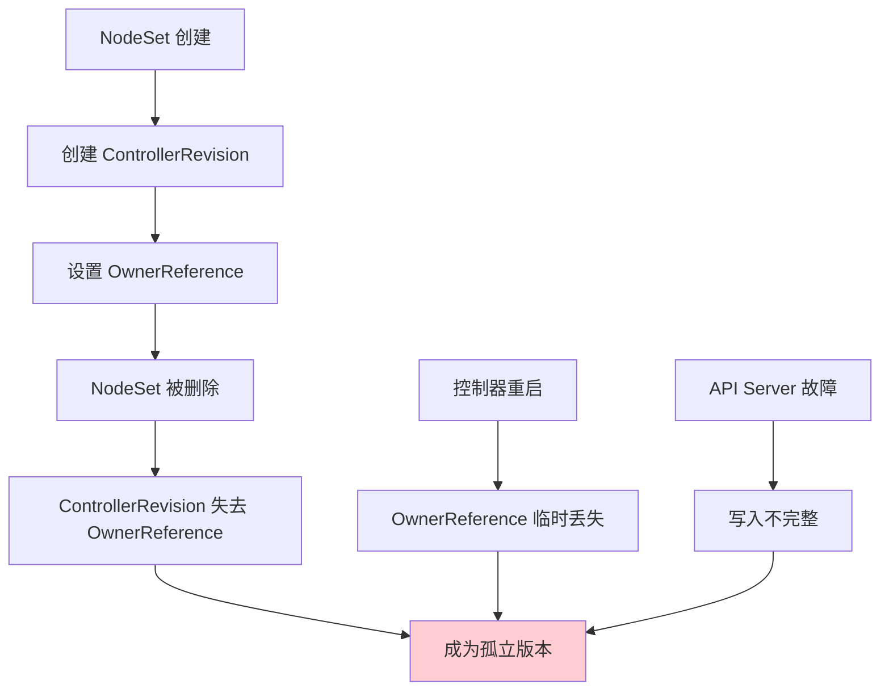
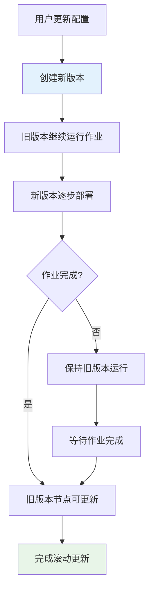
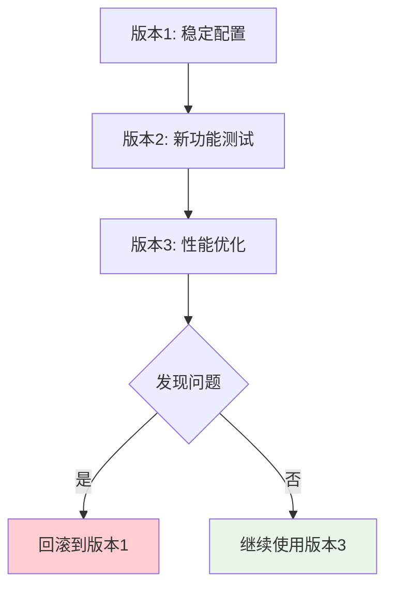
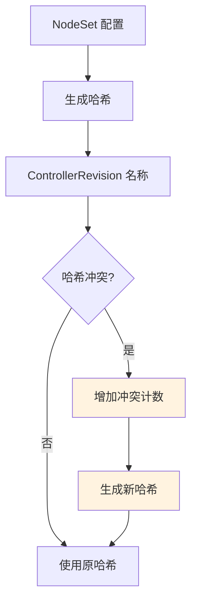
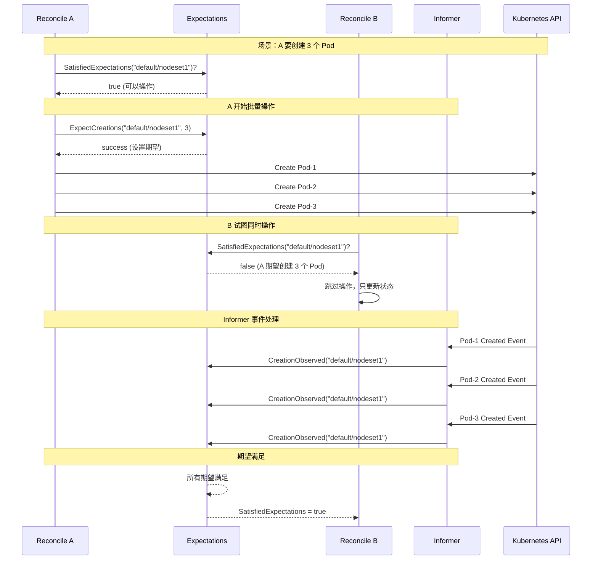
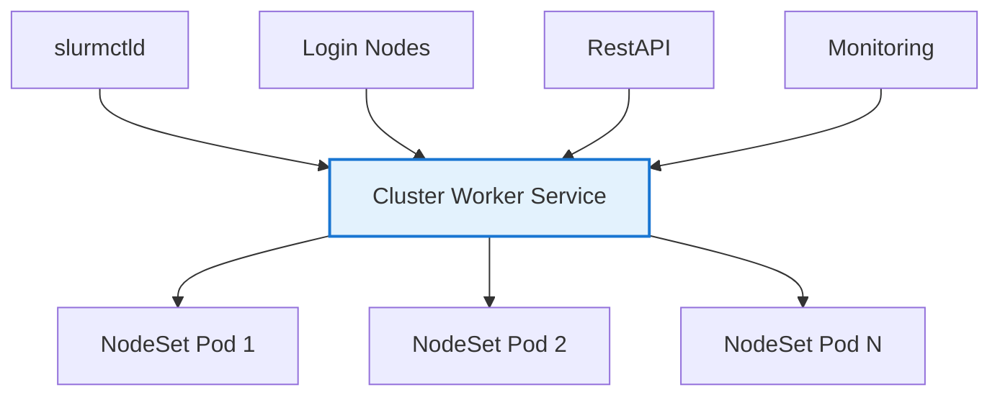
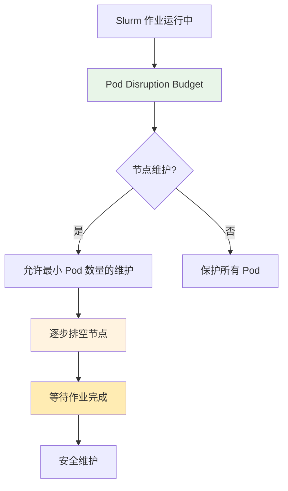
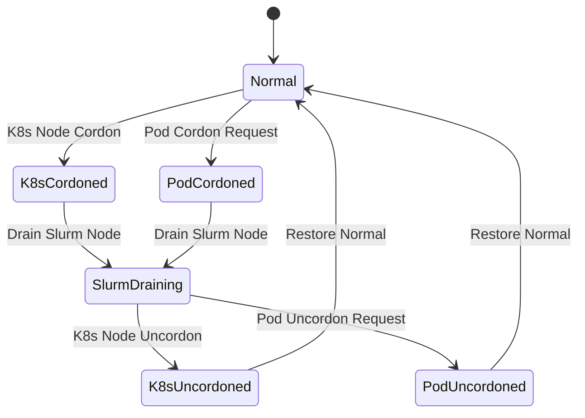
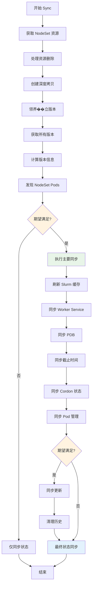
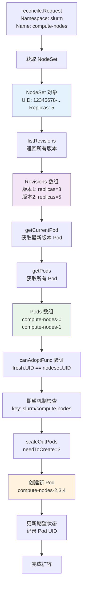

# NodeSet 控制器 Sync 函数深度解析

## 目录

1. [整体架构概览](#整体架构概览)
2. [第一阶段：资源获取与状态检查](#第一阶段资源获取与状态检查)
3. [第二阶段：版本管理与历史追踪](#第二阶段版本管理与历史追踪)
4. [ControllerRevision 详细解释](#controllerrevision-详细解释)
5. [第三阶段：Pod 发现与关系管理](#第三阶段pod-发现与关系管理)
6. [第四阶段：期望机制检查](#第四阶段期望机制检查)
7. [第五阶段：核心同步逻辑](#第五阶段核心同步逻辑)
8. [第六阶段：更新管理和历史清理](#第六阶段更新管理和历史清理)
9. [第七阶段：状态同步](#第七阶段状态同步)
10. [总结：执行流程概览](#总结执行流程概览)

---

## 整体架构概览

### 核心使命

NodeSet 控制器的核心使命是：**在 Kubernetes 环境中管理 Slurm 计算节点的生命周期，确保 Kubernetes Pod 状态与 Slurm 集群节点状态的一致性**。

### HPC 环境的特殊性

在 HPC（高性能计算）环境中，NodeSet 控制器需要解决以下独特挑战：

- **作业保护**：Slurm 作业不能因 Kubernetes 操作而中断
- **状态同步**：Kubernetes Pod 状态必须实时反映 Slurm 节点状态
- **资源协调**：CPU、内存、GPU 等资源在两个系统间的协调分配
- **网络通信**：确保 Slurm 组件间的网络连接稳定
- **故障恢复**：快速检测和恢复节点故障

### 函数签名

```go
func (r *NodeSetReconciler) Sync(ctx context.Context, req reconcile.Request) error
```

---

## 第一阶段：资源获取与状态检查

### 1.1 获取 NodeSet 资源

```go
nodeset := &slinkyv1alpha1.NodeSet{}
if err := r.Get(ctx, req.NamespacedName, nodeset); err != nil {
    if apierrors.IsNotFound(err) {
        logger.V(3).Info("NodeSet has been deleted.", "request", req)
        r.expectations.DeleteExpectations(logger, req.String())
        return nil
    }
    return err
}
```

**第一性原理解释**：

#### 为什么需要 Get？
- **状态获取**：从 Kubernetes API Server 获取 NodeSet 资源的当前状态，这是我们所有决策的基础
- **版本信息**：获取包含 ResourceVersion 的最新版本，用于后续的并发控制
- **配置读取**：读取用户定义的期望状态（replicas、template、updateStrategy 等）

#### 为什么处理 NotFound？
```go
if apierrors.IsNotFound(err) {
    r.expectations.DeleteExpectations(logger, req.String())
    return nil
}
```

**Kubernetes 控制器模式的标准实践**：
- **期望清理**：NodeSet 被删除时，清理相关的期望状态，避免内存泄漏
- **防止僵尸期望**：避免期望机制因为资源删除而陷入死锁状态
- **优雅退出**：确保控制器在资源删除后能正常退出

#### 为什么 DeepCopy？
```go
nodeset = nodeset.DeepCopy()
```

**防止缓存污染的关键措施**：
- **内存安全**：创建对象的独立副本，避免修改影响其他并发操作
- **并发保护**：多个 Reconcile 可能同时运行，每个都需要独立的工作副本
- **状态隔离**：确保我们的修改不会意外影响缓存中的原始对象

#### 为什么生成 key？
```go
key := objectutils.KeyFunc(nodeset)
```

**期望机制的唯一标识**：
- **格式规范**：key 格式为 "namespace/nodeset-name"
- **期望追踪**：用于期望机制中追踪特定的 NodeSet 操作
- **并发协调**：确保多个 Reconcile 能正确识别同一资源的操作

### 1.2 领养孤立版本 (adoptOrphanRevisions)

#### 为什么会有"孤立"的 ControllerRevision？



**产生孤立版本的常见场景**：

1. **控制器重启**：控制器重启过程中，OwnerReference 可能临时丢失
2. **API Server 故障**：写入操作不完整，导致关联关系丢失
3. **网络问题**：网络分区导致状态不一致
4. **手动干预**：管理员直接修改资源导致关联丢失

#### adoptOrphanRevisions 的工作原理

```go
func (r *NodeSetReconciler) adoptOrphanRevisions(ctx context.Context, nodeset *slinkyv1alpha1.NodeSet) error {
    revisions, err := r.listRevisions(nodeset)
    if err != nil {
        return err
    }
    orphanRevisions := make([]*appsv1.ControllerRevision, 0)
    for i := range revisions {
        if metav1.GetControllerOf(revisions[i]) == nil {
            orphanRevisions = append(orphanRevisions, revisions[i])
        }
    }
}
```

**详细步骤解析**：

1. **查找匹配的版本** (`listRevisions`):
```go
func (r *NodeSetReconciler) listRevisions(nodeset *slinkyv1alpha1.NodeSet) ([]*appsv1.ControllerRevision, error) {
    // 基于标签选择器查找相关的 ControllerRevision
    selectorLabels := labels.NewBuilder().WithWorkerSelectorLabels(nodeset).Build()
    selector := k8slabels.SelectorFromSet(k8slabels.Set(selectorLabels))
    return r.historyControl.ListControllerRevisions(nodeset, selector)
}
```

**为什么基于标签而不是 OwnerReference？**
- **故障恢复**：在 OwnerReference 丢失时仍能找到相关版本
- **广泛搜索**：确保不会遗漏任何可能相关的版本
- **精确匹配**：后续通过过滤确保只领养正确的版本

2. **识别孤立版本**:
```go
for i := range revisions {
    if metav1.GetControllerOf(revisions[i]) == nil {
        // 没有 OwnerReference 的版本就是孤立的
        orphanRevisions = append(orphanRevisions, revisions[i])
    }
}
```

**孤立版本的特征**：
- **无所有者**：`metav1.GetControllerOf(revision[i]) == nil`
- **标签匹配**：仍然具有与 NodeSet 匹配的标签
- **配置完整**：包含完整的 PodTemplate 配置

3. **确保版本标识**:
```go
if _, ok := revisions[i].Labels[history.ControllerRevisionHashLabel]; !ok {
    toUpdate := revisions[i].DeepCopy()
    toUpdate.Labels[history.ControllerRevisionHashLabel] = toUpdate.Name
    if err := r.Update(ctx, toUpdate); err != nil {
        return err
    }
}
```

**为什么使用版本名称作为哈希标识？**
- **避免哈希冲突**：不同配置可能产生相同哈希，名称是唯一的
- **简化逻辑**：不需要复杂的哈希计算和冲突处理
- **向后兼容**：支持旧版本的升级路径

4. **验证可以领养**:
```go
canAdoptErr := r.canAdoptFunc(nodeset)(ctx)
if canAdoptErr != nil {
    return fmt.Errorf("cannot adopt ControllerRevisions: %w", canAdoptErr)
}
```

**canAdoptFunc 的验证逻辑**：
```go
func (r *NodeSetReconciler) canAdoptFunc(nodeset *slinkyv1alpha1.NodeSet) func(ctx context.Context) error {
    return kubecontroller.RecheckDeletionTimestamp(func(ctx context.Context) (metav1.Object, error) {
        namespacedName := types.NamespacedName{
            Namespace: nodeset.GetNamespace(),
            Name:      nodeset.GetName(),
        }
        fresh := &slinkyv1alpha1.NodeSet{}
        if err := r.Get(ctx, namespacedName, fresh); err != nil {
            return nil, err
        }
        if fresh.UID != nodeset.UID {
            return nil, fmt.Errorf("original NodeSet(%s) is gone: got UID(%v), wanted UID(%v)",
                klog.KObj(nodeset), fresh.UID, nodeset.UID)
        }
        return fresh, nil
    })
}
```

**验证逻辑的重要性**：
- **防止领养错误**：确保不会领养属于其他同名 NodeSet 的版本
- **删除检查**：确保 NodeSet 没有被标记删除
- **一致性保证**：通过 UID 比较确保对象的同一性

**为什么要做领养操作？**
- **配置保护**：避免丢失重要的历史配置
- **回滚支持**：确保回滚功能正常工作
- **状态恢复**：在控制器重启后能正确恢复状态
- **版本连续性**：维护版本历史的完整性

---

## 第二阶段：版本管理与历史追踪

### 2.1 获取所有版本

```go
revisions, err := r.listRevisions(nodeset)
if err != nil {
    return err
}

currentRevision, updateRevision, collisionCount, err := r.getNodeSetRevisions(nodeset, revisions)
if err != nil {
    return err
}
hash := historycontrol.GetRevision(updateRevision.GetLabels())
```

#### 为什么需要版本管理？

在 HPC 环境中，版本管理具有特殊重要性：

1. **配置变更的安全性**：
   - **作业保护**：Slurm 配置变更不能影响正在运行的作业
   - **渐进应用**：支持滚动更新和灰度发布
   - **快速回滚**：在配置错误时能快速回退到稳定版本

2. **软件升级的复杂性**：
   - **Slurm 版本兼容性**：不同 Slurm 版本的配置格式可能不同
   - **依赖管理**：Slurm 组件间的版本依赖关系
   - **升级路径**：确保升级过程的平滑进行

3. **资源调整的考虑**：
   - **作业调度**：CPU、内存等资源变更需要考虑作业调度策略
   - **性能影响**：资源配置变更可能影响作业性能
   - **容量规划**：基于历史数据进行容量规划

#### getNodeSetRevisions 的详细工作流程

```go
func (r *NodeSetReconciler) getNodeSetRevisions(
    nodeset *slinkyv1alpha1.NodeSet,
    revisions []*appsv1.ControllerRevision,
) (*appsv1.ControllerRevision, *appsv1.ControllerRevision, int32, error) {
```

**核心逻辑步骤**：

1. **版本排序**:
```go
history.SortControllerRevisions(revisions)
```

**为什么要排序？**
- **历史追踪**：按时间顺序维护版本历史
- **冲突解决**：在哈希冲突时按顺序选择版本
- **清理策略**：基于时间顺序进行历史清理

2. **创建新版本**:
```go
updateRevision, err := newRevision(nodeset, nextRevision(revisions), &collisionCount)
```

**newRevision 的作用**：
- **配置快照**：将当前的 PodTemplate 保存为版本快照
- **版本号生成**：生成唯一的版本号
- **冲突处理**：在哈希冲突时调整版本号

3. **查找等效版本**:
```go
equalRevisions := history.FindEqualRevisions(revisions, updateRevision)
```

**等效版本的概念**：
- **内容相同**：PodTemplate 配置完全相同
- **版本复用**：避免创建重复的版本
- **存储优化**：减少不必要的存储开销

4. **处理版本冲突**:
```go
var collisionCount int32
if nodeset.Status.CollisionCount != nil {
    collisionCount = *nodeset.Status.CollisionCount
}
```

**为什么需要冲突计数？**
- **哈希碰撞**：不同配置可能产生相同哈希值
- **版本区分**：确保每个版本都有唯一标识
- **故障恢复**：在冲突时能够正确恢复到正确版本

#### 版本管理的 HPC 特殊考虑

1. **作业感知的版本更新**：
   - **作业完成检查**：在更新前检查节点上的作业状态
   - **迁移策略**：将作业从旧版本节点迁移到新版本节点
   - **时间窗口选择**：选择合适的维护窗口进行更新

2. **资源配置的版本化**：
   - **资源配额**：不同版本可能有不同的资源配置需求
   - **调度策略**：版本变更可能影响作业调度策略
   - **性能调优**：基于历史版本数据进行性能优化

3. **网络配置的版本管理**：
   - **网络拓扑**：版本变更可能影响网络拓扑结构
   - **服务发现**：确保服务发现机制在版本更新时正常工作
   - **安全策略**：网络安全策略的版本化管理

---

## ControllerRevision 详细解释

### 什么是 ControllerRevision？

ControllerRevision 是 Kubernetes 中的一个重要 API 资源，专门用于控制器的历史版本管理。它保存了控制器（如 Deployment、StatefulSet、DaemonSet，以及这里的 NodeSet）的**模板状态历史记录**。

### 为什么需要 ControllerRevision？

在 HPC 环境中，版本管理尤其重要：



### ControllerRevision 的核心结构

从实际的 YAML 示例可以看到 ControllerRevision 的完整结构：

```yaml
apiVersion: apps/v1
kind: ControllerRevision
metadata:
  name: compute-nodes-95b5665b7  # 名称格式：{NodeSet名称}-{hash}
  namespace: slurm
  labels:
    controller.kubernetes.io/hash: 95b5665b7  # 版本哈希
  ownerReferences:  # 指向所属的 NodeSet
  - apiVersion: slinky.slurm.net/v1alpha1
    kind: NodeSet
    name: compute-nodes
    uid: 0e314ba7-2c34-40c3-9b89-4f886e62c278
  resourceVersion: "11993"
  uid: 2853f3a9-f1cc-4fab-a3cf-3dd26beb2148
revision: 1  # 版本号
data:  # 保存的模板数据
  spec:
    slurmd:
      $patch: replace  # 战略合并补丁
      command: ["/bin/sleep", "3600"]
      image: busybox:1.35
      resources:
        limits:
          cpu: 200m
          memory: 256Mi
        requests:
          cpu: 100m
          memory: 128Mi
    template:
      $patch: replace
      metadata: {}
      spec:
        containers: null
```

### ControllerRevision 的核心价值

#### 1. 版本回滚


#### 2. HPC 环境的特殊需求

在 HPC 环境中，ControllerRevision 解决了以下关键问题：

**作业保护**：
- **渐进更新**：新版本逐步部署，旧版本继续运行作业
- **零中断回滚**：发现问题时能快速回滚到稳定版本
- **配置验证**：在生产环境部署前可以充分测试

**配置管理**：
- **变更追踪**：记录每次配置变更的详细信息
- **审计需求**：满足合规性和审计要求
- **故障分析**：通过历史配置分析问题根因

### ControllerRevision 在 Slinky 中的工作原理

#### 版本创建过程

```go
func newRevision(nodeset *slinkyv1alpha1.NodeSet, revision int64, collisionCount *int32) (*appsv1.ControllerRevision, error) {
    patch, err := getPatch(nodeset)
    if err != nil {
        return nil, err
    }
    cr, err := history.NewControllerRevision(
        nodeset,                                    // 父对象
        slinkyv1alpha1.NodeSetGVK,                 // 控制器类型
        nodeset.Spec.Template.PodMetadata.Labels,   // 标签
        runtime.RawExtension{Raw: patch},          // 补丁数据
        revision,                                   // 版本号
        collisionCount)                             // 冲突计数
    if err != nil {
        return nil, err
    }
    // 复制注解
    if cr.Annotations == nil {
        cr.Annotations = make(map[string]string)
    }
    maps.Copy(cr.Annotations, nodeset.Annotations)
    return cr, nil
}
```

**版本创建的关键步骤**：

1. **生成补丁** (`getPatch`):
   ```go
   func getPatch(nodeset *slinkyv1alpha1.NodeSet) ([]byte, error) {
       // 只保存 PodTemplate 部分，而不是整个 NodeSet
       // 使用 Strategic Merge Patch 格式
       // 这样可以在应用时精确地只修改需要的部分
   }
   ```

2. **创建 ControllerRevision**:
   ```go
   cr, err := history.NewControllerRevision(
       nodeset,                                    // 父对象
       slinkyv1alpha1.NodeSetGVK,                 // 控制器类型
       nodeset.Spec.Template.PodMetadata.Labels,   // 标签
       runtime.RawExtension{Raw: patch},          // 补丁数据
       revision,                                   // 版��号
       collisionCount)                             // 冲突计数
   ```

#### 版本哈希和冲突处理

**为什么需要哈希？**



从实际示例可以看到：
```yaml
metadata:
  name: compute-nodes-95b5665b7  # 名称包含哈希
  labels:
    controller.kubernetes.io/hash: 95b5665b7  # 标签中的哈希
```

**哈希的作用**：
- **唯一标识**：每个版本都有唯一的标识符
- **快速查找**：通过哈希可以快速定位版本
- **冲突解决**：当哈希冲突时通过冲突计数解决

#### 版本应用过程

```go
// 概念性的版本应用逻辑
func applyRevision(nodeset *NodeSet, revision *ControllerRevision) error {
    // 1. 解析 ControllerRevision 中的补丁
    patch := revision.Data.Raw

    // 2. 将补丁应用到当前的 NodeSet
    updatedNodeset, err := strategicMergePatch(nodeset, patch)
    if err != nil {
        return err
    }

    // 3. 验证应用后的配置
    if err := validateNodesetConfig(updatedNodeset); err != nil {
        return err
    }

    // 4. 更新 NodeSet
    return client.Update(ctx, updatedNodeset)
}
```

### ControllerRevision 在 HPC 场景中的应用

#### 1. 作业感知的版本管理

```go
// HPC 环境的版本回滚逻辑
func rollbackForHPC(ctx context.Context, nodeset *NodeSet, targetRevision string) error {
    // 1. 获取目标版本
    revision := getControllerRevision(nodeset, targetRevision)

    // 2. 检查当前作业状态
    runningJobs := getRunningJobsOnNodes(nodeset)
    if len(runningJobs) > 0 {
        // 有作业运行时，采用渐进回滚策略
        return gradualRollback(ctx, nodeset, revision, runningJobs)
    }

    // 3. 没有作业运行，可以立即回滚
    return immediateRollback(ctx, nodeset, revision)
}
```

#### 2. 版本历史的智能管理

```go
// HPC 环境的版本保留策略
func calculateHistoryLimit(nodeset *NodeSet) int {
    baseLimit := 10

    // 根据作业特征调整
    if hasLongRunningJobs(nodeset) {
        baseLimit *= 2  // 长期作业需要更多历史版本
    }

    // 根据更新频率调整
    if hasHighUpdateFrequency(nodeset) {
        baseLimit *= 1.5  // 高频更新需要更多历史版本
    }

    // 根据合规要求调整
    if hasComplianceRequirements(nodeset) {
        baseLimit = max(baseLimit, 30)  // 合规要求
    }

    return baseLimit
}
```

#### 3. 实际版本信息的体现

**版本信息在 NodeSet 状态中的体现**：
```yaml
# NodeSet 状态中的版本信息
status:
  currentRevision: compute-nodes-95b5665b7  # 当前使用的版本
  updateRevision: compute-nodes-abc123456   # 正在更新的版本
  collisionCount: 0                          # 冲突计数
  currentReplicas: 3                         # 当前版本的 Pod 数
  updatedReplicas: 1                         # 已更新的 Pod 数
  availableReplicas: 3                       # 可用的 Pod 数
```

**Pod 的版本标识**：
```yaml
# Pod 标签中的版本信息
metadata:
  labels:
    controller.kubernetes.io/hash: 95b5665b7  # Pod 使用的版本
    controller-revision-hash: 95b5665b7       # 兼容性标签
```

### ControllerRevision 的优势和限制

#### 优势

1. **原子性操作**：版本切换是原子的，要么全部成功，要么全部失败
2. **数据完整性**：使用补丁格式，只保存变化的部分
3. **向后兼容**：支持旧版本配置的恢复
4. **空间效率**：通过哈希去重，避免存储重复配置

#### 限制

1. **资源消耗**：每个版本都会占用 etcd 存储空间
2. **查询复杂**：需要额外的 API 调用来获取历史版本
3. **冲突处理**：哈希冲突时需要额外的逻辑处理
4. **性能影响**：频繁的版本创建可能影响控制器性能

### 总结

ControllerRevision 是 Kubernetes 中一个强大而复杂的版本管理工具，在 Slinky 项目中，它为 HPC 环境下的 Slurm 集群管理提供了：

- **安全的版本管理**：支持渐进更新和快速回滚
- **作业保护机制**：确保 HPC 作业在版本更新时不受影响
- **完整的变更追踪**：满足审计和合规要求
- **灵活的配置管理**：支持复杂的配置变更策略

通过 ControllerRevision，Slinky 能够在 Kubernetes 环境中提供企业级的 HPC 集群管理能力，既保证了系统的稳定性，又提供了灵活的运维手段。

---

## 第三阶段：Pod 发现与关系管理

### 3.1 获取 NodeSet 的 Pod 列表

```go
nodesetPods, err := r.getNodeSetPods(ctx, nodeset)
if err != nil {
    return err
}
```

#### 为什么需要复杂的 Pod 发现逻辑？

在 HPC 环境中，Pod 状态管理极其重要：

1. **作业保护要求**：
   - **正在运行的作业**：不能随意删除正在运行 Slurm 作业的 Pod
   - **作业状态同步**：Pod 的 Kubernetes 状态必须与 Slurm 节点状态一致
   - **作业迁移**：在必要时能够安全地将作业迁移到其他节点

2. **资源一致性保证**：
   - **双向同步**：Kubernetes Pod 状态 ↔ Slurm 节点状态
   - **状态映射**：Pod Phase/Condition ↔ Slurm Node State
   - **故障检测**：快速检测和响应 Pod 故障

3. **孤儿处理需求**：
   - **控制器重启**：控制器重启后需要重新建立与 Pod 的关系
   - **网络分区**：网络分区可能导致 Pod 状态不一致
   - **手动干预**：管理员手动操作可能导致关系丢失

#### getNodeSetPods 的深度解析

```go
func (r *NodeSetReconciler) getNodeSetPods(
    ctx context.Context,
    nodeset *slinkyv1alpha1.NodeSet,
) ([]*corev1.Pod, error) {
```

**详细步骤解析**：

1. **广泛搜索策略**:
```go
opts := &client.ListOptions{
    Namespace:     nodeset.GetNamespace(),
    LabelSelector: k8slabels.Everything(),
}
```

**为什么不直接用标签选择器？**

- **标签动态变化**：Pod 在更新过程中可能临时改变标签
- **控制器重启场景**：重启后需要重新发现所有相关 Pod
- **关系恢复需求**：确保没有 Pod 被遗漏或错误关联
- **故障容错**：在标签系统故障时仍能正确发现 Pod

2. **精确过滤逻辑**:
```go
filter := func(pod *corev1.Pod) bool {
    return nodesetutils.IsPodFromNodeSet(nodeset, pod)
}
```

**IsPodFromNodeSet 的多维度检查**：

```go
// 概念性的 IsPodFromNodeSet 实现
func IsPodFromNodeSet(nodeset *slinkyv1alpha1.NodeSet, pod *corev1.Pod) bool {
    // 1. 命名模式匹配
    if !strings.HasPrefix(pod.Name, nodeset.Name) {
        return false
    }

    // 2. 所有者引用检查
    if !hasCorrectOwnerReference(pod, nodeset) {
        return false
    }

    // 3. 标签匹配
    if !labelsMatch(pod.Labels, nodeset.Spec.Selector) {
        return false
    }

    // 4. 命名空间匹配
    if pod.Namespace != nodeset.Namespace {
        return false
    }

    return true
}
```

**多维度检查的重要性**：
- **命名一致性**：确保 Pod 命名符合 NodeSet 的命名规范
- **所有权验证**：确认 Pod 确实属于这个 NodeSet
- **标签匹配**：验证 Pod 的标签与 NodeSet 选择器匹配
- **空间隔离**：确保 Pod 和 NodeSet 在同一命名空间

3. **关系管理机制**:
```go
cm := kubecontroller.NewPodControllerRefManager(podControl, nodeset, selector, slinkyv1alpha1.NodeSetGVK, r.canAdoptFunc(nodeset))
return cm.ClaimPods(ctx, pods, filter)
```

**ControllerRefManager 的智能功能**：

- **自动领养** (Adoption)：
  ```go
  // 为没有 OwnerReference 的 Pod 设置正确的所有者
  func (m *PodControllerRefManager) AdoptPod(pod *corev1.Pod) error {
      // 设置 OwnerReference 指向当前 NodeSet
  }
  ```

- **自动释放** (Release)：
  ```go
  // 将不再属于这个 NodeSet 的 Pod 释放
  func (m *PodControllerRefManager) ReleasePod(pod *corev1.Pod) error {
      // 清除 OwnerReference
  }
  ```

- **并发安全**：
  ```go
  // 处理多个控制器同时操作 Pod 的情况
  func (m *PodControllerRefManager) CanAdopt() func() error {
      // 验证是否可以安全领养
  }
  ```

#### Pod 发现的 HPC 特殊场景

1. **作业运行中的 Pod 发现**：
   ```go
   // 检查 Pod 是否正在运行 Slurm 作业
   func isRunningSlurmJobs(pod *corev1.Pod) bool {
       // 检查 Pod 中的 Slurm 进程状态
       // 检查作业调度器的状态
       // 检查节点资源使用情况
   }
   ```

2. **故障节点的 Pod 识别**：
   ```go
   // 识别故障节点上的 Pod
   func identifyPodsOnFailedNodes(pods []*corev1.Pod) []*corev1.Pod {
       // 检查节点的 Ready 状态
       // 检查节点的硬件状态
       // 检查节点的网络连通性
   }
   ```

3. **维护模式的 Pod 处理**：
   ```go
   // 处理维护模式下的 Pod
   func handleMaintenanceModePods(pods []*corev1.Pod) error {
       // 检查节点的维护状态
       // 优雅地停止 Pod 上的作业
       // 将 Pod 迁移到其他节点
   }
   ```

---

## 第四阶段：期望机制检查

### 4.1 期望满足检查

```go
if !r.expectations.SatisfiedExpectations(logger, key) || nodeset.DeletionTimestamp != nil {
    return r.syncStatus(ctx, nodeset, nodesetPods, currentRevision, updateRevision, collisionCount, hash)
}
```

#### 为什么在 HPC 环境中期望机制特别重要？

在 Slurm HPC 集群中，期望机制具有特殊的重要性：

1. **作业保护原则**：
   - **原子操作**：不能同时进行多个可能冲突的操作
   - **作业完整性**：确保 Slurm 作业不会被中断或损坏
   - **资源一致性**：维护 Kubernetes 和 Slurm 状态的一致性

2. **资源管理复杂性**：
   - **批量操作**：Pod 的创建和删除通常是批量进行的
   - **依赖关系**：操作之间存在复杂的依赖关系
   - **故障恢复**：需要在故障后能正确恢复操作状态

3. **操作协调需求**：
   - **时序控制**：确保操作按正确顺序执行
   - **并发控制**：防止多个控制器同时操作同一资源
   - **状态同步**：确保所有控制器对状态有一致的认知

#### 期望机制的详细工作流程



#### 期望状态的类型和作用

1. **创建期望** (`ExpectCreations`):
   ```go
   func (e *ControllerExpectations) ExpectCreations(key string, count int) error {
       e.add += int32(count)  // 增加期望创建的数量
       e.timestamp = time.Now() // 记录期望设置的时间
   }
   ```

   **HPC 环境中的应用场景**：
   - **批量节点创建**：一次创建多个计算节点
   - **扩展操作**：根据作业负载动态扩展集群
   - **故障恢复**：替换故障节点

2. **删除期望** (`ExpectDeletions`):
   ```go
   func (e *ControllerExpectations) ExpectDeletions(key string, keys []string) error {
       e.del += int32(len(keys))  // 增加期望删除的数量
       e.keys.Insert(keys...)     // 记录要删除的具体对象
   }
   ```

   **HPC 环境中的应用场景**：
   - **优雅缩容**：等待作业完成后删除节点
   - **维护操作**：维护节点时临时删除
   - **故障清理**：清理无法恢复的故障节点

3. **满足检查** (`SatisfiedExpectations`):
   ```go
   func (e *ControllerExpectations) SatisfiedExpectations(key string) bool {
       exp, exists := e.expectations[key]
       if !exists {
           return true  // 没有期望 = 已满足
       }

       // 检查超时机制
       if time.Since(exp.timestamp) > ExpectationTimeout {
           delete(e.expectations, key)
           return true  // 超时自动满足
       }

       // 检查是否所有期望都已满足
       return exp.add <= 0 && exp.del <= 0 && exp.keys.Len() == 0
   }
   ```

#### 期望机制的内部实现原理

```go
// 概念性的期望管理器结构
type ExpectationManager struct {
    expectations map[string]*Expectations
    mu           sync.RWMutex
}

type Expectations struct {
    add       int32                    // 期望创建的数量
    del       int32                    // 期望删除的数量
    keys      sets.Set[string]         // 期望删除的具体对象
    timestamp time.Time                // 期望设置的时间
    timeout   time.Duration            // 期望超时时间
}
```

**线程安全的设计**：
- **读写锁**：使用 `sync.RWMutex` 保护并发访问
- **原子操作**：使用原子操作更新计数器
- **内存屏障**：确保内存操作的可见性

#### 期望机制在 HPC 场景中的具体应用

1. **节点扩容场景**：
   ```go
   // 场景：根据作业队列长度动态扩容
   func scaleOutNodes(nodeset *NodeSet, desiredCount int) error {
       key := objectutils.KeyFunc(nodeset)

       // 检查是否已有其他扩容操作在进行
       if !expectations.SatisfiedExpectations(key) {
           return fmt.Errorf("another scaling operation in progress")
       }

       // 设置期望：要创建 newCount 个新节点
       expectations.ExpectCreations(key, desiredCount)

       // 执行创建操作
       for i := 0; i < desiredCount; i++ {
           pod := createNodePod(nodeset, i)
           if err := client.Create(ctx, pod); err != nil {
               // 创建失败，调整期望
               expectations.CreationObserved(key)
           }
       }

       return nil
   }
   ```

2. **节点缩容场景**：
   ```go
   // 场景：优雅缩容，等待作业完成后删除节点
   func scaleInNodes(nodeset *NodeSet, podsToRemove []string) error {
       key := objectutils.KeyFunc(nodeset)

       // 设置期望：要删除这些节点
       expectations.ExpectDeletions(key, podsToRemove)

       // 检查每个节点上的作业状态
       for _, podName := range podsToRemove {
           if isNodeRunningJobs(podName) {
               // 节点还在运行作业，暂不删除
               continue
           }

           // 优雅地排空节点
           if err := drainNode(podName); err != nil {
               expectations.DeletionObserved(key, podName)
               continue
           }

           // 删除 Pod
           if err := client.Delete(ctx, podName); err != nil {
               expectations.DeletionObserved(key, podName)
           }
       }

       return nil
   }
   ```

3. **维护操作场景**：
   ```go
   // 场景：维护窗口期间的节点操作
   func performMaintenance(nodeset *NodeSet, maintenanceWindow time.Duration) error {
       key := objectutils.KeyFunc(nodeset)

       // 设置维护期望
       expectations.ExpectCreations(key, len(nodeset.Spec.Nodes))

       // 逐个节点进行维护
       for _, node := range nodeset.Spec.Nodes {
           // 1. 排空节点
           if err := drainNode(node.Name); err != nil {
               continue
           }

           // 2. 执行维护操作
           if err := performNodeMaintenance(node); err != nil {
               continue
           }

           // 3. 恢复节点
           if err := resumeNode(node.Name); err != nil {
               continue
           }

           expectations.CreationObserved(key)
       }

       return nil
   }
   ```

---

## 第五阶段：核心同步逻辑

### 5.1 主要同步操作

```go
if err := r.sync(ctx, nodeset, nodesetPods, hash); err != nil {
    return r.syncStatus(ctx, nodeset, nodesetPods, currentRevision, updateRevision, collisionCount, hash, err)
}
```

#### 核心同步步骤

```go
func (r *NodeSetReconciler) sync(
    ctx context.Context,
    nodeset *slinkyv1alpha1.NodeSet,
    pods []*corev1.Pod,
    hash string,
) error {
    if err := r.slurmControl.RefreshNodeCache(ctx, nodeset); err != nil {
        return err
    }

    if err := r.syncClusterWorkerService(ctx, nodeset); err != nil {
        return err
    }

    if err := r.syncClusterWorkerPDB(ctx, nodeset); err != nil {
        return err
    }

    if err := r.syncSlurmDeadline(ctx, nodeset, pods); err != nil {
        return err
    }

    if err := r.syncCordon(ctx, nodeset, pods); err != nil {
        return err
    }

    if err := r.syncNodeSet(ctx, nodeset, pods, hash); err != nil {
        return err
    }

    return nil
}
```

### 5.1.1 刷新 Slurm 节点缓存

```go
if err := r.slurmControl.RefreshNodeCache(ctx, nodeset); err != nil {
    return err
}
```

#### 为什么要刷新 Slurm 缓存？

**状态同步的必要性**：
- **双系统一致性**：Kubernetes 和 Slurm 的状态可能不一致
- **作业感知决策**：需要了解 Slurm 中正在运行的作业状态
- **决策基础**：后续的 Pod 管理决策基于准确的 Slurm 状态

**Slurm 节点状态的类型和意义**：

| 状态 | 英文 | HPC 环境中的意义 | Kubernetes 对应操作 |
|------|------|------------------|-------------------|
| **空闲** | IDLE | 节点可用，可接受新作业 | 保持 Pod 运行 |
| **已分配** | ALLOCATED | 节点已分配给作业 | 保持 Pod 运行 |
| **排空中** | DRAINING | 节点正在排空，不接受新作业 | 标记 Pod 为 Cordon |
| **故障** | DOWN | 节点故障，不可用 | 重启或替换 Pod |
| **混合** | MIXED | 部分资源可用，部分不可用 | 部分维护 |
| **未知** | UNKNOWN | 状态未知，需要检查 | 触发诊断流程 |

**缓存刷新的具体实现**：

```go
// 概念性的 Slurm 缓存刷新逻辑
func (sc *SlurmControl) RefreshNodeCache(ctx context.Context, nodeset *NodeSet) error {
    // 1. 连接到 slurmctld
    conn, err := sc.GetSlurmConnection(nodeset.Spec.ControllerRef)
    if err != nil {
        return err
    }

    // 2. 查询所有节点状态
    nodeInfos, err := conn.GetNodeInfos()
    if err != nil {
        return err
    }

    // 3. 更新本地缓存
    sc.nodeCache.Update(nodeInfos)

    // 4. 检查状态变化
    changes := sc.nodeCache.DetectChanges()

    // 5. 触发相应的事件处理
    for _, change := range changes {
        sc.handleNodeStateChange(change)
    }

    return nil
}
```

### 5.1.2 同步集群工作节点服务

```go
if err := r.syncClusterWorkerService(ctx, nodeset); err != nil {
    return err
}
```

#### 集群工作节点服务的作用

在 HPC 环境中，这个 Service 提供关键的 infrastructure：



**服务的核心功能**：

1. **主机名解析**：
   - **稳定标识**：为 Slurm 工作节点提供稳定的 DNS 名称
   - **服务发现**：slurmctld 通过这个 Service 发现工作节点
   - **配置简化**：Slurm 配置文件中可以使用 Service 名称而不是 IP

2. **负载均衡**：
   - **请求分发**：在多个工作节点之间分发 slurmctld 的请求
   - **故障转移**：某个节点故障时自动将流量转移到健康节点
   - **性能优化**：避免单点过载

3. **网络隔离**：
   - **内部通信**：确保 HPC 流量在集群内部流转
   - **安全控制**：通过网络策略控制访问权限
   - **性能保证**：使用 ClusterIP 提供高性能内部通信

**Service 同步的详细逻辑**：

```go
func (r *NodeSetReconciler) syncClusterWorkerService(ctx context.Context, nodeset *slinkyv1alpha1.NodeSet) error {
    // 1. 构建 Service 对象
    service, err := r.builder.BuildClusterWorkerService(nodeset)
    if err != nil {
        return fmt.Errorf("failed to build cluster worker service: %w", err)
    }

    // 2. 获取现有 Service（如果存在）
    serviceKey := client.ObjectKeyFromObject(service)
    if err := r.Get(ctx, serviceKey, service); err != nil {
        if !apierrors.IsNotFound(err) {
            return err
        }
        // Service 不存在，将创建新的
    }

    // 3. 设置 OwnerReference
    clusterName := nodeset.Spec.ControllerRef.Name
    if err := nodesetutils.SetOwnerReferences(r.Client, ctx, service, clusterName); err != nil {
        return err
    }

    // 4. 同步 Service 对象
    if err := objectutils.SyncObject(r.Client, ctx, service, true); err != nil {
        return fmt.Errorf("failed to sync service (%s): %w", klog.KObj(service), err)
    }

    return nil
}
```

**为什么要同步这个 Service？**

- **动态节点管理**：工作节点可能动态增减，Service 需要相应更新
- **配置变更**：NodeSet 配置变更时，Service 配置也需要更新
- **依赖关系**：其他组件依赖这个 Service 进行通信
- **故障恢复**：在 Service 故障时能自动重建

### 5.1.3 同步 PodDisruptionBudget

```go
if err := r.syncClusterWorkerPDB(ctx, nodeset); err != nil {
    return err
}
```

#### PDB 在 HPC 环境中的重要性



**PDB 的 HPC 特定需求**：

1. **作业保护机制**：
   ```yaml
   # 概念性的 PDB 配置
   apiVersion: policy/v1
   kind: PodDisruptionBudget
   metadata:
     name: slurm-nodeset-pdb
   spec:
     minAvailable: 80%  # 至少保持 80% 的节点可用
     selector:
       matchLabels:
         app: slurm-worker
   ```

   **HPC 环境中的考虑**：
   - **作业完整性**：确保关键作业不会因维护而中断
   - **容量保证**：维护期间保持足够的计算能力
   - **SLA 要求**：满足服务水平协议的要求

2. **维护窗口规划**：
   ```go
   // 概念性的维护窗口检查
   func isMaintenanceWindowAllowed(pdb *policyv1.PodDisruptionBudget) bool {
       // 检查当前是否在允许的维护窗口内
       // 检查是否有紧急维护需求
       // 检查作业调度情况
       return true
   }
   ```

3. **渐进维护策略**：
   ```go
   // 概念性的渐进维护逻辑
   func performGradualMaintenance(nodes []*corev1.Pod, pdb *policyv1.PodDisruptionBudget) error {
       allowedDisruptions := pdb.Status.DisruptionsAllowed

       // 每次只处理允许数量的节点
       for i := 0; i < allowedDisruptions && i < len(nodes); i++ {
           node := nodes[i]

           // 1. 检查节点上的作业状态
           if hasRunningJobs(node) {
               continue
           }

           // 2. 排空节点
           if err := drainNode(node); err != nil {
               continue
           }

           // 3. 执行维护
           if err := maintainNode(node); err != nil {
               continue
           }

           // 4. 恢复节点
           if err := resumeNode(node); err != nil {
               continue
           }
       }

       return nil
   }
   ```

### 5.1.4 同步 Slurm 截止时间

```go
if err := r.syncSlurmDeadline(ctx, nodeset, pods); err != nil {
    return err
}
```

#### Slurm 截止时间的 HPC 重要性

在 HPC 环境中，作业截止时间管理至关重要：

**截止时间管理的业务价值**：

1. **作业生命周期管理**：
   - **作业预期**：每个作业都有预期的完成时间
   - **资源预留**：基于截止时间预留计算资源
   - **调度优化**：根据截止时间优化作业调度策略

2. **维护窗口协调**：
   - **维护规划**：系统维护需要避开关键作业时段
   - **节点维护**：节点维护必须在作业完成后进行
   - **服务可用性**：确保维护不影响关键服务

3. **资源调度优化**：
   - **优先级调度**：基于截止时间设置作业优先级
   - **抢占机制**：高优先级作业可以抢占低优先级作业的资源
   - **回填调度**：在小作业的空闲时间运行大作业

**截止时间同步的实现逻辑**：

```go
func (r *NodeSetReconciler) syncSlurmDeadline(
    ctx context.Context,
    nodeset *slinkyv1alpha1.NodeSet,
    pods []*corev1.Pod,
) error {
    // 1. 获取 Slurm 中的节点截止时间信息
    nodeDeadlines, err := r.slurmControl.GetNodeDeadlines(ctx, nodeset, pods)
    if err != nil {
        return err
    }

    // 2. 同步每个 Pod 的截止时间注解
    syncSlurmDeadlineFn := func(i int) error {
        pod := pods[i]
        slurmNodeName := nodesetutils.GetNodeName(pod)
        deadline := nodeDeadlines.Peek(slurmNodeName)

        toUpdate := pod.DeepCopy()
        if deadline.IsZero() {
            // 没有截止时间，删除相关注解
            delete(toUpdate.Annotations, slinkyv1alpha1.AnnotationPodDeadline)
        } else {
            // 设置截止时间注解
            if toUpdate.Annotations == nil {
                toUpdate.Annotations = make(map[string]string)
            }
            toUpdate.Annotations[slinkyv1alpha1.AnnotationPodDeadline] = deadline.Format(time.RFC3339)
        }

        // 更新 Pod
        return r.Patch(ctx, toUpdate, client.StrategicMergeFrom(pod))
    }

    // 3. 并发处理所有 Pod
    if _, err := utils.SlowStartBatch(len(pods), utils.SlowStartInitialBatchSize, syncSlurmDeadlineFn); err != nil {
        return err
    }

    return nil
}
```

**截止时间信息的业务应用**：

```go
// 概念性的截止时间应用逻辑
func scheduleNodeMaintenance(pod *corev1.Pod) (time.Time, error) {
    // 1. 获取 Pod 的截止时间
    deadlineStr := pod.Annotations[slinkyv1alpha1.AnnotationPodDeadline]
    if deadlineStr == "" {
        return time.Time{}, fmt.Errorf("no deadline set")
    }

    deadline, err := time.Parse(time.RFC3339, deadlineStr)
    if err != nil {
        return time.Time{}, err
    }

    // 2. 计算维护窗口
    maintenanceWindow := deadline.Add(-30 * time.Minute) // 提前30分钟开始维护

    // 3. 检查是否在允许的维护时间内
    if !isAllowedMaintenanceTime(maintenanceWindow) {
        return time.Time{}, fmt.Errorf("maintenance not allowed at this time")
    }

    return maintenanceWindow, nil
}
```

### 5.1.5 同步 Cordon 状态

```go
if err := r.syncCordon(ctx, nodeset, pods); err != nil {
    return err
}
```

#### Cordon 状态同步的复杂性

在 HPC 环境中，Cordon 状态管理涉及多个层面的协调：

**状态转换的逻辑图**：



**Cordon 状态的详细处理逻辑**：

```go
func (r *NodeSetReconciler) syncCordon(
    ctx context.Context,
    nodeset *slinkyv1alpha1.NodeSet,
    pods []*corev1.Pod,
) error {
    logger := log.FromContext(ctx)

    syncCordonFn := func(i int) error {
        pod := pods[i]

        // 1. 获取 Pod 所在的 Kubernetes 节点
        node := &corev1.Node{}
        nodeKey := types.NamespacedName{Name: pod.Spec.NodeName}
        if err := r.Get(ctx, nodeKey, node); err != nil {
            if apierrors.IsNotFound(err) {
                return nil // 节点不存在，跳过处理
            }
            return err
        }

        // 2. 检查节点的 Cordon 状态
        nodeIsCordoned := node.Spec.Unschedulable
        podIsCordoned := podutils.IsPodCordon(pod)

        // 3. 根据状态进行相应的处理
        switch {
        // Kubernetes 节点被 cordoned，但 Pod 没有 cordoned
        case nodeIsCordoned && !podIsCordoned:
            reason := fmt.Sprintf("Node (%s) was cordoned, Pod (%s) must be cordoned",
                pod.Spec.NodeName, klog.KObj(pod))
            if err := r.makePodCordonAndDrain(ctx, nodeset, pod, reason); err != nil {
                return err
            }

        // Pod 被 cordoned，需要排空 Slurm 节点
        case podIsCordoned:
            reason := fmt.Sprintf("Pod (%s) was cordoned", klog.KObj(pod))
            if err := r.syncSlurmNodeDrain(ctx, nodeset, pod, reason); err != nil {
                return err
            }

        // Pod 没有 cordoned，需要恢复 Slurm 节点
        case !podIsCordoned:
            reason := fmt.Sprintf("Pod (%s) was uncordoned", klog.KObj(pod))
            if err := r.syncSlurmNodeUndrain(ctx, nodeset, pod, reason); err != nil {
                return err
            }
        }

        return nil
    }

    // 4. 并发处理所有 Pod
    if _, err := utils.SlowStartBatch(len(pods), utils.SlowStartInitialBatchSize, syncCordonFn); err != nil {
        return err
    }

    return nil
}
```

**Cordon 状态的 HPC 特殊考虑**：

1. **作业保护机制**：
   ```go
   // 概念性的作业保护逻辑
   func canDrainNode(pod *corev1.Pod) (bool, error) {
       // 1. 检查节点上是否有正在运行的作业
       jobs, err := getRunningJobsOnNode(pod)
       if err != nil {
           return false, err
       }

       // 2. 检查作业的关键性
       for _, job := range jobs {
           if isCriticalJob(job) {
               return false, fmt.Errorf("critical job %s is running", job.ID)
           }
       }

       // 3. 检查作业的剩余时间
       for _, job := range jobs {
           if job.RemainingTime > maxWaitTime {
               return false, fmt.Errorf("job %s has too much remaining time", job.ID)
           }
       }

       return true, nil
   }
   ```

2. **优雅排空流程**：
   ```go
   // 概念性的优雅排空逻辑
   func drainNodeGracefully(pod *corev1.Pod) error {
       // 1. 停止接受新作业
       if err := setNodeState(pod, "DRAIN"); err != nil {
           return err
       }

       // 2. 等待当前作业完成
       if err := waitForJobsCompletion(pod, maxWaitTime); err != nil {
           return err
       }

       // 3. 检查节点状态
       if err := verifyNodeDrained(pod); err != nil {
           return err
       }

       // 4. 标记 Pod 为 cordoned
       return markPodCordoned(pod)
   }
   ```

### 5.1.6 同步 NodeSet Pod 管理

```go
if err := r.syncNodeSet(ctx, nodeset, pods, hash); err != nil {
    return err
}
```

#### NodeSet Pod 管理的 HPC 特殊考虑

在 HPC 环境中，Pod 的扩缩容必须考虑作业的特殊需求：

```go
func (r *NodeSetReconciler) syncNodeSet(
    ctx context.Context,
    nodeset *slinkyv1alpha1.NodeSet,
    pods []*corev1.Pod,
    hash string,
) error {
    logger := log.FromContext(ctx)

    // 比较当前 Pod 数量与期望数量
    replicaCount := int(ptr.Deref(nodeset.Spec.Replicas, 0))
    diff := len(pods) - replicaCount

    if diff < 0 {
        // 需要扩容
        diff = -diff
        logger.V(2).Info("Too few NodeSet pods", "need", replicaCount, "creating", diff)
        return r.doPodScaleOut(ctx, nodeset, pods, diff, hash)
    }

    if diff > 0 {
        // 需要缩容
        logger.V(2).Info("Too many NodeSet pods", "need", replicaCount, "deleting", diff)
        podsToDelete, podsToKeep := nodesetutils.SplitActivePods(pods, diff)
        return r.doPodScaleIn(ctx, nodeset, podsToDelete, podsToKeep)
    }

    // 数量匹配，处理现有 Pod
    logger.V(2).Info("Processing NodeSet pods", "replicas", replicaCount)
    return r.doPodProcessing(ctx, nodeset, pods, hash)
}
```

**扩容逻辑的 HPC 特殊性** (`doPodScaleOut`):

```go
func (r *NodeSetReconciler) doPodScaleOut(
    ctx context.Context,
    nodeset *slinkyv1alpha1.NodeSet,
    pods []*corev1.Pod,
    numCreate int,
    hash string,
) error {
    // 1. 检查资源可用性
    if err := r.checkResourceAvailability(ctx, nodeset, numCreate); err != nil {
        return err
    }

    // 2. 取消现有 Pod 的 cordoned 状态
    uncordonFn := func(i int) error {
        pod := pods[i]
        return r.syncPodUncordon(ctx, nodeset, pod)
    }
    if _, err := utils.SlowStartBatch(len(pods), utils.SlowStartInitialBatchSize, uncordonFn); err != nil {
        return err
    }

    // 3. 计算可创建的 Pod 数量
    numCreate = mathutils.Clamp(numCreate, 0, burstReplicas)

    // 4. 计算要使用的序号
    usedOrdinals := set.New[int]()
    for _, pod := range pods {
        usedOrdinals.Insert(nodesetutils.GetOrdinal(pod))
    }

    // 5. 创建新的 Pod
    podsToCreate := make([]*corev1.Pod, numCreate)
    ordinal := 0
    for i := range numCreate {
        for usedOrdinals.Has(ordinal) {
            ordinal++
        }
        pod, err := r.newNodeSetPod(ctx, nodeset, ordinal, hash)
        if err != nil {
            return err
        }
        usedOrdinals.Insert(ordinal)
        podsToCreate[i] = pod
    }

    // 6. 设置创建期望
    key := objectutils.KeyFunc(nodeset)
    if err := r.expectations.ExpectCreations(logger, key, numCreate); err != nil {
        return err
    }

    // 7. 批量创建 Pod（使用 Slow Start 策略）
    successfulCreations, err := utils.SlowStartBatch(numCreate, utils.SlowStartInitialBatchSize, func(index int) error {
        pod := podsToCreate[index]
        if err := r.podControl.CreateNodeSetPod(ctx, nodeset, pod); err != nil {
            if apierrors.HasStatusCause(err, corev1.NamespaceTerminatingCause) {
                return nil // 命名空间正在删除，跳过
            }
            return err
        }
        return nil
    })

    // 8. 处理创建失败的 Pod
    if skippedPods := numCreate - successfulCreations; skippedPods > 0 {
        logger.V(2).Info("Slow-start failure. Skipping creation of pods, decrementing expectations",
            "podsSkipped", skippedPods, "kind", slinkyv1alpha1.NodeSetGVK)
        for range skippedPods {
            r.expectations.CreationObserved(logger, key)
        }
    }

    return err
}
```

**HPC 扩容的特殊考虑**：

1. **资源检查**：
   ```go
   func (r *NodeSetReconciler) checkResourceAvailability(ctx context.Context, nodeset *NodeSet, count int) error {
       // 检查 CPU 资源
       if err := r.checkCPUResources(nodeset, count); err != nil {
           return err
       }

       // 检查内存资源
       if err := r.checkMemoryResources(nodeset, count); err != nil {
           return err
       }

       // 检查 GPU 资源（如果需要）
       if err := r.checkGPUResources(nodeset, count); err != nil {
           return err
       }

       // 检查网络资源
       if err := r.checkNetworkResources(nodeset, count); err != nil {
           return err
       }

       return nil
   }
   ```

2. **作业感知创建**：
   ```go
   func (r *NodeSetReconciler) newNodeSetPod(ctx context.Context, nodeset *NodeSet, ordinal int, hash string) (*corev1.Pod, error) {
       // 1. 获取 Controller 引用
       controller := &slinkyv1alpha1.Controller{}
       key := nodeset.Spec.ControllerRef.NamespacedName()
       if err := r.Get(ctx, key, controller); err != nil {
           return nil, err
       }

       // 2. 创建 Pod 对象
       pod := nodesetutils.NewNodeSetPod(nodeset, controller, ordinal, revisionHash)

       // 3. 添加 HPC 特定的注解
       if pod.Annotations == nil {
           pod.Annotations = make(map[string]string)
       }
       pod.Annotations["slurm.slinky.net/node-type"] = "compute"
       pod.Annotations["slurm.slinky.net/creation-time"] = time.Now().Format(time.RFC3339)

       // 4. 设置 HPC 特定的环境变量
       for i := range pod.Spec.Containers {
           container := &pod.Spec.Containers[i]
           if container.Name == "slurmd" {
               container.Env = append(container.Env, corev1.EnvVar{
                   Name: "SLURM_NODE_NAME",
                   Value: fmt.Sprintf("%s-%d", nodeset.Name, ordinal),
               })
           }
       }

       return pod, nil
   }
   ```

**缩容逻辑的 HPC 特殊性** (`doPodScaleIn`):

```go
func (r *NodeSetReconciler) doPodScaleIn(
    ctx context.Context,
    nodeset *slinkyv1alpha1.NodeSet,
    podsToDelete, podsToKeep []*corev1.Pod,
) error {
    // 1. 确保要保留的 Pod 处于正常状态
    uncordonFn := func(i int) error {
        pod := podsToKeep[i]
        return r.syncPodUncordon(ctx, nodeset, pod)
    }
    if _, err := utils.SlowStartBatch(len(podsToKeep), utils.SlowStartInitialBatchSize, uncordonFn); err != nil {
        return err
    }

    // 2. 处理要删除的 Pod 的 PVC
    fixPodPVCsFn := func(i int) error {
        pod := podsToDelete[i]
        if matchPolicy, err := r.podControl.PodPVCsMatchRetentionPolicy(ctx, nodeset, pod); err != nil {
            return err
        } else if !matchPolicy {
            if err := r.podControl.UpdatePodPVCsForRetentionPolicy(ctx, nodeset, pod); err != nil {
                return err
            }
        }
        return nil
    }
    if _, err := utils.SlowStartBatch(len(podsToDelete), utils.SlowStartInitialBatchSize, fixPodPVCsFn); err != nil {
        return err
    }

    // 3. 限制删除的 Pod 数量
    numDelete := mathutils.Clamp(len(podsToDelete), 0, burstReplicas)

    // 4. 设置删除期望
    key := objectutils.KeyFunc(nodeset)
    if err := r.expectations.ExpectDeletions(logger, key, getPodKeys(podsToDelete)); err != nil {
        return err
    }

    // 5. 逐个删除 Pod（等待作业完成）
    _, err := utils.SlowStartBatch(numDelete, utils.SlowStartInitialBatchSize, func(index int) error {
        pod := podsToDelete[index]
        podKey := kubecontroller.PodKey(pod)

        if err := r.processCondemned(ctx, nodeset, podsToDelete, index); err != nil {
            r.expectations.DeletionObserved(logger, key, podKey)
            if !apierrors.IsNotFound(err) {
                logger.V(2).Info("Failed to delete pod, decremented expectations",
                    "pod", podKey, "kind", slinkyv1alpha1.NodeSetGVK)
                return err
            }
        }

        // 检查 Slurm 节点是否已排空
        if isDrained, err := r.slurmControl.IsNodeDrained(ctx, nodeset, pod); !isDrained || err != nil {
            r.expectations.DeletionObserved(logger, key, podKey)
            if err != nil {
                return err
            }
            // 节点未排空，稍后重试
            return fmt.Errorf("node not drained yet")
        }

        return nil
    })

    return err
}
```

**HPC 缩容的特殊考虑**：

1. **作业完成检查**：
   ```go
   func (r *NodeSetReconciler) processCondemned(
       ctx context.Context,
       nodeset *slinkyv1alpha1.NodeSet,
       condemned []*corev1.Pod,
       i int,
   ) error {
       pod := condemned[i]

       // 检查 Pod 是否已在终止状态
       if podutils.IsTerminating(pod) {
           logger.V(3).Info("NodeSet Pod is terminating, skipping further processing",
               "pod", klog.KObj(pod))
           return nil
       }

       // 检查 Slurm 节点是否已排空
       isDrained, err := r.slurmControl.IsNodeDrained(ctx, nodeset, pod)
       if err != nil {
           return err
       }

       if podutils.IsRunning(pod) && !isDrained {
           logger.V(2).Info("NodeSet Pod is draining, pending termination for scale-in",
               "pod", klog.KObj(pod))

           // 设置延迟重试
           key := objectutils.KeyFunc(pod)
           durationStore.Push(key, 30*time.Second)

           reason := fmt.Sprintf("Pod (%s) was cordoned pending termination", klog.KObj(pod))
           return r.makePodCordonAndDrain(ctx, nodeset, pod, reason)
       }

       // 删除 Pod
       logger.V(2).Info("NodeSet Pod is terminating for scale-in",
           "pod", klog.KObj(pod))
       if err := r.podControl.DeleteNodeSetPod(ctx, nodeset, pod); err != nil {
           if !apierrors.IsNotFound(err) {
               return err
           }
       }

       return nil
   }
   ```

---

## 第六阶段：更新管理和历史清理

### 6.1 检查期望满足后的更新操作

```go
if r.expectations.SatisfiedExpectations(logger, key) {
    if err := r.syncUpdate(ctx, nodeset, nodesetPods, hash); err != nil {
        return r.syncStatus(ctx, nodeset, nodesetPods, currentRevision, updateRevision, collisionCount, hash, err)
    }
    if err := r.truncateHistory(ctx, nodeset, revisions, currentRevision, updateRevision); err != nil {
        err = fmt.Errorf("failed to clean up revisions of NodeSet(%s): %w", klog.KObj(nodeset), err)
        return r.syncStatus(ctx, nodeset, nodesetPods, currentRevision, updateRevision, collisionCount, hash, err)
    }
}
```

#### 为什么需要这些后期操作？

在 HPC 环境中，这些操作确保系统的长期稳定性和可维护性：

1. **版���更新管理**：支持滚动更新和零停机维护
2. **历史版本清理**：避免版本历史无限增长
3. **状态一致性**：确保所有组件对版本状态有一致的认知

### 6.1.1 同步更新 (`syncUpdate`)

```go
func (r *NodeSetReconciler) syncUpdate(
    ctx context.Context,
    nodeset *slinkyv1alpha1.NodeSet,
    pods []*corev1.Pod,
    hash string,
) error {
    switch nodeset.Spec.UpdateStrategy.Type {
    case slinkyv1alpha1.OnDeleteNodeSetStrategyType:
        // r.syncNodeSet() will handled it on the next reconcile
        return nil
    case slinkyv1alpha1.RollingUpdateNodeSetStrategyType:
        return r.syncRollingUpdate(ctx, nodeset, pods, hash)
    default:
        return nil
    }
}
```

#### 更新策略在 HPC 环境中的重要性

**OnDelete 策略的 HPC 应用场景**：

```go
// OnDelete 策略的手动控制逻辑
func handleOnDeleteStrategy(nodeset *NodeSet, pods []*corev1.Pod) error {
    // 1. 检查每个节点上的作业状态
    for _, pod := range pods {
        jobs, err := getRunningJobsOnNode(pod)
        if err != nil {
            return err
        }

        // 2. 如果有正在运行的作业，跳过更新
        if len(jobs) > 0 {
            logger.Info("Skipping update for node with running jobs",
                "node", pod.Name,
                "jobs", len(jobs))
            continue
        }

        // 3. 等待管理员手动删除 Pod 后，自动创建新版本
        if !podutils.IsTerminating(pod) {
            logger.Info("Node ready for update, waiting for manual deletion",
                "node", pod.Name)
        }
    }

    return nil
}
```

**OnDelete 策略的优势**：
- **作业保护**：只有在作业完成后才更新节点
- **手动控制**：管理员可以精确控制更新时机
- **最小中断**：确保关键作业不会因更新而中断
- **灵活调度**：可以根据作业调度情况灵活安排更新

**RollingUpdate 策略的 HPC 实现**：

```go
func (r *NodeSetReconciler) syncRollingUpdate(
    ctx context.Context,
    nodeset *slinkyv1alpha1.NodeSet,
    pods []*corev1.Pod,
    hash string,
) error {
    logger := log.FromContext(ctx)

    // 1. 识别需要更新的 Pod
    _, oldPods := findUpdatedPods(pods, hash)

    // 2. 首先删除不健康的 Pod
    unhealthyPods, healthyPods := nodesetutils.SplitUnhealthyPods(oldPods)
    if len(unhealthyPods) > 0 {
        logger.Info("Delete unhealthy pods for Rolling Update",
            "unhealthyPods", len(unhealthyPods))
        if err := r.doPodScaleIn(ctx, nodeset, unhealthyPods, nil); err != nil {
            return err
        }
    }

    // 3. 处理健康的旧版本 Pod（考虑 maxUnavailable）
    podsToDelete, _ := r.splitUpdatePods(ctx, nodeset, healthyPods, hash)
    if len(podsToDelete) > 0 {
        logger.Info("Scale-in pods for Rolling Update",
            "delete", len(podsToDelete))
        if err := r.doPodScaleIn(ctx, nodeset, podsToDelete, nil); err != nil {
            return err
        }
    }

    return nil
}
```

**HPC 滚动更新的特殊考虑**：

1. **作业迁移策略**：
   ```go
   func migrateJobsFromPod(pod *corev1.Pod) error {
       // 1. 获取节点上运行的作业
       jobs, err := getRunningJobsOnNode(pod)
       if err != nil {
           return err
       }

       // 2. 对每个作业执行迁移
       for _, job := range jobs {
           // 检查作业是否支持迁移
           if !job.IsMigratable() {
               return fmt.Errorf("job %s is not migratable", job.ID)
           }

           // 暂停作业
           if err := suspendJob(job); err != nil {
               return err
           }

           // 迁移作业到其他节点
           if err := migrateJob(job, findAvailableNode()); err != nil {
               return err
           }

           // 恢复作业
           if err := resumeJob(job); err != nil {
               return err
           }
       }

       return nil
   }
   ```

2. **容量保证机制**：
   ```go
   func calculateMaxUnavailable(nodeset *NodeSet, pods []*corev1.Pod) (int, error) {
       total := int(ptr.Deref(nodeset.Spec.Replicas, 0))

       // 计算 maxUnavailable
       maxUnavailable := mathutils.GetScaledValueFromIntOrPercent(
           nodeset.Spec.UpdateStrategy.RollingUpdate.MaxUnavailable,
           total,
           true,
           1,
       )

       // 检查当前作业负载
       currentLoad, err := getCurrentClusterLoad()
       if err != nil {
           return maxUnavailable, err
       }

       // 根据负载调整可用性
       if currentLoad > highLoadThreshold {
           // 高负载时减少不可用的节点数量
           maxUnavailable = maxUnavailable / 2
       }

       return maxUnavailable, nil
   }
   ```

### 6.1.2 历史清理 (`truncateHistory`)

```go
func (r *NodeSetReconciler) truncateHistory(
    ctx context.Context,
    nodeset *slinkyv1alpha1.NodeSet,
    revisions []*appsv1.ControllerRevision,
    current, update *appsv1.ControllerRevision,
) error {
```

#### 历史清理的 HPC 特殊考虑

**活跃版本识别的详细逻辑**：

```go
// 1. 标记所有活跃的版本
live := map[string]bool{}
if current != nil {
    live[current.Name] = true  // 当前使用的版本
}
if update != nil {
    live[update.Name] = true  // 正在更新的版本
}

// 2. 标记 Pod 使用的版本
for i := range pods {
    revisionName := historycontrol.GetRevision(pods[i].GetLabels())
    if revisionName != "" {
        live[revisionName] = true
    }
}

// 3. 收集活跃版本和历史版本
history := make([]*appsv1.ControllerRevision, 0, len(revisions))
for i := range revisions {
    if live[revisions[i].Name] {
        history = append(history, revisions[i])
    } else {
        // 非活跃版本，考虑删除
        if len(history) >= nodeset.Spec.RevisionHistoryLimit {
            // 已达到保留限制，标记删除
            toDelete = append(toDelete, revisions[i])
        } else {
            // 未达到限制，保留
            history = append(history, revisions[i])
        }
    }
}
```

**版本保留策略的 HPC 需求**：

1. **回滚支持**：
   ```go
   // 计算需要保留的版本数量
   func calculateHistoryLimit(nodeset *NodeSet) int {
       baseLimit := 10  // 默认保留 10 个版本

       // 根据作业类型调整
       if hasLongRunningJobs(nodeset) {
           baseLimit *= 2  // 长期作业需要更多历史版本
       }

       // 根据更新频率调整
       if hasHighUpdateFrequency(nodeset) {
           baseLimit *= 1.5  // 高频更新需要更多历史版本
       }

       // 根据合规要求调整
       if hasComplianceRequirements(nodeset) {
           baseLimit = max(baseLimit, 30)  // 合规要求至少保留 30 个版本
       }

       return baseLimit
   }
   ```

2. **调试和审计需求**：
   ```go
   // 在删除版本前进行审计检查
   func auditVersionBeforeDeletion(revision *ControllerRevision) error {
       // 1. 检查版本是否有关键配置
       if hasCriticalConfiguration(revision) {
           return fmt.Errorf("cannot delete version with critical configuration")
       }

       // 2. 检查版本是否有相关的故障记录
       if hasRelatedIncidents(revision) {
           return fmt.Errorf("cannot delete version with related incidents")
       }

       // 3. 记录删除审计日志
       auditLogger.Info("Deleting controller revision",
           "revision", revision.Name,
           "creationTime", revision.CreationTimestamp,
           "reason", "history cleanup")

       return nil
   }
   ```

---

## 第七阶段：状态同步

### 7.1 最终状态同步

```go
return r.syncStatus(ctx, nodeset, nodesetPods, currentRevision, updateRevision, collisionCount, hash)
```

#### 状态同步的 HPC 特殊性

在 HPC 环境中，状态同步不仅仅是更新 Kubernetes 状态，还需要：

1. **Slurm 状态映射**：
   ```go
   // 将 Kubernetes Pod 状态映射到 Slurm 节点状态
   func mapPodStatusToSlurmNodeState(pod *corev1.Pod) string {
       switch pod.Status.Phase {
       case corev1.PodRunning:
           if isPodReady(pod) {
               return "IDLE"  // 节点空闲，可接受作业
           } else {
               return "ALLOCATED"  // 节点已分配，但还在初始化
           }
       case corev1.PodPending:
           return "FUTURE"  // 节点在未来状态
       case corev1.PodFailed:
           return "DOWN"  // 节点故障
       case corev1.PodSucceeded:
           return "IDLE"  // 节点完成，回到空闲状态
       default:
           return "UNKNOWN"  // 未知状态
       }
   }
   ```

2. **性能指标收集**：
   ```go
   // 收集 HPC 相关的性能指标
   func collectHPCMetrics(nodeset *NodeSet, pods []*corev1.Pod) error {
       // 1. 节点利用率统计
       for _, pod := range pods {
           nodeMetrics := collectNodeMetrics(pod)

           // CPU 利用率
           cpuUtilization := nodeMetrics.CPUUsage / nodeMetrics.CPUCapacity
           metrics.RecordNodeCPUUtilization(pod.Name, cpuUtilization)

           // 内存利用率
           memoryUtilization := nodeMetrics.MemoryUsage / nodeMetrics.MemoryCapacity
           metrics.RecordNodeMemoryUtilization(pod.Name, memoryUtilization)

           // GPU 利用率（如果有）
           if nodeMetrics.GPUCapacity > 0 {
               gpuUtilization := nodeMetrics.GPUUsage / nodeMetrics.GPUCapacity
               metrics.RecordNodeGPUUtilization(pod.Name, gpuUtilization)
           }

           // 作业统计
           jobMetrics := collectJobMetrics(pod)
           metrics.RecordRunningJobs(pod.Name, jobMetrics.RunningJobs)
           metrics.RecordCompletedJobs(pod.Name, jobMetrics.CompletedJobs)
           metrics.RecordFailedJobs(pod.Name, jobMetrics.FailedJobs)
       }

       return nil
   }
   ```

3. **告警和通知机制**：
   ```go
   // HPC 环境的告警逻辑
   func checkHPCAlerts(nodeset *NodeSet, pods []*corev1.Pod) error {
       for _, pod := range pods {
           // 1. 节点故障告警
           if isPodFailed(pod) {
               r.eventRecorder.Eventf(nodeset, corev1.EventTypeWarning, "NodeFailed",
                   "Node %s has failed, jobs may be affected", pod.Name)
           }

           // 2. 资源不足告警
           if isResourceUtilizationHigh(pod) {
               r.eventRecorder.Eventf(nodeset, corev1.EventTypeWarning, "ResourceHigh",
                   "Node %s has high resource utilization", pod.Name)
           }

           // 3. 作业异常告警
           if hasJobFailures(pod) {
               r.eventRecorder.Eventf(nodeset, corev1.EventTypeWarning, "JobFailures",
                   "Node %s has job failures, investigation required", pod.Name)
           }
       }

       return nil
   }
   ```

**状态同步的完整实现**：

```go
func (r *NodeSetReconciler) syncStatus(
    ctx context.Context,
    nodeset *slinkyv1alpha1.NodeSet,
    pods []*corev1.Pod,
    currentRevision, updateRevision *appsv1.ControllerRevision,
    collisionCount int32,
    hash string,
    errors ...error,
) error {
    // 1. 刷新 Slurm 节点缓存
    if err := r.slurmControl.RefreshNodeCache(ctx, nodeset); err != nil {
        errors = append(errors, err)
    }

    // 2. 计算新的状态
    newStatus := &slinkyv1alpha1.NodeSetStatus{}

    // 2.1 设置版本信息
    if currentRevision != nil {
        newStatus.CurrentRevision = currentRevision.Name
    }
    if updateRevision != nil {
        newStatus.UpdateRevision = updateRevision.Name
    }
    newStatus.CollisionCount = &collisionCount

    // 2.2 设置副本数信息
    newStatus.Replicas = int32(len(pods))
    readyReplicas := 0
    availableReplicas := 0
    currentReplicas := 0
    updatedReplicas := 0

    for _, pod := range pods {
        if podutils.IsPodReady(pod) {
            readyReplicas++
        }
        if podutils.IsPodAvailable(pod, nodeset.Spec.MinReadySeconds, metav1.Now()) {
            availableReplicas++
        }
        if isPodCurrent(pod, currentRevision) {
            currentReplicas++
        }
        if isPodUpdated(pod, updateRevision) {
            updatedReplicas++
        }
    }

    newStatus.ReadyReplicas = int32(readyReplicas)
    newStatus.AvailableReplicas = int32(availableReplicas)
    newStatus.CurrentReplicas = int32(currentReplicas)
    newStatus.UpdatedReplicas = int32(updatedReplicas)

    // 2.3 设置 HPC 特定的状态信息
    hpcStatus, err := r.calculateHPCStatus(ctx, nodeset, pods)
    if err != nil {
        errors = append(errors, err)
    } else {
        newStatus.HPCStatus = hpcStatus
    }

    // 3. 更新状态
    return r.updateNodeSetStatus(ctx, nodeset, newStatus)
}

// HPC 状态计算
func (r *NodeSetReconciler) calculateHPCStatus(ctx context.Context, nodeset *NodeSet, pods []*corev1.Pod) (*slinkyv1alpha1.HPCStatus, error) {
    hpcStatus := &slinkyv1alpha1.HPCStatus{}

    totalNodes := len(pods)
    activeNodes := 0
    drainedNodes := 0
    failedNodes := 0

    for _, pod := range pods {
        // 检查 Slurm 节点状态
        nodeState, err := r.slurmControl.GetNodeState(ctx, pod)
        if err != nil {
            return nil, err
        }

        switch nodeState {
        case "IDLE", "ALLOCATED", "MIXED":
            activeNodes++
        case "DRAINING", "DRAINED":
            drainedNodes++
        case "DOWN", "FAIL", "ERROR":
            failedNodes++
        }
    }

    hpcStatus.TotalNodes = int32(totalNodes)
    hpcStatus.ActiveNodes = int32(activeNodes)
    hpcStatus.DrainedNodes = int32(drainedNodes)
    hpcStatus.FailedNodes = int32(failedNodes)

    // 计算集群健康度
    if totalNodes > 0 {
        healthPercentage := float64(activeNodes) / float64(totalNodes) * 100
        hpcStatus.ClusterHealth = &healthPercentage
    }

    // 获取作业统计信息
    jobStats, err := r.slurmControl.GetJobStats(ctx, nodeset)
    if err != nil {
        return nil, err
    }
    hpcStatus.JobStats = jobStats

    return hpcStatus, nil
}
```

---

## 总结：执行流程概览

### 核心设计原则

NodeSet 控制器的 Sync 函数遵循以下核心设计原则：

1. **作业优先原则**：所有操作都以保护 Slurm 作业为首要目标
2. **状态一致性原则**：确保 Kubernetes 和 Slurm 状态的实时同步
3. **渐进变更原则**：支持滚动更新和零停机维护
4. **故障恢复原则**：具备强大的自愈和恢复能力
5. **性能优化原则**：在保证正确性的前提下优化性能

### 完整执行流程图



### 关键性能优化策略

1. **Slow Start 批处理**：避免大规模操作对 API Server 造成压力
2. **期望机制**：防止重复操作和并发冲突
3. **分层一致性**：根据操作风险选择合适的一致性保护级别
4. **状态缓存**：减少不必要的 API 调用
5. **故障快速检测**：及时发现和处理异常情况

### HPC 环境的特殊适配

1. **作业感知操作**：所有操作都考虑 Slurm 作业的状态
2. **资源协调管理**：确保 HPC 资源的高效利用
3. **网络服务保障**：维护 HPC 集群内部的稳定通信
4. **故障快速恢复**：最小化故障对 HPC 工作负载的影响
5. **性能监控集成**：提供详细的 HPC 性能指标

这个复杂的协调流程确保了在 HPC 环境中，Kubernetes 和 Slurm 集群能够协同工作，既保证了作业的稳定运行，又提供了灵活的资源管理能力。整个系统的设计体现了对 HPC 工作负载的深刻理解和精心适配。

---

## 数据内容与数据流动详解

### 问题背景

对 `func (r *NodeSetReconciler) Sync` 函数的每步工作内容虽然有了大概了解，但对函数内部的数据（入参、返回值、后续使用）流动缺乏感性的认识。为了加深对系统真实运转情况的理解，下面结合经典场景举例说明数据的真实内容和数据流动。

### 场景设定：NodeSet 扩容操作

**初始状态**：
- 当前副本数：2个 Pod
- 目标副本数：5个 Pod
- 操作类型：扩容（需要创建3个新 Pod）

### 1. 入参数据详细内容

#### reconcile.Request 结构
```go
// reconcile.Request 的实际数据内容
req := reconcile.Request{
    NamespacedName: types.NamespacedName{
        Namespace: "slurm",
        Name:      "compute-nodes",  // NodeSet 的名称
    },
}
```

#### 从 API Server 获取的 NodeSet 对象
```go
// r.Get(ctx, req.NamespacedName, nodeset) 获取的实际数据
nodeset := &slinkyv1alpha1.NodeSet{
    TypeMeta: metav1.TypeMeta{
        Kind:       "NodeSet",
        APIVersion: "slinky.slurm.net/v1alpha1",
    },
    ObjectMeta: metav1.ObjectMeta{
        Name:            "compute-nodes",
        Namespace:       "slurm",
        UID:             "12345678-1234-1234-1234-123456789abc",  // 唯一标识
        ResourceVersion: "12345",  // API Server 版本号
        Generation:      1,
        CreationTimestamp: metav1.Time{Time: time.Now()},
        Labels: map[string]string{
            "app.kubernetes.io/name":      "slurmd",
            "app.kubernetes.io/instance":  "compute-nodes",
            "app.kubernetes.io/component": "worker",
        },
    },
    Spec: slinkyv1alpha1.NodeSetSpec{
        Replicas: ptr.To[int32](5),  // 目标副本数
        ControllerRef: &slinkyv1alpha1.ObjectReference{
            Name:      "slurm-controller",
            Namespace: "slurm",
        },
        PodTemplate: slinkyv1alpha1.PodTemplate{
            Spec: corev1.PodSpec{
                Containers: []corev1.Container{
                    {
                        Name:  "slurmd",
                        Image: "slurmd:25.05",
                        Ports: []corev1.ContainerPort{
                            {ContainerPort: 6818},
                        },
                    },
                },
            },
        },
    },
    Status: slinkyv1alpha1.NodeSetStatus{
        Replicas:        2,  // 当前副本数
        ReadyReplicas:   2,  // 就绪副本数
        UpdatedReplicas: 2,
        Conditions: []metav1.Condition{
            {
                Type:               "Ready",
                Status:             "True",
                LastTransitionTime: metav1.Now(),
                Reason:             "NodeSetReady",
                Message:            "NodeSet is ready",
            },
        },
    },
}
```

### 2. listRevisions 函数的数据内容

**之前的疑问**：为什么只返回一条记录？

**答案**：`listRevisions` 函数返回的是**所有匹配的版本**，不是只有一条。在扩容场景中，通常会有多个版本：

```go
// revisions 数组的实际内容（包含多个版本）
revisions := []*appsv1.ControllerRevision{
    {
        ObjectMeta: metav1.ObjectMeta{
            Name:            "compute-nodes-7d8b9c4f5",  // 基于哈希生成
            Namespace:       "slurm",
            UID:             "rev-12345678-abcd",
            ResourceVersion: "67890",
            Labels: map[string]string{
                "app.kubernetes.io/name":     "slurmd",
                "app.kubernetes.io/instance": "compute-nodes",
            },
            OwnerReferences: []metav1.OwnerReference{
                {
                    APIVersion:         "slinky.slurm.net/v1alpha1",
                    Kind:               "NodeSet",
                    Name:               "compute-nodes",
                    UID:                "12345678-1234-1234-1234-123456789abc",
                    Controller:         ptr.To(true),
                    BlockOwnerDeletion: ptr.To(true),
                },
            },
        },
        Data: runtime.RawExtension{
            Raw: []byte(`{
                "spec": {
                    "replicas": 3,
                    "template": {
                        "spec": {
                            "containers": [{
                                "name": "slurmd",
                                "image": "slurmd:25.05.1"
                            }]
                        }
                    }
                }
            }`),
        },
        Revision: 1,  // 历史版本号
    },
    {
        ObjectMeta: metav1.ObjectMeta{
            Name:            "compute-nodes-9a1b2c3d4",
            Namespace:       "slurm",
            UID:             "rev-87654321-dcba",
            ResourceVersion: "67891",
            Labels: map[string]string{
                "app.kubernetes.io/name":     "slurmd",
                "app.kubernetes.io/instance": "compute-nodes",
            },
            OwnerReferences: []metav1.OwnerReference{
                {
                    APIVersion:         "slinky.slurm.net/v1alpha1",
                    Kind:               "NodeSet",
                    Name:               "compute-nodes",
                    UID:                "12345678-1234-1234-1234-123456789abc",
                    Controller:         ptr.To(true),
                    BlockOwnerDeletion: ptr.To(true),
                },
            },
        },
        Data: runtime.RawExtension{
            Raw: []byte(`{
                "spec": {
                    "replicas": 5,
                    "template": {
                        "spec": {
                            "containers": [{
                                "name": "slurmd",
                                "image": "slurmd:25.05.2"
                            }]
                        }
                    }
                }
            }`),
        },
        Revision: 2,  // 当前版本号
    },
}
```

### 3. getCurrentPod 和 getPods 的数据流动

#### getCurrentPod 获取的当前版本 Pod
```go
// currentPod 的实际数据（从最新 Revision 创建）
currentPod := &corev1.Pod{
    ObjectMeta: metav1.ObjectMeta{
        Name:      "compute-nodes-0",
        Namespace: "slurm",
        UID:       "pod-current-12345",
        Labels: map[string]string{
            "app.kubernetes.io/name":      "slurmd",
            "app.kubernetes.io/instance":  "compute-nodes",
            "controller-revision-hash":    "compute-nodes-9a1b2c3d4",  // 关联到最新版本
        },
        OwnerReferences: []metav1.OwnerReference{
            {
                APIVersion:         "slinky.slurm.net/v1alpha1",
                Kind:               "NodeSet",
                Name:               "compute-nodes",
                UID:                "12345678-1234-1234-1234-123456789abc",
                Controller:         ptr.To(true),
                BlockOwnerDeletion: ptr.To(true),
            },
        },
    },
    Spec: corev1.PodSpec{
        Containers: []corev1.Container{
            {
                Name:  "slurmd",
                Image: "slurmd:25.05.2",  // 最新镜像版本
                Ports: []corev1.ContainerPort{
                    {ContainerPort: 6818},
                },
            },
        },
    },
    Status: corev1.PodStatus{
        Phase: corev1.PodRunning,
        Conditions: []corev1.PodCondition{
            {
                Type:   corev1.PodReady,
                Status: corev1.ConditionTrue,
            },
        },
    },
}
```

#### getPods 获取的所有 Pod 数组
```go
// pods 数组包含当前所有 Pod
pods := []*corev1.Pod{
    // Pod 0 - 最新版本，运行中
    {
        ObjectMeta: metav1.ObjectMeta{
            Name:      "compute-nodes-0",
            Namespace: "slurm",
            UID:       "pod-0001-abcdef",
            Labels: map[string]string{
                "controller-revision-hash": "compute-nodes-9a1b2c3d4",  // 最新版本
            },
        },
        Status: corev1.PodStatus{
            Phase: corev1.PodRunning,
        },
    },
    // Pod 1 - 最新版本，运行中
    {
        ObjectMeta: metav1.ObjectMeta{
            Name:      "compute-nodes-1",
            Namespace: "slurm",
            UID:       "pod-0002-bcdefg",
            Labels: map[string]string{
                "controller-revision-hash": "compute-nodes-9a1b2c3d4",  // 最新版本
            },
        },
        Status: corev1.PodStatus{
            Phase: corev1.PodRunning,
        },
    },
    // 注意：此时还没有 Pod 2, 3, 4（需要创建）
}
```

### 4. canAdoptFunc 中的 UID 比较数据

#### 验证场景：正常的 UID 比较
```go
// canAdoptFunc 内部数据比较
func (r *NodeSetReconciler) canAdoptFunc(nodeset *slinkyv1alpha1.NodeSet) func(ctx context.Context) error {
    return func(ctx context.Context) error {
        // 1. 从 API Server 重新获取最新的 NodeSet
        fresh := &slinkyv1alpha1.NodeSet{}
        namespacedName := types.NamespacedName{
            Namespace: "slurm",
            Name:      "compute-nodes",
        }
        r.Get(ctx, namespacedName, fresh)

        // 2. 比较 UID 的实际数据
        // fresh.UID = "12345678-1234-1234-1234-123456789abc"  // 从 API Server 获取
        // nodeset.UID = "12345678-1234-1234-1234-123456789abc" // 缓存中的对象

        if fresh.UID != nodeset.UID {
            // 这种情况不会发生，因为 UID 相同
            return nil
        }

        return fresh, nil  // 验证通过
    }
}
```

#### 验证场景：UID 不匹配的情况
```go
// 假设 NodeSet 被删除并重新创建
// 情况1：原始 NodeSet 被删除，新的 NodeSet 使用相同名称
if fresh.UID != nodeset.UID {
    // fresh.UID = "87654321-4321-4321-4321-210987654321"  // 新创建的 NodeSet UID
    // nodeset.UID = "12345678-1234-1234-1234-123456789abc"  // 旧缓存中的 UID

    return fmt.Errorf("original NodeSet(%s) is gone: got UID(%v), wanted UID(%v)",
        klog.KObj(nodeset), fresh.UID, nodeset.UID)
    // 错误信息：original NodeSet(slurm/compute-nodes) is gone: got UID(87654321-4321-4321-4321-210987654321), wanted UID(12345678-1234-1234-1234-123456789abc)
}
```

### 5. expectations 机制的数据内容

#### 期望机制的 key 数据
```go
// expectations.SatisfiedExpectations(logger, key) 的实际数据
key := "slurm/compute-nodes"  // 格式：namespace/nodeset-name

// expectations 内部状态
expectations := &controller.UIDTrackingControllerExpectations{
    expectations: map[string]*controller.ControllerExpectations{
        "slurm/compute-nodes": {
            create: []types.UID{
                "pod-to-create-1-uid",  // 等待创建的 Pod UID
                "pod-to-create-2-uid",  // 等待创建的 Pod UID
                "pod-to-create-3-uid",  // 等待创建的 Pod UID
            },
            delete: []types.UID{},  // 等待删除的 Pod UID（空）
            watch:   0,             // 等待观察的 Pod 数量
        },
    },
}
```

#### 期望机制的返回值和状态变化

**阶段1：设置期望**
```go
// r.expectations.ExpectCreations(logger, key, 3) 调用后
// expectations 内部状态变为：
expectations := map[string]*controller.ControllerExpectations{
    "slurm/compute-nodes": {
        create: []types.UID{
            "",  // 预留位置，实际 UID 会在创建时填入
            "",
            "",
        },
        delete: []types.UID{},
        watch:   3,  // 需要观察 3 个创建操作
    },
}
```

**阶段2：开始创建 Pod**
```go
// r.PodControl.CreatePods() 调用后
// 每个 Pod 创建时都会记录 UID
expectations := map[string]*controller.ControllerExpectations{
    "slurm/compute-nodes": {
        create: []types.UID{
            "new-pod-2-uid",  // compute-nodes-2 的 UID
            "new-pod-3-uid",  // compute-nodes-3 的 UID
            "new-pod-4-uid",  // compute-nodes-4 的 UID
        },
        delete: []types.UID{},
        watch:   3,
    },
}
```

**阶段3：Pod 创建完成后的状态**
```go
// 当所有 Pod 创建完成后，expectations.SatisfiedExpectations 返回 true
satisfied := expectations.SatisfiedExpectations(logger, "slurm/compute-nodes")
// satisfied = true

// expectations 内部状态变为：
expectations := map[string]*controller.ControllerExpectations{
    "slurm/compute-nodes": {
        create: []types.UID{},  // 所有创建完成，清空
        delete: []types.UID{},
        watch:   0,             // 无需等待
    },
}
```

### 6. scaleOutPods 函数中的数据流动

#### 入参数据
```go
// scaleOutPods 的实际入参
ctx := context.Background()  // 上下文
nodeset := &slinkyv1alpha1.NodeSet{
    // ... 如上所示的完整 NodeSet 数据
}
currentPods := []*corev1.Pod{
    // 当前已有的 2 个 Pod
    // ... 如上所示的 Pod 数据
}
```

#### 计算过程数据
```go
// 计算需要创建的 Pod 数量
targetReplicas := ptr.Deref(nodeset.Spec.Replicas, 0)  // 5
currentReplicas := len(currentPods)                    // 2
needToCreate := targetReplicas - currentReplicas       // 3

// 计算 key
key := "slurm/compute-nodes"  // 从 objectutils.KeyFunc(nodeset) 获取
```

#### 创建 Pod 的数据
```go
// 创建的新 Pod 对象（compute-nodes-2）
newPod := &corev1.Pod{
    ObjectMeta: metav1.ObjectMeta{
        Name:      "compute-nodes-2",
        Namespace: "slurm",
        Labels: map[string]string{
            "app.kubernetes.io/name":       "slurmd",
            "app.kubernetes.io/instance":   "compute-nodes",
            "app.kubernetes.io/component":  "worker",
            "controller-revision-hash":     "compute-nodes-9a1b2c3d4",  // 关联到最新版本
        },
        OwnerReferences: []metav1.OwnerReference{
            {
                APIVersion:         "slinky.slurm.net/v1alpha1",
                Kind:               "NodeSet",
                Name:               "compute-nodes",
                UID:                "12345678-1234-1234-1234-123456789abc",
                Controller:         ptr.To(true),
                BlockOwnerDeletion: ptr.To(true),
            },
        },
    },
    Spec: *nodeset.Spec.PodTemplate.Spec.DeepCopy(),  // 从 PodTemplate 复制
}
```

### 7. 完整数据流动示例

#### 完整的数据流图


#### 数据在不同阶段的引用关系
```go
// 阶段1：初始数据获取
req.NamespacedName → nodeset 对象 → nodeset.UID

// 阶段2：版本管理数据
nodeset.Labels → selector → revisions 数组 → currentPod

// 阶段3：Pod 管理数据
currentPod → pods 数组 → currentPods, oldPods

// 阶段4：身份验证数据
nodeset.UID ↔ canAdoptFunc ↔ fresh.UID

// 阶段5：期望管理数据
key := "slurm/compute-nodes" → expectations → satisfied

// 阶段6：扩容执行数据
needToCreate := 3 → newPods → PodControl → expectations
```

### 8. 关键数据结构和字段的实际意义

#### UID 的作用机制
- **生成时机**：Kubernetes 在对象创建时自动生成
- **唯一性范围**：集群级别全局唯一
- **持久性**：对象生命周期内不变，即使内容更新
- **用途**：分布式系统中的身份标识，防止误操作

#### ResourceVersion 的作用机制
- **生成时机**：每次对象更新时递增
- **作用范围**：单个对象内部
- **用途**：乐观并发控制，防止基于过期数据的修改

#### ControllerRevision 的版本管理
- **命名规则**：`{NodeSet名称}-{hash值}`
- **数据存储**：完整的 PodTemplate Spec 序列化数据
- **关联机制**：通过 OwnerReference 关联到 NodeSet
- **回滚支持**：可回退到任意历史版本

#### 期望机制的协调作用
- **Key 格式**：`namespace/nodeset-name`
- **状态跟踪**：创建、删除、观察三种操作的进度
- **并发控制**：防止多个 Reconcile 同时操作相同资源
- **阻塞机制**：未完成的操作会阻塞新的决策

通过这些具体的数据内容和流动关系，可以更深入地理解 NodeSet Sync 函数的真实工作过程，不仅仅是函数调用的表面逻辑，而是数据在系统中的实际流转和处理过程。