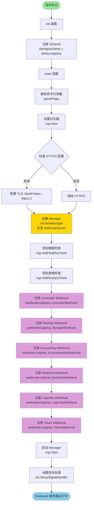

```mermaid
flowchart TD
    Start([程序启动]) --> Init[init 函数]
    Init --> InitScheme[注册 Scheme<br/>clientgoscheme + slinkyv1alpha1]

    InitScheme --> Main[main 函数]
    Main --> ParseFlags[解析命令行参数<br/>parseFlags]
    ParseFlags --> SetupLogger[设置日志器<br/>zap.New]

    SetupLogger --> ConfigHTTP2{检查 HTTP/2 配置}
    ConfigHTTP2 -->|禁用| DisableHTTP2[配置 TLS: NextProtos = http/1.1]
    ConfigHTTP2 -->|启用| EnableHTTP2[保持 HTTP/2]

    DisableHTTP2 --> CreateMgr[创建 Manager<br/>ctrl.NewManager]
    EnableHTTP2 --> CreateMgr

    CreateMgr --> CreateClientMap[创建 ClientMap<br/>clientmap.NewClientMap]
    CreateClientMap --> CreateEventCh[创建事件通道<br/>chan event.GenericEvent]

    CreateEventCh --> RegController[注册控制器 Controller<br/>controller.NewReconciler]
    RegController --> RegRestapi[注册控制器 RestApi<br/>restapi.NewReconciler]
    RegRestapi --> RegAccounting[注册控制器 Accounting<br/>accounting.NewReconciler]
    RegAccounting --> RegNodeSet[注册控制器 NodeSet<br/>nodeset.NewReconciler]
    RegNodeSet --> RegLoginSet[注册控制器 LoginSet<br/>loginset.NewReconciler]
    RegLoginSet --> RegSlurmClient[注册控制器 SlurmClient<br/>slurmclient.NewReconciler]
    RegSlurmClient --> RegToken[注册控制器 Token<br/>token.NewReconciler]

    RegToken --> AddHealthz[添加健康检查<br/>mgr.AddHealthzCheck]
    AddHealthz --> AddReadyz[添加就绪检查<br/>mgr.AddReadyzCheck]

    AddReadyz --> StartMgr[启动 Manager<br/>mgr.Start]
    StartMgr --> SetupSignal[设置信号处理<br/>ctrl.SetupSignalHandler]
    SetupSignal --> Running([Manager 运行中])

    style Start fill:#90EE90
    style Running fill:#87CEEB
    style CreateMgr fill:#FFD700
    style RegController fill:#FFA07A
    style RegRestapi fill:#FFA07A
    style RegAccounting fill:#FFA07A
    style RegNodeSet fill:#FFA07A
    style RegLoginSet fill:#FFA07A
    style RegSlurmClient fill:#FFA07A
    style RegToken fill:#FFA07A
```

# 02 - 程序入口与启动流程

## 入口函数概览

本项目包含 **两个独立的可执行程序**，分别负责控制器协调和 Webhook 验证：

| 二进制文件 | 入口文件 | 入口函数 | 主要职责 |
|-----------|---------|---------|---------|
| **manager** | `cmd/manager/main.go` | `func main()` (85-169行) | 启动控制器管理器，运行所有 CRD 协调循环 |
| **webhook** | `cmd/webhook/main.go` | `func main()` (78-160行) | 启动 Admission Webhook 服务器，验证 CRD 创建/更新/删除 |

## CLI 框架与命令行参数

项目使用 Go 标准库 `flag` 包进行命令行参数解析（无外部 CLI 框架如 cobra）。

### Manager 命令行参数

定义在 `cmd/manager/main.go:50-56` 的 `Flags` 结构体：

| 参数名 | 类型 | 默认值 | 说明 |
|-------|------|--------|------|
| `--health-addr` | string | `:8081` | 健康探测端点绑定地址 |
| `--metrics-addr` | string | `:8080` | Metrics 服务器绑定地址 |
| `--leader-elect` | bool | `false` | 启用 Leader Election（确保只有一个活动的控制器管理器） |
| `--metrics-secure` | bool | `false` | 使用安全方式提供 metrics 端点 |
| `--enable-http2` | bool | `false` | 启用 HTTP/2（默认禁用以防止 CVE） |
| `--zap-*` | - | - | Zap 日志选项（通过 `opts.BindFlags()` 绑定） |

解析函数：`parseFlags()` (`cmd/manager/main.go:58-83`)

### Webhook 命令行参数

定义在 `cmd/webhook/main.go:43-49` 的 `Flags` 结构体：

| 参数名 | 类型 | 默认值 | 说明 |
|-------|------|--------|------|
| `--health-addr` | string | `:8081` | 健康探测端点绑定地址 |
| `--metrics-addr` | string | `0` | Metrics 服务器绑定地址（禁用） |
| `--leader-elect` | bool | `false` | 启用 Leader Election |
| `--metrics-secure` | bool | `false` | 使用安全方式提供 metrics 端点 |
| `--enable-http2` | bool | `false` | 启用 HTTP/2（默认禁用） |
| `--zap-*` | - | - | Zap 日志选项 |

解析函数：`parseFlags()` (`cmd/webhook/main.go:51-76`)

## 服务框架识别

### Controller-Runtime 框架

两个程序均基于 Kubernetes **controller-runtime** 框架构建：

- **Manager**: 核心组件，负责管理控制器和 Webhook 的生命周期
- **Reconciler**: 控制器协调器，实现 CRD 的业务逻辑
- **Webhook Server**: Admission Webhook 服务器，实现验证和默认值设置

### HTTP 服务

- **Metrics Server**: Prometheus metrics 端点（默认 `:8080` for manager, `0` for webhook）
- **Health Probes**: 健康检查端点（`:8081`）
  - `/healthz` - 存活探测
  - `/readyz` - 就绪探测
- **Webhook Server**: HTTPS 服务器，接收 Kubernetes API Server 的 Admission 请求

## Manager 启动流程详解

### Mermaid 流程图



### 启动阶段详解

#### 1. 初始化阶段 (init 函数)

**位置**: `cmd/manager/main.go:42-47`

```go
func init() {
    utilruntime.Must(clientgoscheme.AddToScheme(scheme))
    utilruntime.Must(slinkyv1alpha1.AddToScheme(scheme))
}
```

**作用**:
- 注册 Kubernetes 内置资源类型到 Scheme
- 注册自定义 CRD 类型 (`Controller`, `NodeSet`, `LoginSet`, `Accounting`, `RestApi`, `Token`) 到 Scheme

#### 2. 配置加载阶段

**位置**: `cmd/manager/main.go:85-90`

**步骤**:
1. 创建 `Flags` 结构体
2. 创建 Zap 日志选项并绑定到 `flag.CommandLine`
3. 调用 `parseFlags()` 解析命令行参数
4. 设置全局日志器 `ctrl.SetLogger(zap.New(...))`

#### 3. HTTP/2 安全配置

**位置**: `cmd/manager/main.go:98-106`

**逻辑**:
- 默认禁用 HTTP/2 以防止 Stream Cancellation 和 Rapid Reset CVE 漏洞
- 如果 `--enable-http2=false`（默认），配置 TLS 只允许 HTTP/1.1
- 参考: [GHSA-qppj-fm5r-hxr3](https://github.com/advisories/GHSA-qppj-fm5r-hxr3), [GHSA-4374-p667-p6c8](https://github.com/advisories/GHSA-4374-p667-p6c8)

#### 4. Manager 创建

**位置**: `cmd/manager/main.go:108-122`

**关键配置**:
- `Scheme`: 资源类型注册表
- `Metrics.BindAddress`: Metrics 服务器地址 (`:8080`)
- `HealthProbeBindAddress`: 健康检查地址 (`:8081`)
- `LeaderElection`: Leader Election 配置
- `LeaderElectionID`: `0033bda7.slinky.slurm.net`

#### 5. 依赖初始化

**位置**: `cmd/manager/main.go:124-125`

```go
clientMap := clientmap.NewClientMap()
eventCh := make(chan event.GenericEvent, 100)
```

**关键依赖**:
- **ClientMap**: 线程安全的 Slurm 客户端连接映射表
- **eventCh**: 事件通道，用于 `NodeSet` 和 `SlurmClient` 控制器之间的通信

#### 6. 控制器注册

**位置**: `cmd/manager/main.go:126-153`

**注册顺序**:
1. **Controller** - 管理 slurmctld (传入 `clientMap`)
2. **RestApi** - 管理 slurmrestd
3. **Accounting** - 管理 slurmdbd
4. **NodeSet** - 管理 slurmd 计算节点 (传入 `clientMap` 和 `eventCh`)
5. **LoginSet** - 管理登录节点
6. **SlurmClient** - 内部控制器，管理 Slurm 客户端连接 (传入 `clientMap` 和 `eventCh`)
7. **Token** - 管理 JWT token 生成

**注册模式**:
```go
if err := <Controller>.NewReconciler(mgr.GetClient(), ...).SetupWithManager(mgr); err != nil {
    setupLog.Error(err, "unable to create controller", "controller", "<Name>")
    os.Exit(1)
}
```

#### 7. 健康检查注册

**位置**: `cmd/manager/main.go:155-162`

- `/healthz` - 存活探测 (Liveness Probe)
- `/readyz` - 就绪探测 (Readiness Probe)
- 使用 `healthz.Ping` 处理器

#### 8. Manager 启动

**位置**: `cmd/manager/main.go:164-168`

```go
setupLog.Info("starting manager")
if err := mgr.Start(ctrl.SetupSignalHandler()); err != nil {
    setupLog.Error(err, "problem running controller")
    os.Exit(1)
}
```

**启动逻辑**:
- 调用 `mgr.Start()` 启动 Manager
- 传入 `ctrl.SetupSignalHandler()` 处理 SIGTERM/SIGINT 信号
- Manager 启动后会：
  - 启动 Metrics 服务器
  - 启动健康检查服务器
  - 启动所有控制器的协调循环
  - 处理 Leader Election（如果启用）

## Webhook 启动流程详解

### Mermaid 流程图



### 启动阶段详解

#### 1. 初始化阶段 (init 函数)

**位置**: `cmd/webhook/main.go:35-40`

与 Manager 相同，注册 Scheme。

#### 2. 配置加载阶段

**位置**: `cmd/webhook/main.go:78-83`

与 Manager 相同，解析参数和设置日志器。

#### 3. HTTP/2 安全配置

**位置**: `cmd/webhook/main.go:91-99`

与 Manager 相同，默认禁用 HTTP/2。

#### 4. Manager 创建（包含 Webhook Server）

**位置**: `cmd/webhook/main.go:101-118`

**关键差异**:
- 包含 `WebhookServer` 配置：
  ```go
  WebhookServer: webhook.NewServer(webhook.Options{
      TLSOpts: tlsOpts,
  }),
  ```
- Metrics 服务器地址默认为 `0`（禁用）

#### 5. 健康检查注册

**位置**: `cmd/webhook/main.go:120-127`

与 Manager 相同。

#### 6. Webhook 注册

**位置**: `cmd/webhook/main.go:128-153`

**注册顺序**:
1. **ControllerWebhook** - 验证 `Controller` CRD (需要 `Client`)
2. **RestapiWebhook** - 验证 `RestApi` CRD
3. **AccountingSetWebhook** - 验证 `Accounting` CRD
4. **NodeSetWebhook** - 验证 `NodeSet` CRD
5. **LoginSetWebhook** - 验证 `LoginSet` CRD
6. **TokenWebhook** - 验证 `Token` CRD

**注册模式**:
```go
if err := (&webhookv1alpha1.<Name>Webhook{...}).SetupWebhookWithManager(mgr); err != nil {
    setupLog.Error(err, "unable to create webhook", "webhook", "<Name>")
    os.Exit(1)
}
```

**Webhook 功能**:
- `Default()`: 设置默认值
- `ValidateCreate()`: 验证创建操作
- `ValidateUpdate()`: 验证更新操作（如不可变字段检查）
- `ValidateDelete()`: 验证删除操作

#### 7. Manager 启动

**位置**: `cmd/webhook/main.go:155-159`

```go
setupLog.Info("starting manager")
if err := mgr.Start(ctrl.SetupSignalHandler()); err != nil {
    setupLog.Error(err, "problem running controller")
    os.Exit(1)
}
```

**启动逻辑**:
- 启动 Webhook HTTPS 服务器
- 等待 Kubernetes API Server 的 Admission 请求
- 处理信号以优雅关闭

## 整体启动流程对比

### Manager vs Webhook

| 阶段 | Manager | Webhook |
|-----|---------|---------|
| **Scheme 注册** | ✓ 相同 | ✓ 相同 |
| **参数解析** | ✓ 相同 | ✓ 相同 |
| **日志设置** | ✓ 相同 | ✓ 相同 |
| **HTTP/2 配置** | ✓ 相同 | ✓ 相同 |
| **Manager 创建** | Metrics 默认 `:8080` | Metrics 默认 `0`，包含 WebhookServer |
| **依赖初始化** | ClientMap + eventCh | 无 |
| **控制器注册** | 7 个控制器 | 无 |
| **Webhook 注册** | 无 | 6 个 Webhook |
| **健康检查** | ✓ 相同 | ✓ 相同 |
| **启动运行** | 协调循环 | Webhook HTTPS 服务器 |

## 关键设计考虑

### 1. 职责分离
- **Manager**: 专注于业务逻辑协调
- **Webhook**: 专注于验证和默认值设置
- 两者独立部署，提高安全性和可维护性

### 2. Leader Election
- 支持多副本部署（高可用）
- 通过 `--leader-elect` 启用
- Leader Election ID: `0033bda7.slinky.slurm.net`

### 3. 安全性
- 默认禁用 HTTP/2 防止 CVE 漏洞
- Webhook 使用 TLS 加密通信
- 支持安全的 Metrics 端点

### 4. 可观测性
- Prometheus Metrics
- 健康检查端点 (`/healthz`, `/readyz`)
- 结构化日志 (Zap)

### 5. 优雅关闭
- 使用 `ctrl.SetupSignalHandler()` 监听 SIGTERM/SIGINT
- Manager 在收到信号后会优雅关闭所有控制器和服务器

## 运行示例

### 运行 Manager

```bash
# 基本运行
go run cmd/manager/main.go

# 启用 Leader Election
go run cmd/manager/main.go --leader-elect

# 自定义地址
go run cmd/manager/main.go --metrics-addr=:9090 --health-addr=:9091

# 启用 HTTP/2
go run cmd/manager/main.go --enable-http2

# 调试日志
go run cmd/manager/main.go --zap-log-level=debug
```

### 运行 Webhook

```bash
# 基本运行
go run cmd/webhook/main.go

# 启用 Leader Election
go run cmd/webhook/main.go --leader-elect

# 自定义健康检查地址
go run cmd/webhook/main.go --health-addr=:9091

# 调试日志
go run cmd/webhook/main.go --zap-log-level=debug
```

## 相关文件索引

| 组件 | 文件路径 | 说明 |
|------|---------|------|
| Manager 入口 | [cmd/manager/main.go](cmd/manager/main.go) | Manager 主程序 |
| Webhook 入口 | [cmd/webhook/main.go](cmd/webhook/main.go) | Webhook 主程序 |
| Controller API | [api/v1alpha1/controller_types.go](api/v1alpha1/controller_types.go) | Controller CRD 定义 |
| NodeSet API | [api/v1alpha1/nodeset_types.go](api/v1alpha1/nodeset_types.go) | NodeSet CRD 定义 |
| ClientMap | [internal/clientmap/clientmap.go](internal/clientmap/clientmap.go) | Slurm 客户端连接管理 |
| Controller Reconciler | [internal/controller/controller/](internal/controller/controller/) | Controller 协调器 |
| NodeSet Reconciler | [internal/controller/nodeset/](internal/controller/nodeset/) | NodeSet 协调器 |
| Controller Webhook | [internal/webhook/v1alpha1/controller_webhook.go](internal/webhook/v1alpha1/controller_webhook.go) | Controller Webhook |
| NodeSet Webhook | [internal/webhook/v1alpha1/nodeset_webhook.go](internal/webhook/v1alpha1/nodeset_webhook.go) | NodeSet Webhook |
