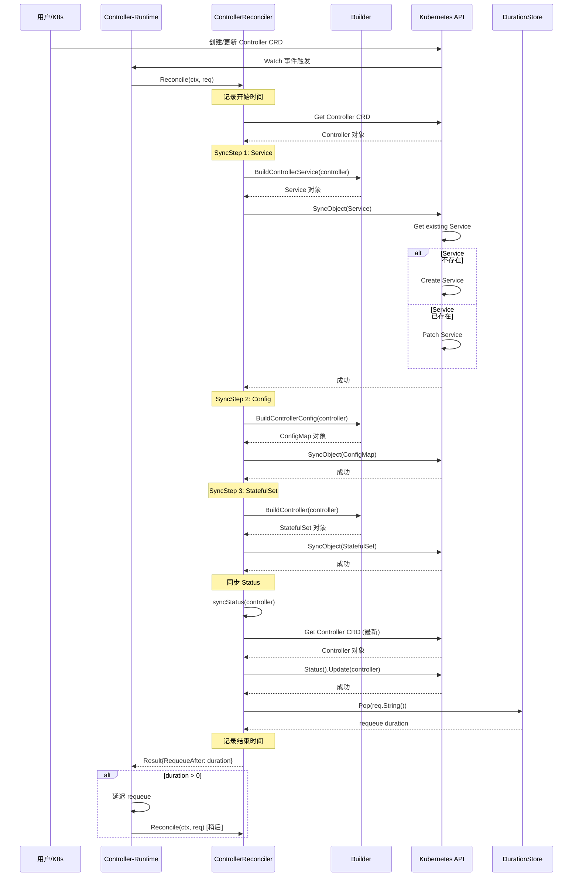

# 03 - 核心调用链

## 概述

本文档详细说明 Slurm Operator 中控制器的核心调用链，包括函数调用树、关键分支和时序图。本文档以两个最具代表性的控制器为例：
- **ControllerReconciler**: 最简单的控制器，管理 slurmctld 守护进程
- **NodeSetReconciler**: 最复杂的控制器，管理 slurmd 计算节点

## 1. Controller 控制器调用链 (简单模式)

### 1.1 函数调用树

```
main() → cmd/manager/main.go:85
  ├─ parseFlags() → cmd/manager/main.go:58
  ├─ ctrl.SetLogger() → 设置全局日志器
  ├─ ctrl.NewManager() → 创建控制器管理器
  ├─ controller.NewReconciler() → internal/controller/controller/controller_controller.go:127
  │   └─ 创建 ControllerReconciler 实例，初始化 Builder、RefResolver、EventRecorder
  ├─ SetupWithManager() → internal/controller/controller/controller_controller.go:106
  │   ├─ ctrl.NewControllerManagedBy() → 注册控制器
  │   ├─ For(&slinkyv1alpha1.Controller{}) → 监听 Controller CRD
  │   ├─ Owns(&appsv1.StatefulSet{}) → 监听 StatefulSet 变化
  │   ├─ Owns(&corev1.Service{}) → 监听 Service 变化
  │   ├─ Owns(&corev1.ConfigMap{}) → 监听 ConfigMap 变化
  │   ├─ Watches(&slinkyv1alpha1.Accounting{}) → 监听 Accounting CRD
  │   └─ Complete(r) → 完成注册
  └─ mgr.Start() → 启动管理器，开始协调循环

【协调循环】当 Controller CRD 发生变化时触发：

Reconcile() → internal/controller/controller/controller_controller.go:75
  ├─ 【前置】启动 backoff GC goroutine (仅一次)
  ├─ 【前置】记录开始时间
  ├─ 【核心】Sync() → internal/controller/controller/controller_sync.go:26
  │   ├─ r.Get() → 获取 Controller CRD 对象
  │   │   └─ 【分支：NotFound】返回 nil (对象已删除)
  │   │
  │   ├─ 【SyncStep 1: Service】
  │   │   ├─ r.builder.BuildControllerService() → internal/builder/controller_service.go
  │   │   │   └─ 构造 Service 对象 (slurmctld 服务)
  │   │   └─ objectutils.SyncObject() → internal/utils/objectutils/patch.go:23
  │   │       ├─ r.Get() → 获取现有对象
  │   │       ├─ 【分支：NotFound】r.Create() → 创建新对象
  │   │       └─ 【分支：Found】r.Patch() → 使用 Strategic Merge Patch 更新对象
  │   │
  │   ├─ 【SyncStep 2: Config】
  │   │   ├─ r.builder.BuildControllerConfig() → internal/builder/controller_config.go
  │   │   │   └─ 构造 ConfigMap 对象 (slurm.conf 配置)
  │   │   └─ objectutils.SyncObject() → 同步 ConfigMap
  │   │
  │   ├─ 【SyncStep 3: StatefulSet】
  │   │   ├─ r.builder.BuildController() → internal/builder/controller_app.go
  │   │   │   └─ 构造 StatefulSet 对象 (slurmctld pod)
  │   │   └─ objectutils.SyncObject() → 同步 StatefulSet
  │   │
  │   └─ r.syncStatus() → internal/controller/controller/controller_sync_status.go:22
  │       ├─ 构建新的 Status 对象
  │       ├─ 比较新旧 Status (DeepEqual)
  │       ├─ 【分支：Status 未变化】跳过更新
  │       └─ 【分支：Status 已变化】r.updateStatus()
  │           └─ retry.RetryOnConflict() → 重试机制
  │               ├─ r.Get() → 重新获取最新对象
  │               └─ r.Status().Update() → 更新 Status 子资源
  │
  ├─ 【后置】durationStore.Pop() → 获取 requeue 延迟时间
  ├─ 【后置】记录结束时间和日志
  └─ 返回 Result{RequeueAfter: duration}
```

### 1.2 关键函数说明

| 函数路径 | 作用 | 关键点 |
|---------|------|--------|
| `Reconcile()` | 协调循环入口，处理 Controller CRD 变化 | 启动 backoff GC、记录时长、处理 requeue |
| `Sync()` | 核心同步逻辑，顺序执行 SyncSteps | 按顺序同步 Service、Config、StatefulSet |
| `BuildControllerService()` | 构造 Service 对象 | 使用 Builder 模式，合并用户配置和默认配置 |
| `BuildControllerConfig()` | 构造 ConfigMap 对象 | 生成 slurm.conf 配置文件 |
| `BuildController()` | 构造 StatefulSet 对象 | 定义 slurmctld pod 规格 |
| `SyncObject()` | 核心的创建/更新逻辑 | Get → Create (NotFound) / Patch (Found) |
| `syncStatus()` | 同步 Status 子资源 | DeepEqual 比较 → 跳过或更新 |
| `updateStatus()` | 更新 Status (带重试) | RetryOnConflict 防止冲突 |

### 1.3 关键分支

#### 错误处理分支
- **对象不存在**: `Get()` 返回 `IsNotFound` 错误 → 返回 `nil` (协调完成)
- **创建失败**: `Create()` 失败 → 返回错误 → Controller-Runtime 自动 requeue
- **更新失败**: `Patch()` 失败 → 返回错误 → 自动 requeue
- **Status 冲突**: `RetryOnConflict` 重试机制 → 最多重试 10 次

#### Requeue 机制
- **durationStore**: 子函数通过 `durationStore.Push()` 通知需要 requeue 的时长
- **Reconcile()** 返回时从 `durationStore.Pop()` 获取延迟时间
- 返回 `Result{RequeueAfter: duration}` 让 Controller-Runtime 延迟重新协调

### 1.4 时序图



## 2. NodeSet 控制器调用链 (复杂模式)

### 2.1 函数调用树

```
Reconcile() → internal/controller/nodeset/nodeset_controller.go:99
  ├─ 【前置】启动 backoff GC goroutine (仅一次)
  ├─ 【前置】记录开始时间
  ├─ 【核心】Sync() → internal/controller/nodeset/nodeset_sync.go:44
  │   ├─ r.Get() → 获取 NodeSet CRD 对象
  │   │   └─ 【分支：NotFound】清理 expectations → 返回 nil
  │   │
  │   ├─ nodeset.DeepCopy() → 避免 client cache 突变
  │   │
  │   ├─ r.adoptOrphanRevisions() → 领养孤儿 ControllerRevision
  │   │   ├─ r.listRevisions() → 列出所有 ControllerRevision
  │   │   ├─ 查找孤儿 (无 ControllerRef)
  │   │   └─ r.historyControl.AdoptControllerRevision() → 设置 OwnerReference
  │   │
  │   ├─ r.getNodeSetRevisions() → 获取当前和更新版本的 Revision
  │   │   └─ 计算 hash、collisionCount
  │   │
  │   ├─ r.getNodeSetPods() → 获取 NodeSet 的所有 Pod
  │   │   ├─ r.List() → 列出所有 Pod
  │   │   ├─ 过滤：nodesetutils.IsPodFromNodeSet()
  │   │   └─ kubecontroller.NewPodControllerRefManager().ClaimPods()
  │   │       ├─ 领养符合 Selector 的 Pod
  │   │       └─ 孤化不符合 Selector 的 Pod
  │   │
  │   ├─ 【检查】r.expectations.SatisfiedExpectations()
  │   │   └─ 【分支：期望未满足 或 DeletionTimestamp 非空】
  │   │       └─ 仅执行 r.syncStatus() → 返回
  │   │
  │   ├─ 【核心】r.sync() → 主协调逻辑
  │   │   ├─ r.slurmControl.RefreshNodeCache() → 刷新 Slurm 节点缓存
  │   │   │   └─ 通过 ClientMap 调用 Slurm API
  │   │   │
  │   │   ├─ r.syncClusterWorkerService() → 同步 Service
  │   │   │   ├─ r.builder.BuildClusterWorkerService()
  │   │   │   ├─ nodesetutils.SetOwnerReferences() → 设置 Controller 为 Owner
  │   │   │   └─ objectutils.SyncObject()
  │   │   │
  │   │   ├─ r.syncClusterWorkerPDB() → 同步 PodDisruptionBudget
  │   │   │   ├─ r.builder.BuildClusterWorkerPodDisruptionBudget()
  │   │   │   └─ objectutils.SyncObject()
  │   │   │
  │   │   ├─ r.syncSlurmDeadline() → 同步 Slurm 节点工作负载截止时间
  │   │   │   ├─ r.slurmControl.GetNodeDeadlines() → 获取各节点的截止时间
  │   │   │   └─ utils.SlowStartBatch() → 批量更新 Pod 注解
  │   │   │       └─ r.Patch() → 更新 AnnotationPodDeadline
  │   │   │
  │   │   ├─ r.syncCordon() → 同步 cordon/drain 状态
  │   │   │   └─ utils.SlowStartBatch() → 批量处理
  │   │   │       ├─ r.Get() → 获取 Kubernetes Node
  │   │   │       ├─ 【分支：Node cordoned】r.makePodCordonAndDrain()
  │   │   │       ├─ 【分支：Pod cordoned】r.syncSlurmNodeDrain()
  │   │   │       └─ 【分支：Pod uncordoned】r.syncSlurmNodeUndrain()
  │   │   │
  │   │   └─ r.syncNodeSet() → 协调 Pod 副本数
  │   │       ├─ 计算 diff = len(pods) - replicaCount
  │   │       ├─ 【分支：diff < 0】r.doPodScaleOut() → 扩容
  │   │       │   ├─ utils.SlowStartBatch(uncordonFn) → 批量 uncordon 现有 Pod
  │   │       │   ├─ 计算可用的 ordinal 编号
  │   │       │   ├─ r.newNodeSetPod() → 为每个新 Pod 创建对象
  │   │       │   ├─ r.expectations.ExpectCreations() → 设置创建期望
  │   │       │   └─ utils.SlowStartBatch() → 批量创建 Pod
  │   │       │       └─ r.podControl.CreateNodeSetPod()
  │   │       │
  │   │       ├─ 【分支：diff > 0】r.doPodScaleIn() → 缩容
  │   │       │   ├─ nodesetutils.SplitActivePods() → 分离待删除和保留的 Pod
  │   │       │   ├─ utils.SlowStartBatch(uncordonFn) → 批量 uncordon 保留的 Pod
  │   │       │   ├─ utils.SlowStartBatch(fixPodPVCsFn) → 修复 PVC retention policy
  │   │       │   ├─ r.expectations.ExpectDeletions() → 设置删除期望
  │   │       │   └─ utils.SlowStartBatch() → 批量处理待删除 Pod
  │   │       │       ├─ r.processCondemned() → 处理被判定的 Pod
  │   │       │       │   ├─ 【分支：Pod terminating】跳过
  │   │       │       │   ├─ r.slurmControl.IsNodeDrained() → 检查 Slurm 节点是否已 drained
  │   │       │       │   ├─ 【分支：Running 且未 drained】
  │   │       │       │   │   ├─ durationStore.Push(30s) → 30秒后 requeue
  │   │       │       │   │   └─ r.makePodCordonAndDrain() → cordon 并 drain
  │   │       │       │   └─ 【分支：已 drained】r.podControl.DeleteNodeSetPod()
  │   │       │       └─ r.slurmControl.IsNodeDrained() → 再次检查
  │   │       │
  │   │       └─ 【分支：diff == 0】r.doPodProcessing() → 常规处理
  │   │           ├─ r.splitUpdatePods() → 分离需更新和保留的 Pod
  │   │           ├─ utils.SlowStartBatch(uncordonFn) → 批量 uncordon 保留的 Pod
  │   │           ├─ r.expectations.SetExpectations(0, 0) → 重置期望
  │   │           └─ utils.SlowStartBatch(processReplicaFn) → 批量处理副本
  │   │               └─ r.processReplica() → 处理单个副本
  │   │                   ├─ 【分支：Failed 或 Succeeded】r.podControl.DeleteNodeSetPod()
  │   │                   └─ 【分支：其他】r.podControl.UpdateNodeSetPod()
  │   │
  │   ├─ 【检查】r.expectations.SatisfiedExpectations() → 再次检查期望
  │   │   └─ 【分支：期望已满足】
  │   │       ├─ r.syncUpdate() → 同步更新策略
  │   │       │   ├─ 【分支：OnDelete】什么都不做
  │   │       │   └─ 【分支：RollingUpdate】r.syncRollingUpdate()
  │   │       │       ├─ findUpdatedPods() → 查找新旧 Pod
  │   │       │       ├─ nodesetutils.SplitUnhealthyPods() → 分离不健康的 Pod
  │   │       │       ├─ r.doPodScaleIn(unhealthyPods) → 删除不健康的 Pod
  │   │       │       ├─ r.splitUpdatePods() → 计算可更新的 Pod 数量
  │   │       │       │   └─ 基于 MaxUnavailable 计算
  │   │       │       └─ r.doPodScaleIn(podsToDelete) → 滚动更新删除旧 Pod
  │   │       │
  │   │       └─ r.truncateHistory() → 清理旧的 ControllerRevision
  │   │           └─ r.historyControl.DeleteControllerRevisions()
  │   │
  │   └─ r.syncStatus() → 同步 Status
  │       └─ internal/controller/nodeset/nodeset_sync_status.go
  │
  ├─ 【后置】durationStore.Pop() → 获取 requeue 延迟时间
  ├─ 【后置】记录结束时间和日志
  └─ 返回 Result{RequeueAfter: duration}
```

### 2.2 关键函数说明

| 函数路径 | 作用 | 关键点 |
|---------|------|--------|
| `Reconcile()` | 协调循环入口 | 与 Controller 类似，但逻辑更复杂 |
| `Sync()` | 核心同步逻辑 | 包含 Pod 生命周期管理和 Slurm 状态同步 |
| `adoptOrphanRevisions()` | 领养孤儿 ControllerRevision | 确保版本历史归属正确 |
| `getNodeSetRevisions()` | 获取版本信息 | 计算当前版本和更新版本的 hash |
| `getNodeSetPods()` | 获取并领养 Pod | 使用 ControllerRefManager 领养/孤化 |
| `sync()` | 主协调逻辑 | 刷新缓存 → Service → PDB → Deadline → Cordon → Pod 副本数 |
| `slurmControl.RefreshNodeCache()` | 刷新 Slurm 节点缓存 | 通过 ClientMap 调用 Slurm API |
| `syncClusterWorkerService()` | 同步 Service | 为计算节点创建 Headless Service |
| `syncClusterWorkerPDB()` | 同步 PodDisruptionBudget | 防止过多 Pod 同时中断 |
| `syncSlurmDeadline()` | 同步工作负载截止时间 | 获取并更新 Pod 注解 |
| `syncCordon()` | 同步 cordon/drain 状态 | K8s Node cordon ↔ Slurm Node drain |
| `syncNodeSet()` | 协调 Pod 副本数 | 扩容/缩容/常规处理 |
| `doPodScaleOut()` | 扩容逻辑 | Uncordon → 计算 ordinal → 期望创建 → 批量创建 |
| `doPodScaleIn()` | 缩容逻辑 | Uncordon 保留 → 修复 PVC → 期望删除 → 批量删除 |
| `doPodProcessing()` | 常规处理逻辑 | Uncordon → 重置期望 → 批量处理副本 |
| `processCondemned()` | 处理被判定的 Pod | 检查 drained → Cordon & Drain → 删除 |
| `processReplica()` | 处理单个副本 | 删除 Failed/Succeeded Pod，更新其他 Pod |
| `syncUpdate()` | 同步更新策略 | OnDelete 或 RollingUpdate |
| `syncRollingUpdate()` | 滚动更新逻辑 | 删除不健康 → 计算可更新数 → 滚动删除旧 Pod |
| `truncateHistory()` | 清理版本历史 | 保留有限数量的 ControllerRevision |

### 2.3 关键分支

#### 并发控制 - Expectations 机制
- **ExpectCreations()**: 在创建 Pod 前设置期望，记录预期创建的 Pod 数量
- **ExpectDeletions()**: 在删除 Pod 前设置期望，记录预期删除的 Pod UIDs
- **SatisfiedExpectations()**: 检查期望是否满足
  - **未满足**: 跳过主协调逻辑，仅更新 Status → 等待 Informer 观察到 Pod 变化
  - **已满足**: 执行完整协调逻辑
- **CreationObserved()**: Informer 观察到 Pod 创建事件时调用
- **DeletionObserved()**: Informer 观察到 Pod 删除事件时调用

#### 批量处理 - SlowStartBatch 机制
- **utils.SlowStartBatch()**: 批量处理函数，从小批量开始，成功后倍增批量大小
  - 初始批量: `SlowStartInitialBatchSize` (通常为 1)
  - 倍增策略: 成功后批量大小翻倍
  - 失败处理: 返回成功数量，跳过剩余
- **用途**:
  - 创建 Pod: 防止大量失败请求淹没 API Server
  - 更新 Pod: 批量更新注解、标签
  - Cordon/Uncordon: 批量更新 cordon 状态

#### Slurm 状态同步
- **Cordon → Drain**: Pod 被 cordon → Slurm 节点被 drain
- **Uncordon → Undrain**: Pod 被 uncordon → Slurm 节点被 undrain
- **K8s Node cordon**: 外部 cordon K8s Node → 自动 cordon 该 Node 上的所有 NodeSet Pod
- **Drain 检查**: 删除 Pod 前必须等待 Slurm 节点完全 drained
  - **未 drained**: Requeue 30 秒后重试
  - **已 drained**: 执行删除

#### 更新策略分支
- **OnDelete**: 用户手动删除 Pod 后才会使用新版本重建
- **RollingUpdate**: 自动滚动更新
  - 删除不健康的旧 Pod
  - 根据 `MaxUnavailable` 计算可同时更新的 Pod 数量
  - 批量删除旧 Pod，触发重建为新版本

#### 错误处理
- **Get 失败**: 返回错误 → 自动 requeue
- **Create/Delete 失败**:
  - `IsNotFound`: 忽略 (对象已不存在)
  - `NamespaceTerminatingCause`: 忽略 (namespace 正在删除)
  - 其他错误: 返回错误 → 自动 requeue
- **Slurm API 失败**: 返回错误 → 自动 requeue
- **Expectations 未满足**: 跳过主逻辑 → 仅更新 Status → 等待 Informer 事件

### 2.4 时序图

```mermaid
sequenceDiagram
    participant User as 用户/K8s
    participant CR as Controller-Runtime
    participant Rec as NodeSetReconciler
    participant Slurm as SlurmControl
    participant Builder as Builder
    participant K8s as Kubernetes API
    participant Exp as Expectations
    participant DStore as DurationStore

    User->>K8s: 创建/更新 NodeSet CRD
    K8s->>CR: Watch 事件触发
    CR->>Rec: Reconcile(ctx, req)

    Note over Rec: 记录开始时间

    Rec->>K8s: Get NodeSet CRD
    K8s-->>Rec: NodeSet 对象
    Rec->>Rec: DeepCopy() 避免缓存突变

    Rec->>Rec: adoptOrphanRevisions()
    Rec->>Rec: getNodeSetRevisions()
    Rec->>K8s: List & Claim Pods
    K8s-->>Rec: Pod 列表

    Rec->>Exp: SatisfiedExpectations(key)
    Exp-->>Rec: true/false

    alt Expectations 未满足
        Note over Rec: 跳过主逻辑，仅更新 Status
        Rec->>Rec: syncStatus()
        Rec-->>CR: Result{RequeueAfter: 0}
    else Expectations 已满足

        Note over Rec: sync() - 主协调逻辑

        Rec->>Slurm: RefreshNodeCache(nodeset)
        Slurm->>Slurm: 调用 Slurm API
        Slurm-->>Rec: 节点状态缓存已刷新

        Rec->>Builder: BuildClusterWorkerService()
        Builder-->>Rec: Service 对象
        Rec->>K8s: SyncObject(Service)
        K8s-->>Rec: 成功

        Rec->>Builder: BuildClusterWorkerPDB()
        Builder-->>Rec: PDB 对象
        Rec->>K8s: SyncObject(PDB)
        K8s-->>Rec: 成功

        Rec->>Slurm: GetNodeDeadlines(nodeset, pods)
        Slurm-->>Rec: 节点截止时间 Map
        Rec->>K8s: SlowStartBatch(Patch Pod annotations)
        K8s-->>Rec: 成功

        Rec->>K8s: SlowStartBatch(syncCordon)
        loop 每个 Pod
            Rec->>K8s: Get Kubernetes Node
            K8s-->>Rec: Node 对象
            alt Node cordoned
                Rec->>Rec: makePodCordonAndDrain()
                Rec->>K8s: Patch Pod (add cordon annotation)
                Rec->>Slurm: MakeNodeDrain(pod)
            else Pod cordoned
                Rec->>Slurm: MakeNodeDrain(pod)
            else Pod uncordoned
                Rec->>Slurm: MakeNodeUndrain(pod)
            end
        end
        K8s-->>Rec: 成功

        Note over Rec: syncNodeSet() - 协调副本数

        Rec->>Rec: 计算 diff = len(pods) - replicas

        alt diff < 0 (需要扩容)
            Rec->>K8s: SlowStartBatch(uncordon existing pods)
            Rec->>Rec: 计算可用 ordinals
            Rec->>Rec: 为每个新 Pod 创建对象
            Rec->>Exp: ExpectCreations(key, numCreate)
            Rec->>K8s: SlowStartBatch(CreateNodeSetPod)
            K8s-->>Rec: 成功创建 N 个 Pod
        else diff > 0 (需要缩容)
            Rec->>Rec: SplitActivePods() 分离待删除和保留
            Rec->>K8s: SlowStartBatch(uncordon pods to keep)
            Rec->>K8s: SlowStartBatch(fix PVCs)
            Rec->>Exp: ExpectDeletions(key, podKeys)
            Rec->>K8s: SlowStartBatch(processCondemned)
            loop 每个被判定的 Pod
                Rec->>K8s: Get Pod (最新)
                alt Pod terminating
                    Note over Rec: 跳过
                else Pod running && not drained
                    Rec->>DStore: Push(key, 30s)
                    Rec->>Rec: makePodCordonAndDrain()
                    Rec->>K8s: Patch Pod (add cordon)
                    Rec->>Slurm: MakeNodeDrain(pod)
                else Pod drained
                    Rec->>K8s: DeleteNodeSetPod(pod)
                end
            end
            K8s-->>Rec: 成功
        else diff == 0 (常规处理)
            Rec->>Rec: splitUpdatePods()
            Rec->>K8s: SlowStartBatch(uncordon pods to keep)
            Rec->>Exp: SetExpectations(key, 0, 0)
            Rec->>K8s: SlowStartBatch(processReplica)
            loop 每个副本
                alt Pod Failed/Succeeded
                    Rec->>K8s: DeleteNodeSetPod(pod)
                else
                    Rec->>K8s: UpdateNodeSetPod(pod)
                end
            end
            K8s-->>Rec: 成功
        end

        Rec->>Exp: SatisfiedExpectations(key)
        Exp-->>Rec: true

        Note over Rec: syncUpdate() - 同步更新策略

        alt RollingUpdate
            Rec->>Rec: findUpdatedPods() 查找新旧 Pod
            Rec->>Rec: SplitUnhealthyPods() 分离不健康
            Rec->>K8s: doPodScaleIn(unhealthyPods)
            Rec->>Rec: splitUpdatePods() 计算可更新数
            Rec->>K8s: doPodScaleIn(podsToDelete)
        end

        Rec->>Rec: truncateHistory() 清理旧版本

        Rec->>Rec: syncStatus()
        Rec->>K8s: Status().Update(nodeset)
        K8s-->>Rec: 成功

        Rec->>DStore: Pop(req.String())
        DStore-->>Rec: requeue duration

        Note over Rec: 记录结束时间
        Rec-->>CR: Result{RequeueAfter: duration}
    end

    alt duration > 0
        CR->>CR: 延迟 requeue
        CR->>Rec: Reconcile(ctx, req) [稍后]
    end
```



## 3. 核心工具函数调用链

### 3.1 SyncObject 调用链

```
SyncObject() → internal/utils/objectutils/patch.go:23
  ├─ 【步骤 1】类型断言，创建对应的空对象
  ├─ 【步骤 2】r.Get(ctx, key, oldObj)
  │   ├─ 【分支：NotFound】r.Create(ctx, newObj) → 返回
  │   └─ 【分支：Found】继续下一步
  ├─ 【步骤 3】检查 DeletionTimestamp
  │   └─ 【分支：非零】跳过更新 → 返回
  ├─ 【步骤 4】检查 shouldUpdate 参数
  │   └─ 【分支：false】跳过更新 → 返回
  ├─ 【步骤 5】类型特定的 Patch 逻辑
  │   ├─ ConfigMap: 检查 Immutable → 合并 Annotations/Labels → 更新 Data
  │   ├─ Secret: 检查 Immutable → 合并 Annotations/Labels → 更新 Data/StringData
  │   ├─ Service: 合并 Annotations/Labels → 更新 Spec
  │   ├─ Deployment: 合并 Annotations/Labels → 更新 MinReadySeconds/Replicas/Strategy/Template
  │   ├─ StatefulSet: 合并 Annotations/Labels → 更新 MinReadySeconds/Ordinals/PVCRetentionPolicy/Replicas/Template/UpdateStrategy
  │   ├─ CRD (Controller/RestApi/Accounting/NodeSet/LoginSet): 合并 Annotations/Labels → 更新 Spec
  │   └─ PDB: 合并 Annotations/Labels → 更新 MaxUnavailable/MinAvailable/Selector
  └─ 【步骤 6】r.Patch(ctx, oldObj, patch)
      └─ 使用 client.MergeFrom 进行 Strategic Merge Patch
```

**作用**: 通用的创建/更新逻辑，支持多种 Kubernetes 资源类型
**关键点**:
- Get → NotFound → Create
- Get → Found → Patch (Strategic Merge)
- 支持 Immutable 检查
- 支持 DeletionTimestamp 检查

### 3.2 Builder 调用链示例

```
BuildController() → internal/builder/controller_app.go
  ├─ 创建 StatefulSet 对象
  ├─ 设置 ObjectMeta (Name, Namespace, Labels, Annotations)
  ├─ 设置 Spec
  │   ├─ Replicas: ptr.To[int32](1)
  │   ├─ ServiceName: controller.ServiceName()
  │   ├─ Selector: labels.NewBuilder().WithControllerSelectorLabels()
  │   ├─ Template: b.BuildControllerPodTemplate()
  │   │   ├─ 设置 PodTemplateSpec.ObjectMeta
  │   │   ├─ 合并用户提供的 PodTemplate
  │   │   ├─ 构建 Container: b.BuildControllerContainer()
  │   │   │   ├─ 设置 Image、Command、Args
  │   │   │   ├─ 设置 Ports、Env、VolumeMounts
  │   │   │   └─ 合并用户提供的 Container 配置
  │   │   ├─ 构建 InitContainers
  │   │   ├─ 构建 Volumes
  │   │   └─ 设置 SecurityContext、ServiceAccount 等
  │   ├─ VolumeClaimTemplates: 为持久化存储创建 PVC
  │   └─ UpdateStrategy: RollingUpdate
  └─ 返回 StatefulSet 对象
```

**作用**: 从 CRD 构造 Kubernetes 资源对象
**关键点**:
- 分层构建: App → PodTemplate → Container
- 合并用户配置和默认配置
- 使用 Builder 模式封装复杂逻辑

### 3.3 RefResolver 调用链

```
Resolve() → internal/utils/refresolver/refresolver.go
  ├─ 【输入】ObjectReference{Name, Namespace, Kind}
  ├─ 【步骤 1】确定 Namespace
  │   └─ 如果 ref.Namespace 为空 → 使用 defaultNamespace
  ├─ 【步骤 2】根据 Kind 创建对应的空对象
  │   ├─ Secret → &corev1.Secret{}
  │   ├─ ConfigMap → &corev1.ConfigMap{}
  │   ├─ Controller → &slinkyv1alpha1.Controller{}
  │   └─ 其他...
  ├─ 【步骤 3】r.Get(ctx, namespacedName, obj)
  │   ├─ 【分支：NotFound】返回 nil, IsNotFound 错误
  │   └─ 【分支：Found】返回对象
  └─ 返回解析后的对象
```

**作用**: 解析 `ObjectReference` 到实际的 Kubernetes 对象
**关键点**:
- 支持 Namespace 回退 (默认为引用对象的 Namespace)
- 类型安全的对象解析
- 用于解析跨 CRD 引用 (如 `ControllerRef`, `AccountingRef`)

## 4. 关键设计模式总结

### 4.1 协调循环模式

```
Reconcile()
  → 前置处理 (GC, 计时)
  → Sync() [核心业务逻辑]
  → 后置处理 (requeue, 日志)
  → 返回 Result
```

**优点**:
- 分离关注点：前置/核心/后置
- 统一的错误处理和日志记录
- 可测试性高

### 4.2 SyncSteps 模式

```
Sync() {
    for step in syncSteps {
        if err := step.Sync(); err != nil {
            syncStatus() // 更新 Status
            return err
        }
    }
    syncStatus() // 最终更新 Status
}
```

**优点**:
- 顺序执行多个同步步骤
- 任何步骤失败都会更新 Status
- 易于扩展新的同步步骤

### 4.3 Builder 模式

```
Builder.Build*()
  → 创建基础对象
  → 设置 Operator 管理的字段
  → 合并用户提供的配置
  → 返回完整对象
```

**优点**:
- 封装复杂的资源构造逻辑
- 分离 Operator 管理字段和用户自定义字段
- 支持配置合并

### 4.4 Expectations 模式

```
Before Create/Delete:
  expectations.Expect*()

During Reconcile:
  if !expectations.SatisfiedExpectations() {
      skip main logic
      return
  }

On Informer Event:
  expectations.*Observed()
```

**优点**:
- 防止过早协调 (等待 Informer 事件)
- 避免并发冲突
- 提高协调效率

### 4.5 SlowStartBatch 模式

```
SlowStartBatch(count, initialBatchSize, fn) {
    batch = initialBatchSize
    for i < count {
        process batch items
        if all success {
            batch *= 2  // 倍增
        } else {
            return successCount
        }
    }
}
```

**优点**:
- 防止大量失败请求淹没 API Server
- 自适应批量大小
- 快速失败，节省资源

## 5. 完整调用链对比

| 特性 | Controller 控制器 | NodeSet 控制器 |
|------|------------------|---------------|
| **复杂度** | 简单 | 复杂 |
| **主要 SyncSteps** | Service → Config → StatefulSet | Service → PDB → Deadline → Cordon → Pod 副本数 |
| **外部系统交互** | 无 | Slurm API (ClientMap) |
| **Expectations 机制** | 无 | 有 (创建/删除 Pod) |
| **批量处理** | 无 | SlowStartBatch (多处) |
| **版本管理** | 无 | ControllerRevision |
| **更新策略** | 无 (StatefulSet 自管理) | OnDelete / RollingUpdate |
| **Pod 生命周期** | StatefulSet 自管理 | 完全手动管理 |
| **Cordon/Drain** | 无 | 与 Slurm 状态同步 |
| **PVC 管理** | 无 | PVCRetentionPolicy |
| **Requeue 来源** | 无 | durationStore (30s for drain wait) |

## 6. 相关文件索引

| 组件 | 文件路径 | 说明 |
|------|---------|------|
| Controller Reconciler | [internal/controller/controller/controller_controller.go](internal/controller/controller/controller_controller.go) | Controller 协调器入口 |
| Controller Sync | [internal/controller/controller/controller_sync.go](internal/controller/controller/controller_sync.go) | Controller 同步逻辑 |
| Controller SyncStatus | [internal/controller/controller/controller_sync_status.go](internal/controller/controller/controller_sync_status.go) | Controller Status 同步 |
| NodeSet Reconciler | [internal/controller/nodeset/nodeset_controller.go](internal/controller/nodeset/nodeset_controller.go) | NodeSet 协调器入口 |
| NodeSet Sync | [internal/controller/nodeset/nodeset_sync.go](internal/controller/nodeset/nodeset_sync.go) | NodeSet 同步逻辑 (1000+ 行) |
| NodeSet SyncStatus | [internal/controller/nodeset/nodeset_sync_status.go](internal/controller/nodeset/nodeset_sync_status.go) | NodeSet Status 同步 |
| SyncObject | [internal/utils/objectutils/patch.go](internal/utils/objectutils/patch.go) | 通用对象同步函数 |
| Builder | [internal/builder/builder.go](internal/builder/builder.go) | Builder 入口 |
| Controller Builder | [internal/builder/controller_app.go](internal/builder/controller_app.go) | Controller StatefulSet 构建 |
| Worker Builder | [internal/builder/worker_app.go](internal/builder/worker_app.go) | Worker Pod 构建 |
| RefResolver | [internal/utils/refresolver/refresolver.go](internal/utils/refresolver/refresolver.go) | ObjectReference 解析器 |
| DurationStore | [internal/utils/durationstore/durationstore.go](internal/utils/durationstore/durationstore.go) | Requeue 时长存储 |
| SlowStartBatch | [internal/utils/utils.go](internal/utils/utils.go) | 批量处理工具函数 |
