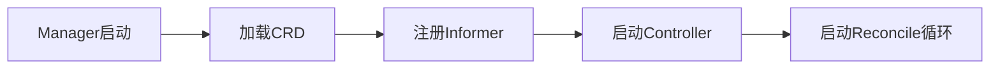
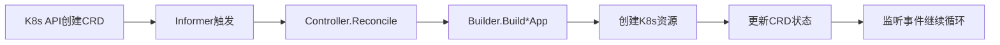
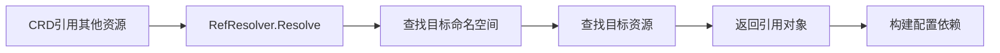

# 04-模块依赖与数据流

## 模块依赖关系

```mermaid
graph TD
    A[外部入口] --> B[cmd/]
    B --> C[internal/controller/]
    B --> D[internal/webhook/]
    B --> E[internal/builder/]
    B --> F[internal/utils/]

    B --> B1[manager/main.go]
    B --> B2[webhook/main.go]

    C --> C1[ControllerReconciler]
    C --> C2[NodeSetReconciler]
    C --> C3[LoginSetReconciler]
    C --> C4[AccountingReconciler]
    C --> C5[RestapiReconciler]
    C --> C6[TokenReconciler]
    C --> C7[SlurmClientReconciler]

    D --> D1[ControllerWebhook]
    D --> D2[NodeSetWebhook]
    D --> D3[LoginSetWebhook]
    D --> D4[AccountingWebhook]
    D --> D5[RestApiWebhook]
    D --> D6[TokenWebhook]

    E --> E1[ControllerBuilder]
    E --> E2[NodeSetBuilder]
    E --> E3[LoginSetBuilder]
    E --> E4[AccountingBuilder]
    E --> E5[RestApiBuilder]

    F --> F1[objectutils]
    F --> F2[refresolver]
    F --> F3[clientmap]
    F --> F4[podcontrol]
    F --> F5[historycontrol]
    F --> F6[durationstore]

    C --> F1
    C --> F2
    C --> F3
    C --> F4
    C --> F5
    C --> F6

    E --> F1
    E --> F2
    F1 --> F3
    F2 --> F3

    G[api/v1alpha1/] --> C
    G --> D
    G --> E

    H[config/] --> B1
    H --> B2
```



## 重要数据结构

### 核心CRD结构

#### 1. Controller类型
**文件**: `api/v1alpha1/controller_types.go`
```go
type Controller struct {
    metav1.TypeMeta   `json:",inline"`
    metav1.ObjectMeta `json:"metadata,omitempty"`

    Spec   ControllerSpec   `json:"spec,omitempty"`
    Status ControllerStatus `json:"status,omitempty"`
}
```
**职责**: 管理Slurm控制器主节点(slurmctld)，是集群的中央协调资源

**关键字段**:
- `ClusterName`: 集群名称，创建后不可变
- `SlurmKeyRef`: Slurm认证密钥引用
- `JwtHs256KeyRef`: JWT签名密钥引用
- `AccountingRef`: 可选的记账系统引用

#### 2. NodeSet类型
**文件**: `api/v1alpha1/nodeset_types.go`
```go
type NodeSet struct {
    metav1.TypeMeta   `json:",inline"`
    metav1.ObjectMeta `json:"metadata,omitempty"`

    Spec   NodeSetSpec   `json:"spec,omitempty"`
    Status NodeSetStatus `json:"status,omitempty"`
}
```
**职责**: 管理Slurm工作节点(slurmd)，处理节点生命周期和Slurm状态感知

**核心特性**:
- **Scale to Zero**: 支持缩容到零节省资源
- **主机名解析**: 提供可预测的pod主机名
- **Slurm状态感知**: 基于Slurm节点状态进行协调
- **Pod条件同步**: 将Slurm节点状态映射到Kubernetes Pod条件

#### 3. LoginSet类型
**文件**: `api/v1alpha1/loginset_types.go`
```go
type LoginSet struct {
    metav1.TypeMeta   `json:",inline"`
    metav1.ObjectMeta `json:"metadata,omitempty"`

    Spec   LoginSetSpec   `json:"spec,omitempty"`
    Status LoginSetStatus `json:"status,omitempty"`
}
```
**职责**: 管理Slurm登录/提交节点，面向用户的SSH登录节点

**集成特性**:
- **SSSD集成**: 支持用户身份管理
- **反向代理**: 自动配置SSH端口转发
- **负载均衡**: 多副本部署支持

#### 4. Accounting类型
**文件**: `api/v1alpha1/accounting_types.go`
```go
type Accounting struct {
    metav1.TypeMeta   `json:",inline"`
    metav1.ObjectMeta `json:"metadata,omitempty"`

    Spec   AccountingSpec   `json:"spec,omitempty"`
    Status AccountingStatus `json:"status,omitempty"`
}
```
**职责**: 管理Slurm记账数据库(slurmdbd)

**数据库支持**:
- **MariaDB**: 推荐配置
- **PostgreSQL**: 可选支持
- **自动配置**: 数据库连接配置自动生成

#### 5. RestApi类型
**文件**: `api/v1alpha1/restapi_types.go`
```go
type RestApi struct {
    metav1.TypeMeta   `json:",inline"`
    metav1.ObjectMeta `json:"metadata,omitempty"`

    Spec   RestApiSpec   `json:"spec,omitempty"`
    Status RestApiStatus `json:"status,omitempty"`
}
```
**职责**: 管理Slurm REST API服务器(slurmrestd)

**功能特性**:
- **REST接口**: 提供HTTP REST API访问
- **监控���成**: 支持Prometheus指标收集
- **认证**: 支持JWT认证

#### 6. Token类型
**文件**: `api/v1alpha1/token_types.go`
```go
type Token struct {
    metav1.TypeMeta   `json:",inline"`
    metav1.ObjectMeta `json:"metadata,omitempty"`

    Spec   TokenSpec   `json:"spec,omitempty"`
    Status TokenStatus `json:"status,omitempty"`
}
```
**职责**: 生成和管理Slurm JWT认证令牌

**自动刷新**: 支持令牌自动刷新和轮换

### 混合部署相关结构

#### 7. 混合配置支持
混合部署允许部分Slurm组件运行在Kubernetes外部，例如：

**外部组件**:
- slurmd进程在bare metal节点上运行
- 传统LDAP/Active Directory服务
- NFS文件系统
- 外部数据库服务

**配置要点**:
- 使用`ObjectReference`引用外部资源
- 通过环境变量配置外部服务连接
- 支持DNS名称解析到外部服务

### 开发工具链结���

#### 8. 开发辅助配置
**开发环境配置**:
- **KIND**: 本地Kubernetes集群创建和测试
- **Docker**: 容器构建和运行环境
- **Helm**: 应用打包和部署管理
- **Skaffold**: 本地开发自动化工具链
- **Pre-commit**: 代码质量检查和格式化

**工具链依赖**:
- Go 1.24+ 编程语言
- Kubebuilder v4 框架
- client-go Kubernetes客户端库

#### 3. LoginSet类型
**文件**: `api/v1alpha1/loginset_types.go`
```go
type LoginSet struct {
    metav1.TypeMeta   `json:",inline"`
    metav1.ObjectMeta `json:"metadata,omitempty"`

    Spec   LoginSetSpec   `json:"spec,omitempty"`
    Status LoginSetStatus `json:"status,omitempty"`
}
```
**职责**: 管理Slurm登录/提交节点，面向用户的SSH登录节点

#### 4. Accounting类型
**文件**: `api/v1alpha1/accounting_types.go`
```go
type Accounting struct {
    metav1.TypeMeta   `json:",inline"`
    metav1.ObjectMeta `json:"metadata,omitempty"`

    Spec   AccountingSpec   `json:"spec,omitempty"`
    Status AccountingStatus `json:"status,omitempty"`
}
```
**职责**: 管理Slurm记账数据库(slurmdbd)

#### 5. RestApi类型
**文件**: `api/v1alpha1/restapi_types.go`
```go
type RestApi struct {
    metav1.TypeMeta   `json:",inline"`
    metav1.ObjectMeta `json:"metadata,omitempty"`

    Spec   RestApiSpec   `json:"spec,omitempty"`
    Status RestApiStatus `json:"status,omitempty"`
}
```
**职责**: 管理Slurm REST API服务器(slurmrestd)

#### 6. Token类型
**文件**: `api/v1alpha1/token_types.go`
```go
type Token struct {
    metav1.TypeMeta   `json:",inline"`
    metav1.ObjectMeta `json:"metadata,omitempty"`

    Spec   TokenSpec   `json:"spec,omitempty"`
    Status TokenStatus `json:"status,omitempty"`
}
```
**职责**: 生成和管理Slurm JWT认证令牌

### 核心控制器结构

#### 1. ControllerReconciler
**文件**: `internal/controller/controller/controller.go`
```go
type ControllerReconciler struct {
    client.Client
    Scheme *runtime.Scheme
    // 其他依赖注入
}
```
**职责**: 控制器主入口，实现Reconcile接口

#### 2. clientmap.ClientMap
**文件**: `internal/clientmap/clientmap.go`
```go
type ClientMap struct {
    mu     sync.RWMutex
    clients map[string]*Client
}
```
**职责**: 线程安全的Slurm客户端连接映射，按Controller资源键存储

### 构建器结构

#### 1. Builder
**文件**: `internal/builder/builder/builder.go`
```go
type Builder struct {
    client.Client
    scheme *runtime.Scheme
}
```
**职责**: 从CRD规范构建Kubernetes资源的工厂类

## 典型请求处理流程

### 1. 资源创建请求

**输入**: Kubernetes API Server创建CRD资源

```
Kubernetes API → Informer → ControllerReconciler → Sync()
                    ↓
        [Reconcile() → Sync() → syncStatus()]
                    ↓
         Sequential SyncSteps (NodeSet为例):
            1. syncNodeSetState()
            2. syncNodeSetStatus()
            3. syncNodeSetPod()
            4. syncNodeSetService()
                    ↓
         Builder.BuildNodeSetApp() → StatefulSet创建
                    ↓
         objectutils.SyncObject() → 调用Kubernetes API
```

### 2. Webhook验证请求

**输入**: Admission请求

```
Kubernetes API Server → Webhook Server → Validation Webhook
                    ↓
        [ValidateCreate/Update/Delete()]
                    ↓
         检查资源引用完整性
                    ↓
         检查字段约束(如ClusterName不可变)
                    ↓
         返回AdmissionResponse
```

### 3. 节点状态同步请求

**输入**: Slurm客户端查询

```
SlurmClientReconciler → ClientMap获取连接 → Slurm API查询
                    ↓
        [clientmap.GetClient() → gRPC/REST连接]
                    ↓
         NodeSetReconciler接收状态更新
                    ↓
         更新NodeSet.Status.conditions
                    ↓
         更新NodePod状态
```

## API接口表

### HTTP API (Webhook)

| 路径 | 方法 | 入参 | 出参 | 中间件 |
|------|------|------|------|--------|
| `/validate/controller` | POST | Controller resource | AdmissionResponse | mutating, validating |
| `/validate/nodeset` | POST | NodeSet resource | AdmissionResponse | mutating, validating |
| `/validate/loginset` | POST | LoginSet resource | AdmissionResponse | mutating, validating |
| `/validate/accounting` | POST | Accounting resource | AdmissionResponse | mutating, validating |
| `/validate/restapi` | POST | RestApi resource | AdmissionResponse | mutating, validating |
| `/validate/token` | POST | Token resource | AdmissionResponse | mutating, validating |

### gRPC API (ClientMap)

| 服务 | 方法 | 入参 | 出参 | 描述 |
|------|------|------|------|------|
| SlurmClient | GetClusterInfo | GetClusterInfoRequest | ClusterInfo | 获取集群信息 |
| SlurmClient | ListNodes | ListNodesRequest | ListNodesResponse | 列出所有节点 |
| SlurmClient | GetNodeState | GetNodeStateRequest | NodeState | 获取节点状态 |
| SlurmClient | SubmitJob | SubmitJobRequest | SubmitJobResponse | 提交作业 |

### 内部控制接口

| 接口类型 | 方法 | 入参 | 出参 | 职责 |
|----------|------|------|------|------|
| ControllerReconciler | Reconcile | reconcile.Request | reconcile.Result | 主控制循环 |
| Builder | BuildControllerApp | Controller | *appsv1.StatefulSet | 构建StatefulSet |
| objectutils | SyncObject | Object → Object | Object → error | 同步Kubernetes对象 |
| refresolver | Resolve | ObjectReference | Object | 解析资源引用 |

## 数据流转过程

### 1. 控制器启动流程



### 2. 资源创建到部署流程



### 3. 跨资源引用解析



## 关键依赖关系

### 1. 控制器依赖
- **ObjectReference解析**: 依赖`refresolver`解析跨CRD引用
- **客户端连接**: 依赖`clientmap`管理Slurm连接池
- **资源构建**: 依赖`Builder`创建Kubernetes资源

### 2. 构建器依赖
- **对象合并**: 依赖`objectutils`进行Strategic Merge Patch
- **元数据处理**: 依赖`metadata`包处理标签和注解
- **模板构建**: 依赖`labels`包生成一致的标签

### 3. 工具类依赖
- **预期跟踪**: `PodControl`管理Pod创建/删除期望
- **历史管理**: `HistoryControl`管理ControllerRevision
- **持续时间**: `DurationStore`跟踪重试间隔

这种模块化设计确保了各层的职责分离，便于测试和维护，同时通过依赖注入提供了灵活的扩展能力。

## 实际使用示例

### 1. 基础集群部署

#### Controller 资源定义
```yaml
apiVersion: slinky.slurm.net/v1alpha1
kind: Controller
metadata:
  name: slurm-cluster
spec:
  clusterName: "production"
  slurmKeyRef:
    name: slurm-secret
    key: munge-key
  jwtHs256KeyRef:
    name: jwt-secret
    key: jwt-key
```

#### NodeSet 资源定义
```yaml
apiVersion: slinky.slurm.net/v1alpha1
kind: NodeSet
metadata:
  name: compute-nodes
spec:
  controllerRef:
    name: slurm-cluster
  replicas: 4
  image: "schedmd/slurm:25.05.2"
  serviceAccountName: "slurm-compute"
  podTemplate:
    spec:
      containers:
      - name: slurmd
        image: schedmd/slurm:25.05.2
        resources:
          requests:
            cpu: "4"
            memory: "16Gi"
          limits:
            cpu: "8"
            memory: "32Gi"
```

### 2. 自动扩缩容配置

#### KEDA ScaledObject
```yaml
apiVersion: keda.sh/v1alpha1
kind: ScaledObject
metadata:
  name: compute-nodes-autoscale
spec:
  scaleTargetRef:
    apiVersion: slinky.slurm.net/v1alpha1
    kind: NodeSet
    name: compute-nodes
  minReplicaCount: 0
  maxReplicaCount: 10
  triggers:
    - type: prometheus
      metadata:
        serverAddress: http://prometheus.monitoring:9090
        query: slurm_partition_pending_jobs{partition="compute"}
        threshold: "5"
```

#### NodeSet 工作负载隔离
```yaml
apiVersion: slinky.slurm.net/v1alpha1
kind: NodeSet
metadata:
  name: gpu-nodes
spec:
  controllerRef:
    name: slurm-cluster
  replicas: 2
  podTemplate:
    spec:
      tolerations:
      - key: nvidia.com/gpu
        effect: NoSchedule
      affinity:
        podAntiAffinity:
          requiredDuringSchedulingIgnoredDuringExecution:
          - topologyKey: kubernetes.io/hostname
            labelSelector:
              matchExpressions:
              - key: app.kubernetes.io/name
                operator: In
                values:
                - slurmd
```

### 3. 混合部署配置

#### 外部 slurmd 节点引用
```yaml
apiVersion: slinky.slurm.net/v1alpha1
kind: Controller
metadata:
  name: hybrid-cluster
spec:
  clusterName: "hybrid"
  externalSlurmd:
    enabled: true
    endpoints:
    - host: "external-node-1"
      port: 6818
      features:
      - gpu
    - host: "external-node-2"
      port: 6818
```

#### LoginSet SSDD 集成
```yaml
apiVersion: slinky.slurm.net/v1alpha1
kind: LoginSet
metadata:
  name: user-login
spec:
  controllerRef:
    name: hybrid-cluster
  sssdConfRef:
    name: sssd-config
    key: sssd.conf
  replicas: 2
  serviceAccountName: "slurm-login"
```

### 4. 开发环境配置

#### 本地开发使用 Skaffold
```bash
# 创建开发环境
make values-dev

# 启动本地开发
cd helm/slurm-operator/
skaffold run --port-forward --tail

# 调试 operator
kind create cluster --name slurm-dev
./hack/kind.sh slurm-dev
```

#### 预提交钩子配置
```bash
# 安装预提交钩子
pre-commit install

# 运行代码质量检查
pre-commit run --all-files

# 格式化和代码检查
make fmt
make vet
make golangci-lint
```

### 5. 调试和监控

#### 查看集群状态
```bash
# 查看 Controller 状态
kubectl get clusters.slinky.slurm.net -o wide

# 查看 NodeSet 状态
kubectl get nodesets.slinky.slurm.net -o wide

# 查看 Pod 状态
kubectl get pods -n slurm -l app.kubernetes.io/instance=slurm-cluster

# 查看 Slurm 集群信息
kubectl exec -n slurm statefulset/slurm-controller -- sinfo
```

#### 故障排查
```bash
# 查看 operator 日志
kubectl logs -n slurm-operator deployment/slurm-operator

# 查看 controller 状态
kubectl describe cluster slurm-cluster -n slurm

# 查看 NodeSet 事件
kubectl describe nodeset compute-nodes -n slurm

# 连接到 Slurm CLI
kubectl exec -it -n slurm statefulset/slurm-controller -- bash
```