# 05-架构文档

## 系统整体架构综述

### 项目定位与价值主张

**Slinky** 是由 **SchedMD** 官方维护的 Kubernetes Slurm Operator，旨在统一 Kubernetes 平台和 Slurm 集群管理系统的优势：

- **统一管理**: 在 Kubernetes 平台上管理完整的 Slurm 集群
- **云原生**: 利用 Kubernetes 的容器化、调度、扩缩容能力
- **混合架构**: 支持部分组件在 Kubernetes 外部署的混合模式
- **企业级**: 提供高可用、安全、可扩展的 HPC 集群管理解决方案

### 架构特点
- **分层架构**: 明确的API层、控制层、构建层、工具层分离
- **控制器模式**: 使用Kubernetes控制器范式进行资源编排
- **事件驱动**: 基于Kubernetes Informer的事件驱动架构
- **构建器模式**: 统一的资源构建接口和策略
- **Webhook保护**: 通过Admission Webhook进行资源验证和默认设置

### 核心组件
1. **Manager**: 主控制器，负责协调所有CRD的reconcile循环
2. **Webhook**: 独立的验证服务，确保资源约束和引用完整性
3. **Controller层**: 各CRD的reconcile逻辑实现
4. **Builder层**: 资源构建和配置合并策略
5. **ClientMap**: Slurm客户端连接管理
6. **工具库**: 通用功能模块（对象同步、引用解析等）

### 核心功能特性

#### 高级功能
- **自动扩缩容**: 支持 KEDA 和 HPA，基于 Slurm ���标动态调整节点数量
- **混合部署**: 支持部分组件在 Kubernetes 外部署，兼容传统架构
- **工作负载隔离**: 使用 Taints、Tolerations 和 Pod Anti-Affinity 确保资源隔离
- **Scale to Zero**: 支持节点缩容到零，节省资源成本

#### 容器化支持
- **Pyxis 集成**: 支持 NVIDIA GPU 容器化作业
- **特权模式**: 支持 enroot 容器化作业运行
- **SPANK 插件**: 集成 slurm-spank-enroot 实现容器化

#### 企业级特性
- **认证集成**: 支持 SSSD 用户身份管理
- **计费系统**: 集成 MariaDB 进行作业计费
- **监控指标**: Prometheus 指标收集和 Grafana 可视化
- **高可用**: 多副本部署，故障自愈

## 顶层目录表

| 目录 | 作用 | 关键文件 |
|------|------|----------|
| **api/v1alpha1/** | CRD定义和类型定义 | `*_types.go`, `*_keys.go`, `well_known.go` |
| **cmd/** | 程序入口点 | `manager/main.go`, `webhook/main.go` |
| **config/** | 生成的Kubernetes配置 | `crds.yaml`, `rbac.yaml`, `manager.yaml` |
| **internal/** | 内部实现代码 | `controller/`, `builder/`, `webhook/`, `utils/` |
| **helm/** | Helm chart打包 | `slurm-operator-crds/`, `slurm-operator/`, `slurm/` |
| **hack/** | 开发工具脚本 | `build.sh`, `test.sh`, `generate.sh` |
| **docs/** | 项目文档 | API文档、架构文档、用户指南 |

### 关键入口文件

- **`cmd/manager/main.go`**: Manager服务入口，启动控制器管理器
- **`cmd/webhook/main.go`**: Webhook服务入口，启动Admission服务器
- **`api/v1alpha1/*_types.go`**: CRD类型定义，定义资源规范
- **`internal/controller/*_reconciler.go`**: 各CRD的控制器实现

## 启动流程图


### Manager启动详细流程


## 核心调���链时序图

### 1. 资源创建协调流程


### 2. 节点生命周期管理流程


### 3. Webhook验证流程


## 模块依赖关系图


## 外部依赖

### 1. Kubernetes API
- **作用**: 集群状态管理、资源创建/更新/删除
- **接口**: Client-go库提供Kubernetes客户端
- **资源**: StatefulSet, Deployment, Service, ConfigMap, Secret, Pod等
- **版本**: Kubernetes v1.29+

### 2. Slurm服务
- **作用**: Slurm集群状态查询、作业提交、节点管理
- **协议**: gRPC/REST API
- **版本**: Slurm 25.05+
- **组件**:
  - slurmctld (控制器守护进程)
  - slurmd (节点守护进程)
  - slurmdbd (数据库守护进程)
  - slurmrestd (REST API服务)

### 3. 数据库
- **作用**: Slurm持久化数据和记账
- **类型**: PostgreSQL/MySQL (通过slurmdbd), MariaDB (推荐)
- **功能**: 用户信息、作业历史、集群统计、计费数据
- **依赖**: 需要部署外部数据库服务或使用数据库 Helm chart

### 4. 认证系统
- **作用**: Slurm集群安全认证
- **组件**:
  - Munge key (共享密钥认证)
  - JWT (JSON Web Token认证)
  - SSSD (System Security Services Daemon)
  - LDAP/Active Directory (可选)

### 5. 自动扩缩容组件
- **KEDA**: Kubernetes Event-driven Autoscaling
- **HPA**: Horizontal Pod Autoscaler
- **Prometheus**: 指标收集和存储
- **Metrics Server**: Kubernetes资源指标API

### 6. 配置管理
- **作用**: 系统配置和密钥管理
- **来源**: Kubernetes ConfigMap/Secret
- **内容**: Slurm配置文件、数据库凭证、JWT密钥
- **支持**: 运行时配置覆盖

### 7. 监控和日志
- **作用**: 系统健康监控和调试
- **协议**: Prometheus Metrics, Structured Logs
- **端点**: /metrics, /healthz
- **组件**: slurm-exporter, Prometheus, Grafana

### 8. 开发工具链
- **KIND**: Kubernetes in Docker，本地测试集群
- **Docker**: 容器构建和运行
- **Helm**: 应用打包和部署
- **Skaffold**: 本地开发自动化
- **kubectl**: Kubernetes命令行工具
- **Pre-commit**: 代码质量检查钩子

## 配置项

### 1. Manager配置 (manager.yaml)

```yaml
apiVersion: v1
kind: ConfigMap
metadata:
  name: slurm-operator-config
data:
  # 控制器配置
  controller-workers: "8"
  controller-requeue-after: "30s"

  # 客户端配置
  client-timeout: "10s"
  client-retry-interval: "5s"
  client-max-retries: "3"

  # 构建器配置
  builder-image-pull-policy: "IfNotPresent"
  builder-default-annotations: |
    slurm.slinky.net/operator-version: v1.0.0

  # Webhook配置
  webhook-port: 9443
  webhook-tls-file: "/etc/webhook/tls.crt"
```

### 2. Helm Values (values.yaml)

```yaml
# 全局配置
global:
  image:
    repository: "registry.example.com/slurm-operator"
    tag: "latest"
    pullPolicy: "IfNotPresent"

  # 监控配置
  metrics:
    enabled: true
    port: 8080
    serviceMonitor:
      enabled: true

  # 资源限制
  resources:
    limits:
      cpu: "500m"
      memory: "512Mi"
    requests:
      cpu: "100m"
      memory: "128Mi"

# CRD配置
crds:
  # 控制器资源限制
  controller:
    resources:
      limits:
        cpu: "1000m"
        memory: "2Gi"
      requests:
        cpu: "200m"
        memory: "256Mi"

# Webhook配置
webhook:
  resources:
    limits:
      cpu: "200m"
      memory: "256Mi"
    requests:
      cpu: "50m"
      memory: "64Mi"

# RBAC配置
rbac:
  create: true
  serviceAccount:
    create: true
    name: "slurm-operator"
```

### 3. 环境变量

| 环境变量 | 类型 | 默认值 | 描述 |
|----------|------|--------|------|
| `WATCH_NAMESPACE` | string | "" | 监控的命名空间 (空表示所有) |
| `LEADER_ELECTION_ENABLED` | bool | true | 启用领导者选举 |
| `LEADER_ELECTION_ID` | string | "slurm-operator.slurm.slinky.net" | 领导者选举ID |
| `METRICS_BIND_ADDRESS` | string | ":8080" | 监控指标绑定地址 |
| `HEALTH_BIND_ADDRESS` | string | ":9440" | 健康检查绑定地址 |
| `WEBHOOK_PORT` | int | 9443 | Webhook服务端口 |
| `WEBHOOK_TLS_FILE` | string | "" | Webhook TLS证书文件路径 |

### 4. Slurm配置模板

```yaml
# slurm.conf模板
slurm.conf: |
  # Slurm全局配置
  ClusterName={{ .ClusterName }}
  ControlMachine={{ .ControllerName }}.{{ .Namespace }}.svc.cluster.local
  SlurmUser=slurm
  SlurmctldPort=6817
  SlurmdPort=6818

  # Cgroup配置 (Slurm 25.05+)
  CgroupPlugin=cgroup/v2
  SlurmctldParameters=enable_configless

  # 网络配置
  ProctrackType=cgroup
  TaskPlugin=task/cgroup
  ReturnToService=1
  MaxJobCount=10000

  # 记账配置
  JobAcctGatherType=jobacct/task
  JobAcctGatherFrequency=30
```

## 架构设计原则

### 1. 单一职责原则
- 每个控制器专注于特定CRD的管理
- 构建器专门负责资源构建逻辑
- 工具库提供通用功能

### 2. 依赖注入原则
- 通过构造函数注入依赖
- 接口抽象便于测试和替换实现

### 3. 事件驱动原则
- 基于Kubernetes Informer的事件响应
- 异步处理避免阻塞主线程

### 4. 可观测性原则
- 内置Prometheus指标
- 结构化日志记录
- 健康检查端点

### 5. 容错性原则
- 重试机制处理临时故障
- 优雅关闭处理资源释放
- 错误状态记录和恢复

这种架构设计确保了系统的可扩展性、可维护性和可靠性，能够高效管理大规模Slurm HPC集群的部署和运维。

## 架构对比：传统 vs Kubernetes

### 传统架构与Kubernetes架构的差异

```mermaid
graph TB
    subgraph "传统Slurm架构"
        TRAD_LOGIN["登录节点<br/>login-node-01<br/>login-node-02<br/>物理机/虚拟机"]
        TRAD_LOGIN -- SSH --> USER["用户"]
        TRAD_LOGIN -- "sbatch/srun" --> TRAD_CTRL["控制器节点<br/>slurmctld<br/>物理机"]
        TRAD_CTRL -- "RPC调用" --> TRAD_DB["数据库节点<br/>slurmdbd<br/>MariaDB/PostgreSQL"]
        TRAD_CTRL -- "节点管理" --> TRAD_COMPUTE["计算节点<br/>slurmd-host-01<br/>slurmd-host-02<br/>物理机/虚拟机"]
        TRAD_COMPUTE -- "执行作业" --> NODE_CPU["CPU/GPU资源"]

        style TRAD_LOGIN fill:#E1F5FE
        style TRAD_CTRL fill:#FFF3E0
        style TRAD_DB fill:#F3E5F5
        style TRAD_COMPUTE fill:#E8F5E8
    end

    subgraph "Kubernetes Slurm Operator架构"
        subgraph "用户层"
            K8S_USER["用户<br/>kubectl/sbatch/srun"]
        end

        subgraph "Kubernetes集群"
            subgraph "Login层"
                K8S_LOGIN["LoginSet Pods<br/>login-set-0.login-set.svc.cluster.local<br/>login-set-1.login-set.svc.cluster.local<br/>SSH + SSSD集成"]
                K8S_LOGIN -- SSH --> K8S_USER
            end

            subgraph "控制层"
                K8S_CTRL["Controller StatefulSet<br/>slurm-controller-0.slurm-controller.svc.cluster.local<br/>slurmctld + 配置管理"]
                K8S_LOGIN -- "sbatch/srun" --> K8S_CTRL
            end

            subgraph "数据层"
                K8S_DB["Accounting StatefulSet<br/>slurm-accounting-0.slurm-accounting.svc.cluster.local<br/>slurmdbd + MariaDB"]
                K8S_CTRL -- "gRPC/REST API" --> K8S_DB
            end

            subgraph "计算层"
                K8S_COMPUTE["NodeSet StatefulSet<br/>slurm-worker-{0,1,2,...}.slurm-worker.svc.cluster.local<br/>slurmd + GPU支持"]
                K8S_CTRL -- "节点管理" --> K8S_COMPUTE
                K8S_COMPUTE -- "执行作业" --> K8S_POD["Pod资源<br/>CPU/GPU/内存"]
            end

            subgraph "API层"
                K8S_API["RestApi Deployment<br/>slurm-restapi.slurm.svc.cluster.local<br/>slurmrestd + HTTP API"]
                K8S_CTRL -- "状态同步" --> K8S_API
            end

            subgraph "认证层"
                K8S_TOKEN["Token Secret<br/>JWT tokens<br/>自动刷新机制"]
                K8S_TOKEN -- "JWT认证" --> K8S_CTRL
                K8S_TOKEN -- "JWT认证" --> K8S_API
                K8S_TOKEN -- "JWT认证" --> K8S_LOGIN
            end
        end
    end

    %% 互连关系
    K8S_LOGIN -- "Service Discovery" --> K8S_CTRL
    K8S_CTRL -- "K8s API调用" --> K8S_COMPUTE
    K8S_COMPUTE -- "Pod状态报告" --> K8S_CTRL

    %% 图例
    subgraph "图例"
        LEGEND_POD[("Pod<br/>容器化进程")]
        LEGEND_SVC[("Service<br/>集群内访问")]
        LEGEND_STS[("StatefulSet<br/>有状态服务")]
        LEGEND_DEP[("Deployment<br/>无状态服务")]
        LEGEND_SEC[("Secret<br/>密钥管理")]
    end

    %% 样式定义
    style K8S_USER fill:#FFE0B2
    style K8S_LOGIN fill:#E1F5FE
    style K8S_CTRL fill:#FFF3E0
    style K8S_DB fill:#F3E5F5
    style K8S_COMPUTE fill:#E8F5E8
    style K8S_API fill:#FCE4EC
    style K8S_TOKEN fill:#F1F8E9
```



### 用户访问方式对比

#### 传统架构
```bash
# 直接连接到物理登录节点
ssh user@login-node-01
sbatch my_job.sh

# 固定IP地址
ssh user@192.168.1.100
```

#### Kubernetes架构
```bash
# 通过Service名称连接，支持负载均衡
ssh user@login-set-0.login-set.svc.cluster.local
sbatch my_job.sh

# DNS解析自动处理
ssh user@login-set-1.login-set.slurm.svc.cluster.local
```

### SSH连接方式的区别

#### 1. **特定Pod连接方式**
```bash
ssh user@login-set-0.login-set.svc.cluster.local
```

**特点**:
- **特定Pod**: 直接连接到名为 `login-set-0` 的具体Pod
- **Headless Service**: 使用的是StatefulSet的Headless Service
- **固定标识**: Pod名称中的数字 `0` 是固定的
- **单点访问**: 连接到单个登录节点

**适用场景**:
- 开发调试：连接到特定节点进行问题排查
- 特定需求：用户偏好或特定功能访问
- 直接访问：绕过负载均衡层

#### 2. **负载均衡连接方式**
```bash
ssh user@login-set-1.login-set.slurm.svc.cluster.local
```

**特点**:
- **不同Pod**: 连接到名为 `login-set-1` 的另一个具体Pod
- **手动负载分布**: 用户需要自己选择连接哪个节点
- **故障转移**: 如果 `login-set-0` 故障，需要手动切换到 `login-set-1`
- **轮询访问**: 用户可以轮询连接到不同的登录节点

**适用场景**:
- 手动负载均衡：用户主动分布连接负载
- 高可用：避免单点故障的备用方案
- 测试：测试不同登录节点的状态

#### 3. **推荐的负载均衡方案**

##### **LoadBalancer Service**（推荐用于生产环境）
```yaml
apiVersion: v1
kind: Service
metadata:
  name: login-set-lb
  namespace: slurm
spec:
  type: LoadBalancer  # 自动负载均衡
  selector:
    app.kubernetes.io/name: login
    app.kubernetes.io/instance: login-set
  ports:
  - name: ssh
    port: 22
    targetPort: 22
```

**使用方式**:
```bash
ssh user@<LOAD_BALANCER_IP>  # 自动负载均衡到任一可用节点
```

##### **Ingress**（统一入口管理）
```bash
ssh user@login.cluster.example.com  # 统一入口，智能路由
```

#### 4. **实际使用策略对比**

| 策略 | 连接方式 | 优点 | 缺点 | 适用场景 |
|------|----------|------|------|----------|
| **特定Pod** | `login-set-0.login-set.svc.cluster.local` | 直接访问、便于调试 | 单点故障风险、负载不均 | 开发调试、特定需求 |
| **手动轮询** | `login-set-1.login-set.slurm.svc.cluster.local` | 避免单点、手动负载分布 | 需要手动选择、无智能分配 | 高可用、手动负载均衡 |
| **LoadBalancer** | `<LOAD_BALANCER_IP>` | 自动负载均衡、高可用 | 依赖云服务商、额外成本 | 生产环境、大规模部署 |
| **Ingress** | `login.cluster.example.com` | 统一入口、智能路由 | 配置复杂、需要额外组件 | 企业环境、统一管理 |

#### 5. **DNS解析机制**

##### **Headless Service DNS记录**:
```
login-set-0.login-set.svc.cluster.local  -> 10.244.1.10
login-set-1.login-set.svc.cluster.local  -> 10.244.2.11
login-set.login-set.svc.cluster.local    -> SRV记录 (多个IP)
```

##### **LoadBalancer Service DNS记录**:
```
login-set-lb.slurm.svc.cluster.local     -> 172.16.1.100 (单一VIP)
                                    -> 10.244.1.10 (backend1)
                                    -> 10.244.2.11 (backend2)
```

#### 6. **架构设计理念**

这种连接方式的区别体现了Kubernetes架构的设计演进：

- **从直接管理到抽象层**: 从直接连接Pod到通过Service负载均衡
- **从静态配置到动态适应**: 从固定的Pod连接到智能的负载分配
- **从手动运维到自动化**: 从手动故障转移到自动恢复机制

**最佳实践总结**:
- **开发/测试**: 使用特定Pod连接便于调试和开发
- **生产环境**: 使用LoadBalancer或Ingress实现自动负载均衡
- **高可用需求**: 需要额外的负载均衡层和健康检查机制
- **企业环境**: 统一入口管理，集成身份认证和安全策略

### 关键架构差异

| 维度 | 传统架构 | Kubernetes架构 |
|------|----------|----------------|
| **基础设施** | 物理机/虚拟机 | Kubernetes集群 |
| **登录访问** | 固定IP地址 | Service名称 + DNS |
| **部署方式** | 手动配置 | 声明式CRD |
| **扩展能力** | 静态，手动扩展 | 动态，自动扩缩容 |
| **故障恢复** | 手动干预 | 自动自愈 |
| **监控管理** | 分散监控 | 集中监控 |
| **安全控制** | 主机级安全 | K8s RBAC + 网络策略 |
| **版本升级** | 停机升级 | 滚动升级 |
| **资源调度** | Slurm专用 | K8s通用调度 |

### 架构演进优势

#### 1. **容器化优势**
- **隔离性**: 每个进程独立容器，故障隔离
- **标准化**: 统一的部署和生命周期管理
- **可移植性**: 跨环境一致性

#### 2. **自动化运维**
- **自愈能力**: 自动故障检测和恢复
- **弹性伸缩**: 基于负载自动调整节点数量
- **滚动升级**: 无停机版本更新

#### 3. **云原生集成**
- **服务发现**: 内置Service和DNS解析
- **监控集成**: Prometheus + Grafana原生支持
- **安全框架**: 基于Kubernetes的RBAC和网络策略

#### 4. **现代化管理**
- **声明式配置**: YAML定义期望状态
- **事件驱动**: 实时状态同步和告警
- **API驱动**: REST API集成和自动化

### 关键设计转变

#### **从"硬"管理到"软"管理**
- **传统**: 管理物理设备和配置文件
- **Kubernetes**: 管理抽象资源和期望状态

#### **从静态到动态**
- **传统**: 固定的节点配置和容量
- **Kubernetes**: 弹性的资源分配和动态调整

#### **从分散到集中**
- **传统**: 分散的监控和管理工具
- **Kubernetes**: 统一的API和控制器模式

这种架构转变不仅提升了运维效率，还为HPC集群管理提供了更好的可扩展性、可靠性和现代化管理能力。

