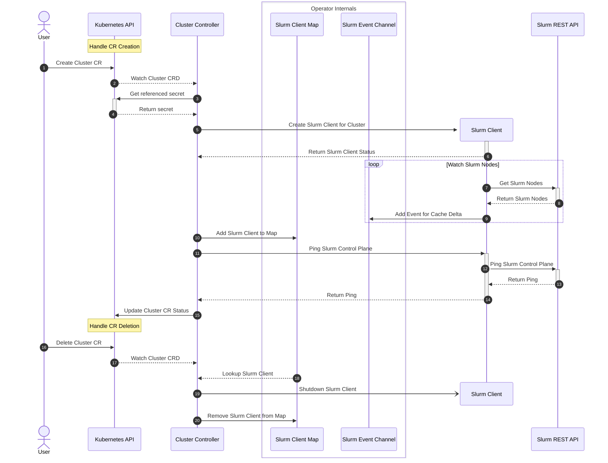

# Cluster Controller

## Table of Contents

<!-- mdformat-toc start --slug=github --no-anchors --maxlevel=3 --minlevel=1 -->

- [Cluster Controller](#cluster-controller)
  - [Table of Contents](#table-of-contents)
  - [Overview](#overview)
  - [Sequence Diagram](#sequence-diagram)

<!-- mdformat-toc end -->

## Overview

This controller is responsible for managing and reconciling the Cluster CRD. A
CRD represents communication to a Slurm cluster via slurmrestd and `auth/jwt`.

This controller uses the [Slurm client] library.

## Sequence Diagram

<!-- Links -->

[slurm client]: https://github.com/SlinkyProject/slurm-client
