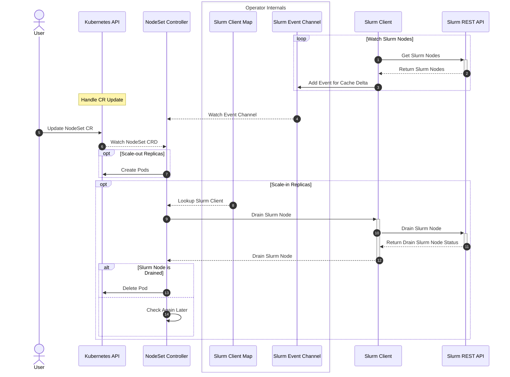

# NodeSet Controller

## Table of Contents

<!-- mdformat-toc start --slug=github --no-anchors --maxlevel=6 --minlevel=1 -->

- [NodeSet Controller](#nodeset-controller)
  - [Table of Contents](#table-of-contents)
  - [Overview](#overview)
  - [Design](#design)
    - [Sequence Diagram](#sequence-diagram)

<!-- mdformat-toc end -->

## Overview

The nodeset controller is responsible for managing and reconciling the NodeSet
CRD, which represents a set of homogeneous Slurm Nodes.

## Design

This controller is responsible for managing and reconciling the NodeSet CRD. In
addition to the regular responsibility of managing resources in Kubernetes via
the Kubernetes API, this controller should take into consideration the state of
Slurm to make certain reconciliation decisions.

### Sequence Diagram

